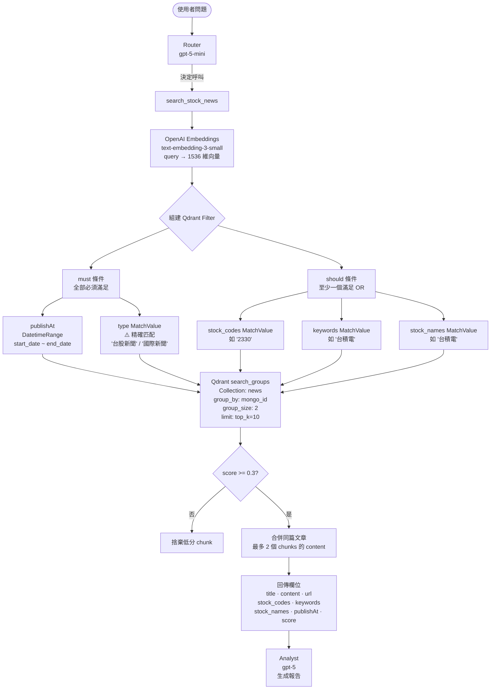
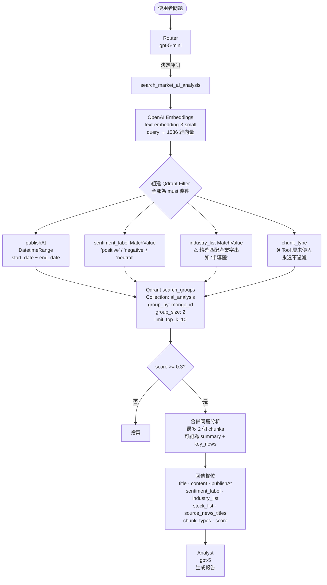
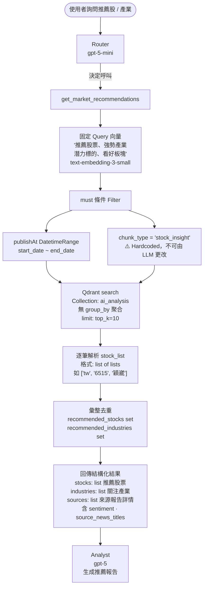
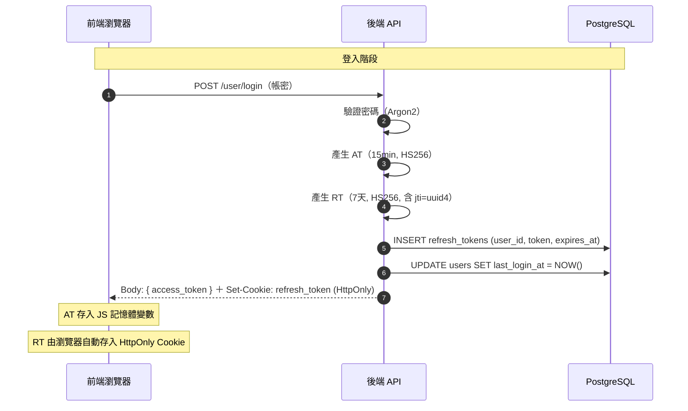
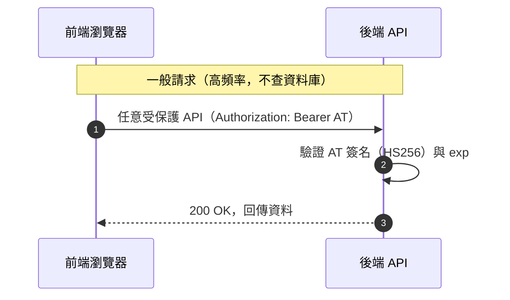
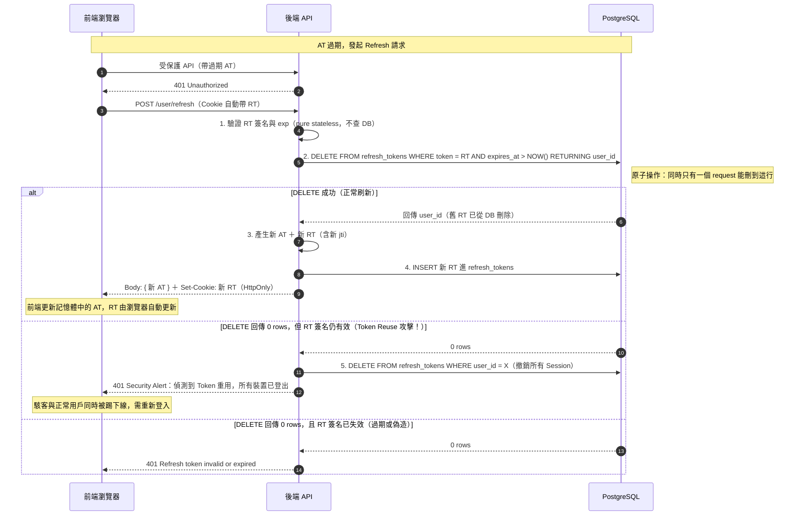
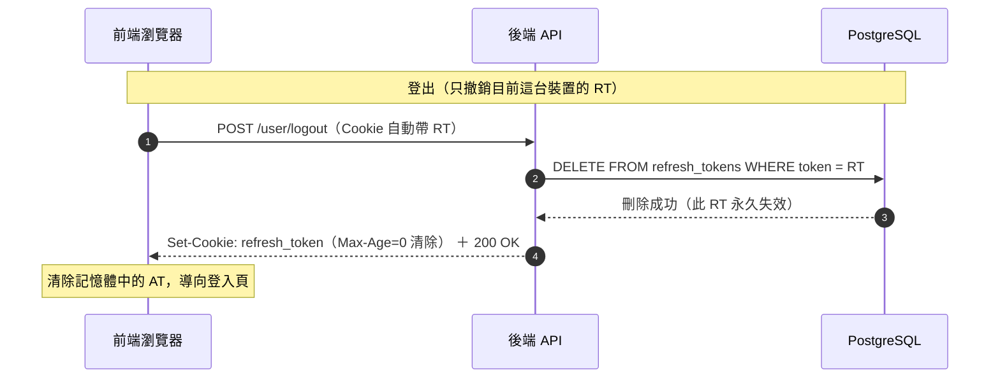

# 📈 Stock Insight Chat

[](https://github.com/WilliamTsai1227/Stock-Insight-Chat)
[](https://github.com/WilliamTsai1227/Stock-Insight-Chat)

> **股市洞察生成式聊天系統** —— 結合即時新聞、AI 產業分析與企業財報的智慧對話助手。

##  系統概覽

Stock Insight Chat 是一套專為投資者設計的 AI 智能對話系統。它不僅能理解使用者的提問，更能主動調用專業工具，從海量的新聞數據與 AI 分析報告中檢索關鍵片段（RAG），並結合企業歷史財報，提供具備深度見解的投資分析。

---

##  快速開始 (Quick Start)

### 0. 進入網站測試 (Frontend)
本專案前端為 **純 HTML/CSS/JS**，由 Docker 內的 **Nginx** 提供服務（`frontend`，預設對外 `80` port）。

- **登入頁**: [http://localhost/login.html](http://localhost/login.html)
- **主頁**: [http://localhost/index.html](http://localhost/index.html)
- **後端健康檢查**: [http://localhost:8000/](http://localhost:8000/)

#### 測試帳號 (Development Only)
> [!WARNING]
> 以下帳號僅供本機/開發測試使用，請勿用於正式環境或公開部署。

- **Username**: `test`
- **Email**: `test@mail.com`
- **Password**: `1qaz!QAZ`

### 1. 啟動基礎設施
透過 Docker Compose 啟動 Qdrant 向量資料庫與 PostgreSQL：
```bash
docker-compose -f ./deploy/docker-compose.yml up -d
```

#### 常用 Docker Compose 指令速查
```bash
# 啟動所有服務 (背景執行)
docker-compose -f ./deploy/docker-compose.yml up -d

# 重建並啟動所有服務 (程式碼有更新時使用)
docker-compose -f ./deploy/docker-compose.yml up --build -d

# 追蹤單一服務 logs
docker-compose -f ./deploy/docker-compose.yml logs -f <service name>

# 停止容器 (保留容器/資料)
docker-compose -f ./deploy/docker-compose.yml stop

# 停止並移除容器/網路 (volume 預設保留)
docker-compose -f ./deploy/docker-compose.yml down
```

### 1-1. 重啟後端服務 (Restarting Backend)
若你修改了後端程式碼（如 `chat.py` 或 `news.py`），需要重新構建 Image 並重啟容器：
```bash
docker-compose -f ./deploy/docker-compose.yml up -d --build backend
```
> [!TIP]
> 使用 `--build` 參數確保 Docker 讀取最新的程式碼變動。

### 2. 環境設定
在專案根目錄建立或編輯 `.env` 檔案，確保包含以下必要的配置：
```bash
# AI Provider
OPENAI_API_KEY=sk-your-key-here

# MongoDB (資料來源)
MONGO_URI=mongodb://localhost:27017
MONGO_DB=stock_insight

# Qdrant (向量目標)
QDRANT_HOST=localhost
QDRANT_PORT=6333
```

### 3. Python 環境安裝
建議使用 **Python 3.11** 版本（Python 3.13 仍有套件相容性問題）：
```bash
# 建立虛擬環境
python3.11 -m venv venv
source venv/bin/activate

# 安裝依賴
pip install -r app/backend/requirements.txt
```

### 4. 執行資料遷移 (Migration)
將資料從 MongoDB 遷移至 Qdrant。你可以直接從 **專案根目錄** 執行：

```bash
# Step A: 初始化 Collection 與索引
python3 app/backend/scripts/setup_qdrant.py

# Step B: Dry Run 預覽切分結果 (推薦先執行確認)
python3 app/backend/scripts/migrate_to_qdrant.py --dry-run --limit 10

# Step C: 正式遷移 (各取最新 100 篇)
python3 app/backend/scripts/migrate_to_qdrant.py --limit 100

# Step D: 驗證遷移結果
python3 app/backend/scripts/test_qdrant_filter.py
```

#### 遷移進階用法
```bash
# 只遷移特定 collection
python3 app/backend/scripts/migrate_to_qdrant.py --collection news --limit 500
python3 app/backend/scripts/migrate_to_qdrant.py --collection ai_analysis --limit 200

# 全量遷移
python3 app/backend/scripts/migrate_to_qdrant.py --limit 99999

# 重建 Collection (⚠️ 清除所有現有資料)
python3 app/backend/scripts/setup_qdrant.py --reset
```

### 5. 驗證資料 (Qdrant Dashboard)
遷移完成後，你可以透過瀏覽器存取 Qdrant 內建的控制台來檢查資料：
*   **Dashboard 地址**: [http://localhost:6333/dashboard](http://localhost:6333/dashboard)
*   可在界面中直接查看 `news` 與 `ai_analysis` 的 Points、Payload 與向量數值。

---

## 🧪 測試工具 (Testing)
本專案提供後端工具函式的自動化測試，確保檢索邏輯正常：
```bash
# 執行所有工具測試
pytest test/backend/tools/ -s

# 或執行個別測試
# 1. 新聞檢索測試
pytest test/backend/tools/test_news_tool.py -s
# 2. AI 分析報告測試
pytest test/backend/tools/test_ai_analysis_tool.py -s
# 3. 推薦標的提取測試 (New)
python test/backend/tools/test_recommendations_tool.py
# 4. Agent 綜合對話測試
python app/backend/agent/chat.py
```

---

## 向量儲存結構 (Qdrant Schema)

系統採用 **Qdrant** 作為核心向量資料庫，支援高效的語義搜尋與動態過濾。以下是目前規劃的 Collection 結構設計：

### Collections 總覽

| Collection | 中文名稱 | 內容摘要 |
| :--- | :--- | :--- |
| `news` | 股市新聞 | 爬蟲新聞依語意段落切分後入庫 |
| `ai_analysis` | AI 產業分析 | LLM 產出之統整／趨勢分析，依語意角色拆成多向量 |

### 1. 通用規格

| 項目 | 設定值 |
| :--- | :--- |
| 向量模型 (Embedding) | OpenAI `text-embedding-3-small`（1536 維） |
| 距離計算法 (Distance Metric) | `Cosine Similarity` |
| 時區規範 | `Asia/Taipei`（UTC+8） |

### 2. Collection: `news`（股市新聞）

收錄每日爬蟲抓取的最新股市動態，依語意段落進行精細切分。

| 欄位 (Payload Key) | 資料型態 | 索引類型 | 說明 |
| :--- | :--- | :--- | :--- |
| `mongo_id` | String | - | 對應 MongoDB 原始新聞 ID |
| `title` | String | - | 新聞標題 |
| `publishAt` | String (ISO) | **Datetime** | 發布時間 (支援時間區間過濾) |
| `source` | String | Keyword | 來源 (如: anue) |
| `category` | String | Keyword | 文章分類 (如: headline) |
| `type` | String | Keyword | 新聞類型 (如: 台股新聞, 國際新聞) |
| `stock_codes` | Array[String] | Keyword | 提及之股票代碼 (如: ["3017", "2330"]) |
| `stock_names` | Array[String] | Keyword | 提及之股票名稱 (如: ["奇鋐", "台積電"]) |
| `keywords` | Array[String] | Keyword | 新聞關鍵字 (如: ["水冷散熱", "AI伺服器"]) |
| `chunk_type` | String | Keyword | `full` (短文不切) 或 `partial` (長文切分後) |
| `chunk_idx` | Integer | Integer | 當前片段序號 |
| `total_chunks` | Integer | Integer | 該文章總片段數 |
| `content` | String | - | 文字片段內容 (含標題前綴) |
| `url` | String | - | 原始新聞連結 |
| `collection_type` | String | Keyword | 固定為 `news` |

### 3. Collection: `ai_analysis`（AI 產業分析）

收錄由 LLM 產出的深度統整與產業趨勢分析，按欄位語意角色拆分為多個向量。

| 欄位 (Payload Key) | 資料型態 | 索引類型 | 說明 |
| :--- | :--- | :--- | :--- |
| `mongo_id` | String | Keyword | 對應 MongoDB 原始分析報告 ID (用於 group_by 聚合) |
| `title` | String | - | 報告標題 |
| `publishAt` | String (ISO) | **Datetime** | 生成時間 |
| `chunk_type` | String | Keyword | 語意角色: `summary` / `key_news` / `stock_insight` |
| `sentiment` | String | - | 原始情緒描述文字 |
| `sentiment_label` | String | Keyword | 情緒分類: `positive` / `negative` / `neutral` |
| `industry_list` | Array[String] | Keyword | 涉及產業 (如: 半導體、能源) |
| `stock_list` | Array | Keyword | 推薦或提及之股票 (如: [["tw","6515","穎崴"]]) |
| `category` | String | Keyword | 來源分類 (如: headline) |
| `is_summary` | Boolean | Bool | 是否為彙總報告 |
| `analysis_batch` | Integer | Integer | 分析批次編號 |
| `source_news_titles` | Array[String] | - | 引用的來源新聞標題 |
| `source_news_ids` | Array[String] | - | 引用的來源新聞 MongoDB IDs |
| `content` | String | - | 分析內容片段 |
| `collection_type` | String | Keyword | 固定為 `ai_analysis` |

---

## 🔍 Tool 搜尋流程圖 (Search Flow)

以下流程圖說明每個 LangChain Tool 如何與 Qdrant 資料庫互動，包含 Filter 條件、向量搜尋方式與回傳欄位。

> ⚠️ **注意**：`news.type`（`must` 精確匹配）與 `ai_analysis.industry_list`（`must` 精確匹配）為高風險過濾欄位；若 LLM 傳入的值與資料庫實際儲存字串不一致，將導致零結果。

### Tool 1：`search_stock_news` → Qdrant `news`



### Tool 2：`search_market_ai_analysis` → Qdrant `ai_analysis`



### Tool 3：`get_market_recommendations` → Qdrant `ai_analysis`



---

## 🛠️ 技術架構 (System Stack)

*   **後端系統**: Python FastAPI (非同步架構)
*   **向量檢索**: Qdrant (Rust-based Vector Database)
*   **數據儲存**: MongoDB Atlas (雲端全文存儲) & PostgreSQL (對話狀態管理)
*   **AI 核心**: OpenAI GPT-5 & GPT-5 mini (雙模型架構)
*   **工作排程**: LangGraph (Agent 邏輯編排與狀態隔離)
*   **文本切分**: LangChain `RecursiveCharacterTextSplitter` (語意段落感知)

---

## 🔐 JWT 認證架構 (Authentication Flow)

### Token 儲存位置

| Token | 前端儲存位置 | 說明 |
| :--- | :--- | :--- |
| **AT** (Access Token, 15 分鐘) | **JavaScript 記憶體變數** | 不寫入 localStorage / sessionStorage，防止 XSS 竊取；頁面刷新後消失，需靠 RT 重新換發 |
| **RT** (Refresh Token, 7 天) | **HttpOnly Cookie** | 瀏覽器自動帶上，JavaScript 無法讀取，防 XSS；`SameSite=Lax` 防 CSRF |

> **jti（JWT ID）**：每個 RT 在產生時都內嵌一個 `jti` 欄位，值為 `uuid4()` 隨機 UUID（128-bit，碰撞機率 ≈ 1/2¹²²）。後端以 RT 字串本身為 DB key，`DELETE ... RETURNING` 原子消費確保唯一性，jti 同時提供稽核索引能力。

---

### 前端無縫換 Token 三機制（`auth.js`）

為確保用戶在發送聊天時不因 Token 驗證而感受到等待，前端實作三重機制：

```
機制 A（主要路徑）─────────────────────────────────────────────────
 取得新 AT 後立即計算 exp - 60s
 → 設定 setTimeout(_silentRefresh, delay)
 → Timer 到期時在背景靜默呼叫 /refresh
 → 取得新 AT 存入記憶體，並重設下一輪 Timer
 → 用戶發聊天時 AT 已是新的，零等待

機制 B（Fallback）──────────────────────────────────────────────────
 authFetch 每次發請求前檢查 AT 剩餘秒數：
   ├─ exp - now ≤ 90s → 先呼叫 tryRefreshToken()，換完再發
   └─ 若 API 回傳 401（Timer 延遲未及換） → tryRefreshToken() → 重送請求
 瀏覽器分頁在背景被節流時 Timer 可能延誤，機制 B 作為補位防線

機制 C（並發鎖）────────────────────────────────────────────────────
 _isRefreshing flag + _refreshPromise 共用同一個 Promise
   ├─ 第一個觸發 /refresh 的請求：設 _isRefreshing = true，執行並記下 Promise
   └─ 同時間其他請求：等待同一個 Promise，共用換 Token 結果

 ⚠️ 無此鎖的風險：
   兩個並發 401 → 同時呼叫 /refresh（兩次）
   → 第一次：RT 旋轉成功，DB 舊 RT 被刪
   → 第二次：拿著已被消費的舊 RT → 後端判定 Reuse Attack
   → 後端撤銷所有 Session → 用戶被強制登出所有裝置
```

| 機制 | 實作位置 | 觸發條件 | 用戶感知 |
| :--- | :--- | :--- | :--- |
| A 主動 Timer | `_scheduleProactiveRefresh()` | AT exp - 60s | 無感知（背景執行） |
| B Request Interceptor | `authFetch()` | exp ≤ 90s 或收到 401 | 輕微等待（~200ms） |
| C 並發鎖 | `tryRefreshToken()` | 多個請求同時觸發 | 無影響（共用結果） |

---

### 流程一：登入（Login）



---

### 流程二：一般 API 請求（Stateless AT 驗證）



---

### 流程三：RT Rotation（AT 過期後換發）



---

### 流程四：登出（單裝置）



> **多裝置支援**：每次登入都 INSERT 一筆獨立 RT，登出只刪自己那筆，其他裝置不受影響。若要強制登出所有裝置，可呼叫 `DELETE FROM refresh_tokens WHERE user_id = X`。

---

##  核心 API 規範 (Messaging API)

本系統的核心 API 採用高度透明的設計，提供完整的執行軌跡與效能數據。

### 1. 發送訊息與分析 (`getAIResponse`)
- **Endpoint**: `POST /api/getAIResponse`
- **功能**: 啟動 LangGraph 雙模型工作流，進行搜尋與投資分析。

#### **Request Body (JSON)**
| 參數名稱 | 型別 | 必填 | 說明 |
| :--- | :--- | :--- | :--- |
| `query` | string | 是 | 使用者的問題內容。 |
| `chat_id` | string | 否 | 傳入 UUID 以延續對話上下文；若為 `null` 則啟動新 session。 |
| `agent_config` | object | 否 | 包含 `enabled_tools` (list)，若為空則由 Agent 自行判斷工具。 |

#### **範例請求**
```json
{
  "query": "近期台積電表現如何？",
  "chat_id": null,
  "agent_config": {
    "enabled_tools": ["search_stock_news", "get_market_recommendations"]
  }
}
```

#### **Response Body (JSON)**
| 欄位名稱 | 說明 |
| :--- | :--- |
| `status` | 請求狀態 (`success` / `error`)。 |
| `chat_id` | 本次對話的 UUID，前端後續應帶回此 ID 以延續語境。 |
| `total_execution_time` | API 總執行耗時（秒）。 |
| `steps` | **核心執行軌跡 (ReAct Trace)**：包含所有 Router 的思考過程與 Analyst 的生成內容。 |
| `final_content` | 最後一個分析節點產出的報告內容（快捷讀區）。 |
| `retrieval_sources` | 條列本次檢索到的所有原始來源 Metadata (含 ID, URL, Preview)。 |

#### **ReAct 執行範例 (以台積電化學公司偵測為例)**
當問題較為複雜時，Agent 會啟動多次思考循環：
1. **Step 1 (Router)**: 搜尋台積電供應商名單。
2. **Step 2 (Router)**: 針對名單中的「台灣化學纖維」再次進行精確風險搜尋（ReAct）。
3. **Step 3 (Analyst)**: 整合多段資訊，產出最終報告。

---

###  核心模型架構 (Next-Gen AI Stack)
為了達到速度與品質的最佳平衡，系統採用雙模型動態協作：
- **Router LLM**: `GPT-5 mini` (負責極速意圖辨識、工具決策與 ReAct 導航)。
- **Analyst LLM**: `GPT-5` (負責旗艦級資料合成、深度投資見解與專業報告產出)。
- **Embedding**: `text-embedding-3-small` (高效能且低成本的向量轉換)。

---

##  對話歷史結構與溯源 (Chat History & Parent DAG Architecture)

系統捨棄了傳統的「陣列式」對話儲存，改採用進階的 **「自參照樹狀結構 (Self-referencing DAG)」**。透過 `messages` 表中的 `parent_id` 欄位，系統能夠精確掌握上下句的關聯性。

### 1. 解決的問題 (Why Parent ID?)
*   **支援「重新生成」(Regenerate)**：當使用者要求重新回答時，兩則 AI 回答會共用同一個 User 訊息的 `parent_id`，前端可藉此繪製版本切換 `< 1/2 >` UI。
*   **精確追問與溯源**：後端能得知使用者是在針對滿天飛的回答中的「哪一句話」進行追問，進而提供正確的 Context。
*   **防禦訊息超車 (Race Conditions)**：即便網路延遲導致資料庫寫入順序錯亂，憑藉 `parent_id` 依然能百分之百還原正確的時間線邏輯。

### 2. 歷史讀取策略 (Context Loading)
為了避免超出 LLM Token 上限，系統結合 **滑動視窗** 與 **動態摘要**：
1.  **遞迴回溯 (Recursive CTE)**：後端不使用 `ORDER BY created_at` 盲目撈取，而是從「最新的訊息」沿著 `parent_id` 往上遞迴 (最多 10 層)，撈出純淨無干擾（不含被放棄的分支）的對話邏輯鏈。
2.  **動態摘要注入 (`chats.summary`)**：對於超過 10 則的舊歷史，系統會在背景產生精短摘要寫回 `chats` 表，並作為 Context 的第一句話送給 LLM。

---

##  資料遷移與維護

系統內建完善的數據 ETL 工具，可確保 Qdrant 與 MongoDB 資料同步：

*   `setup_qdrant.py`: 自動初始化 Collection 與建立高性能索引（含 Datetime / Keyword / Integer / Bool 索引），支援 `--reset` 旗標重建。
*   `migrate_to_qdrant.py`: 具備**防重複機制**的遷移腳本。
    *   利用 `uuid5` 產生確定性 ID（基於 `mongo_id` + `chunk_type` + `chunk_idx`），確保資料變動時僅執行 `upsert`。
    *   支援 `--dry-run` 模式預覽切分結果。
    *   支援 `--collection` 指定遷移特定 collection。
    *   Batch Embedding (批次 256 筆)，大幅加速遷移效率。
    *   Exponential backoff 重試機制，提升穩定性。
*   `test_qdrant_filter.py`: 全面驗證 v2 metadata 的過濾/聚合功能。

---

##  資料切分與儲存策略 (Chunking & Storage Strategy)

為了確保 RAG (檢索增強生成) 的品質與系統的強健性，本專案採用**混合式切分策略**，針對不同資料性質使用最適合的方法：

### 1. 文本切分 (Chunking Strategy)

#### News Collection — 語意段落切分
*   **工具**: LangChain `RecursiveCharacterTextSplitter`
*   **參數**: `chunk_size=800`, `chunk_overlap=150`
*   **分隔符**: `["\n\n", "\n", "。", "，", "；", " ", ""]`（優先在段落與句號處斷開）
*   **智慧判斷**: 短文 (≤ 800 字) 不切分，直接作為單一 chunk (`chunk_type=full`)；長文才進行語意切分 (`chunk_type=partial`)
*   **上下文注入**: 每個片段開頭均加上 `[標題]` 前綴，確保 Embedding 具備主題背景

#### AI Analysis Collection — 按欄位語意角色拆分
*   **策略**: 每篇 AI 分析報告按欄位角色拆為最多 3 個獨立向量，**不做二次切割**
*   **Chunk 類型**:
    | chunk_type | 內容來源 | 搜尋場景 |
    | :--- | :--- | :--- |
    | `summary` | `article_title` + `summary` | 搜尋「某產業近況」 |
    | `key_news` | `important_news` | 搜尋「具體事件」 |
    | `stock_insight` | `potential_stocks_and_industries` | 搜尋「推薦個股」 |

### 2. 資料一致性與防重複 (Idempotency)
*   **確定性 ID 生成**: 系統使用 `uuid5` 演算法，根據 `mongo_id` + `chunk_type` + `chunk_idx` 產生固定 UUID。
*   **覆蓋更新 (Upsert)**: Qdrant 偵測到相同 ID 時會自動執行更新，這讓遷移腳本可以多次重複執行而不會造成資料庫重複寫入。

### 3. 資料精煉與同步 (Data Refinement & Sync)
*   **最新優先 (Newest First)**: 遷移腳本預設採用 `.sort("_id", -1)` 排序，確保優先搬移最新的新聞與分析資料。
*   **情緒標準化**: 保留原始情緒文字（`sentiment`），同時使用 Heuristic 比對產生分類標籤（`sentiment_label`）供 Qdrant filter 使用。
*   **時間格式統一**: 將所有時間轉換為 `Asia/Taipei` 時區的 ISO 8601 格式，以支援精確的時間區間檢索。
*   **Metadata 全量保留**: keywords、stock_names、source_news_titles 等欄位完整寫入 Qdrant payload。
*   **對應關係**:
    *   MongoDB `news` -> Qdrant `news`
    *   MongoDB `AI_news_analysis` -> Qdrant `ai_analysis`

---

## 🔍 RAG 檢索邏輯 (Retrieval Architecture)

系統採用兩階段檢索架構，平衡搜尋速度與資料完整性：

### 1. 第一階段：向量檢索 (Qdrant)
*   **目標**: 快速定位最相關的資料片段。
*   **搜尋方式**: 透過 `text-embeddings-3-small` 產生的 `query_vector` 進行 **Cosine Similarity (餘弦相似度)** 搜尋。
*   **去重聚合**: 使用 `search_groups(group_by="mongo_id")` 確保同一篇文章/報告不會因多 chunks 而重複出現。
*   **精準過濾 (Payload Filtering)**:
    *   `news` collection: 支援 `publishAt` (時間)、`stock_codes` (股票代碼)、`type` (新聞類型) 過濾
    *   `ai_analysis` collection: 支援 `publishAt` (時間)、`chunk_type` (語意角色)、`sentiment_label` (情緒)、`industry_list` (產業) 過濾
*   **智慧 chunk_type 路由**: `search_recommendations` 工具自動鎖定 `chunk_type=stock_insight`，精準命中潛力標的分析。
*   **輸出**: 回傳 Top-K 個不重複的文章/報告，每篇附帶完整 metadata。

### 2. 第二階段：全文提領 (MongoDB)
*   **目標**: 提供深度分析所需的完整上下文。
*   **觸發場景**:
    *   **場景 A (節省 Token)**: AI 僅需回答事實性問題，此時僅使用 Qdrant 片段。
    *   **場景 B (深度分析)**: 當需要總結長篇或對比細節時，由 `mongo_id` 指向 MongoDB 提領全文。

### 3. 專項工具：結構化推薦 (Recommendations)
*   **工具**: `get_market_recommendations`
*   **功能**: 專門搜尋 `chunk_type=stock_insight` 的向量，從 payload 中提取 `stock_list` 與 `industry_list`。
*   **策略**: 使用推薦關鍵字向量觸發關鍵報告，彙整並去重後產出潛力標的清單，同時附帶情緒標籤與來源溯源。

### 4. 時間同步機制 (Temporal Sync)
*   **邏輯**: Agent 會根據當下問題鎖定一個時間窗口（如：最近一週）。
*   **同步**: 將完全相同的 `start_date` 與 `end_date` 分發給 **新聞、分析與推薦** 三大工具，確保 RAG 產出的結論在時間維度上是嚴謹一致的。

---

##  Token 管理與會員等級設計 (Membership & Token Economics)

為了支撐商業化營運，系統設計了一套嚴謹的 Token 計量與會員等級系統。這不僅是資料庫欄位的增加，更涉及高併發下的數據一致性與效能平衡。

### 1. 會員等級與配額 (Subscription Tiers)
系統預設提供三種等級，透過 `subscription_tiers` 表定義：
*   **Free (免費版)**：每個月 100k Tokens，支援 10 個專案。
*   **Pro (中階版)**：每個月 1M Tokens，支援 20 個專案，優先處理權。
*   **Ultra (高級版)**：每個月 5M Tokens，無限制專案，支援進階 RAG 模式。

### 2. Token 管理架構 (Token Management Architecture)

設計 Token 系統時，採用 **「雙軌制儲存」** 與 **「預扣/結算機制」**。

#### A. 雙軌制儲存策略
*   **PostgreSQL (權威存儲)**：
    *   `user_usage_quotas`: 儲存當前週期的「累計用量」，用於精確計費。
    *   `token_usage_logs`: 儲存每一筆對話的詳細流水（含 Model 名稱、Prompt/Completion 分布、成本），用於對帳與報表。
*   **Redis (即時快取)**：
    *   儲存 `usage:{user_id}:current`，利用 Redis 的 `INCRBY` 原子操作提供微秒級的計量與檢查。

#### B. 高併發策略 (Concurrency Control)
在高併發情況下，若直接使用 `UPDATE ... SET used = used + N` 容易造成資料庫鎖競爭或死鎖。
1.  **原子更新 (Atomic Increment)**：
    ```sql
    UPDATE user_usage_quotas 
    SET used_tokens = used_tokens + :n, updated_at = NOW()
    WHERE user_id = :uid AND used_tokens + :n <= :limit;
    ```
2.  **非同步回寫 (Async Flush)**：
    應用層先將 Token 用量寫入訊息隊列 (MQ) 或 Redis 串流，再由專門的 Worker 批次 (Batch) 寫回 PostgreSQL，減少對資料庫的頻繁 IO。

### 3. 即時限流與配額檢查 (Real-time Guardrails)

系統如何判斷「這一句」能不能說？
1.  **Pre-flight Check (預檢查)**：在呼叫 LLM 前，先從快取讀取當前用量，若已達 95% 則發出警告；若已達 100% 則直接拒絕請求。
2.  **Reservation Pattern (預留模式)**：
    *   假設 LLM 可能生成 1000 tokens，先在 Redis 中預扣 1000。
    *   當 LLM 生成結束後，根據「實際使用量」(如 450) 進行結算，將多扣的 (550) 退回。
    *   這能確保在高併發追問下，使用者絕不會超出預算。

### 4. Python Class 設計實踐

在程式碼層面，我們建議採用 **「單一權責原則」** 的 `UsageManager`：

```python
class TokenUsage:
    """封裝 Token 計算邏輯"""
    prompt_tokens: int
    completion_tokens: int
    model_weight: float = 1.0

    @property
    def total_billable(self) -> int:
        return int((self.prompt_tokens + self.completion_tokens) * self.model_weight)

class UsageManager:
    """處理與資料庫/快取的交互"""
    async def check_quota(self, user_id: str) -> bool:
        # 從 Redis 快速判斷
        pass

    async def record_usage(self, user_id: str, usage: TokenUsage):
        # 1. 寫入流水帳 (Log)
        # 2. 原子更新累計值 (Quota)
        # 3. 更新快取
        pass
```

---

##  專案進度
- [x] 資料庫 Schema 設計 (PostgreSQL+MongoDB)
- [x] Qdrant 向量結構規劃與初始化
- [x] 資料遷移腳本 (含排序、防重覆機制)
- [x] v2 混合式切分策略 (語意段落切分 + 欄位角色拆分)
- [x] Metadata 全量保留與精準過濾 (stock_codes, keywords, chunk_type, sentiment_label)
- [x] search_groups 聚合去重
- [x] Batch Embedding + Dry Run 預覽
- [x] LangGraph Agent 核心邏輯實現 (支援 ReAct 模式)
- [x] 前端對話介面開發 (Vanilla JS + HTML/CSS 玻璃擬態設計)

---
*Last Update: 2026-04-18*
