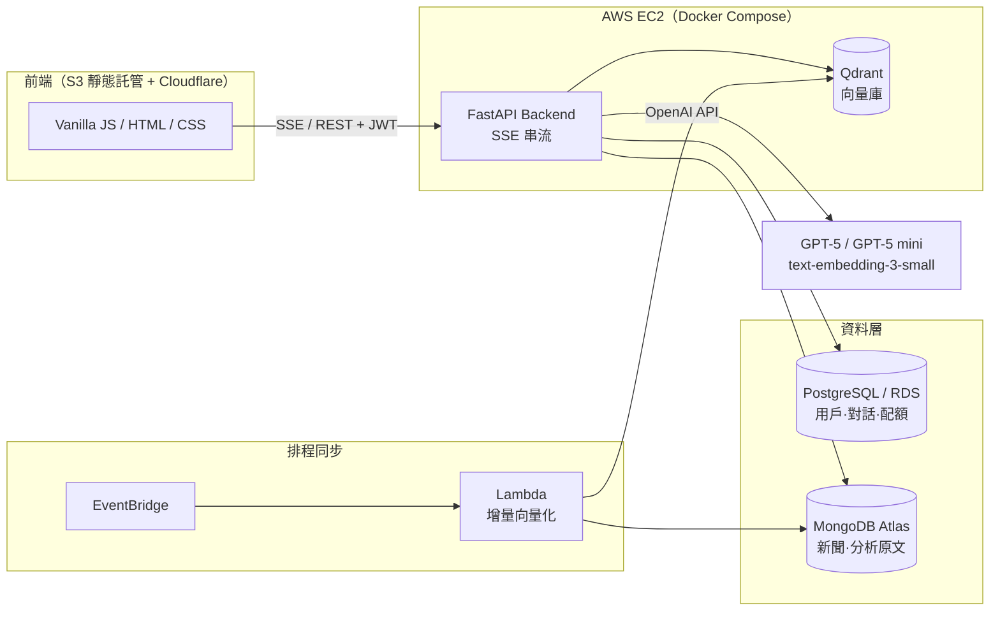

# 📈 Stock Insight Chat

> **AI 股市洞察對話平台** — 以 LangGraph 多角色 Agent + RAG（Qdrant Hybrid Search）為核心，
> 支援一般對話、即時網路搜尋與股市深度分析的全端專案（FastAPI + Vanilla JS，部署於 AWS）。

**技術重點速覽**：SSE 串流的生產者–消費者解耦｜Router/Analyst 雙模型 Agent｜Hybrid RAG（dense + BM25）｜Context 工程（Router Token ↓~75%）｜Google SSO + RT Rotation 安全設計｜Token 配額計量｜Serverless 增量向量同步

---

## 系統架構


```mermaid
flowchart LR
    subgraph Client["前端（S3 靜態託管 + Cloudflare）"]
        FE[Vanilla JS / HTML / CSS]
    end

    subgraph EC2["AWS EC2（Docker Compose）"]
        BE[FastAPI Backend<br/>SSE 串流]
        QD[(Qdrant<br/>向量庫)]
    end

    subgraph Data["資料層"]
        PG[(PostgreSQL / RDS<br/>用戶·對話·配額)]
        MG[(MongoDB Atlas<br/>新聞·分析原文)]
    end

    subgraph Sync["排程同步"]
        EB[EventBridge] --> LB[Lambda<br/>增量向量化]
    end

    FE -- "SSE / REST + JWT" --> BE
    BE --> QD
    BE --> PG
    BE --> MG
    BE -- "OpenAI API" --> LLM[GPT-5 / GPT-5 mini<br/>text-embedding-3-small]
    LB --> MG
    LB --> QD
```

### 三種對話模式

| 模式 | `chat_mode` / `response_mode` | 流程 |
| :--- | :--- | :--- |
| **一般對話** | `general` | 直連 LLM；小模型先判斷「是否需要即時資訊」，必要時才呼叫 Tavily 搜尋 |
| **股市 Agent（思考）** | `stock_agent` + `thinking` | LangGraph Router（gpt-5-mini）多輪 ReAct 調用工具 → Analyst（gpt-5）產出報告 |
| **股市 Agent（快捷）** | `stock_agent` + `flash` | 略過 Router，單輪向量檢索（可選並行 query 改寫雙軌檢索）→ 輕量 Analyst |

### 技術棧

| 層 | 技術 |
| :--- | :--- |
| 後端 | Python 3.11 · FastAPI（全非同步）· asyncpg / motor |
| Agent | LangGraph（Router–Tools–Analyst 狀態圖）· LangChain Tools |
| 向量檢索 | Qdrant（Hybrid：dense 1536 維 + BM25 sparse）· OpenAI `text-embedding-3-small` |
| 資料庫 | PostgreSQL（RDS，交易性資料）· MongoDB Atlas（新聞/分析文稿） |
| LLM | GPT-5（Analyst）· GPT-5 mini（Router / Flash）雙模型分工 |
| 部署 | 前端 S3 + Cloudflare；EC2 Docker Compose（backend + Qdrant）；Lambda + EventBridge 資料同步 |
| 認證 | Google SSO（OAuth 2.0 / OIDC）+ 自建 JWT（AT/RT）|

---

## 核心技術亮點

### 1. SSE 串流：生產者–消費者解耦（斷線仍完成持久化）

**問題**：LLM 回應需 10–30 秒，若直接在 SSE generator 內跑 LLM，使用者關頁面時 `asyncio.CancelledError` 會中斷整個回合——分析作廢、DB 沒有紀錄。

**解法**（[app/backend/api/chat.py](app/backend/api/chat.py)）：每個請求建立 `asyncio.Queue`，LLM 回合以 `asyncio.create_task()` 作為**生產者**在背景執行，SSE generator 作為**消費者**只負責 `queue.get()` → `yield`。前端斷線只會 cancel 消費者；生產者不受影響，跑完整個 LangGraph 流程並將助理訊息寫入 PostgreSQL，最後以 `put(None)` 哨兵收尾（置於 `finally` 保證送達）。

> 本質是把「對話要不要繼續產生」（業務邏輯）與「使用者有沒有在看」（連線狀態）兩件事解耦。

SSE 事件：`thinking`（Router 思考）· `tool_start` / `tool_done` · `token`（逐字輸出）· `title_update` · `done`（含執行軌跡與耗時）· `error`。

### 2. LangGraph 雙模型 Agent（Router + Analyst）

**成本結構驅動的角色拆分**（[app/backend/agent/chat.py](app/backend/agent/chat.py)）：

- **Router（gpt-5-mini）**：只做意圖辨識與工具決策，支援 ReAct 多輪（搜尋 → 根據結果再精確搜尋）；透過 system prompt 禁止其產出總結，避免便宜模型浪費 token 寫長文。
- **Analyst（gpt-5）**：拿到完整檢索資料後一次性產出投資分析報告。
- **三個 RAG 工具**：`search_stock_news`（新聞向量檢索）、`search_market_ai_analysis`（AI 產業分析檢索）、`get_market_recommendations`（鎖定 `chunk_type=stock_insight` 的結構化推薦）。三工具共用同一組 `start_date`/`end_date` 時間窗口，確保結論在時間維度一致。

### 3. RAG 檢索設計（Qdrant Hybrid Search）

**Chunking——不同資料用不同策略**（[app/backend/scripts/migrate_to_qdrant.py](app/backend/scripts/migrate_to_qdrant.py)）：

- **新聞**：`RecursiveCharacterTextSplitter`（`chunk_size=800`、`overlap=150`，優先在段落/句號斷開）；短文不切（`chunk_type=full`）；每個片段前綴 `[標題]`，確保脫離上下文仍可被正確檢索。
- **AI 分析**：按欄位語意角色拆為最多 3 個向量——`summary`（產業近況）/ `key_news`（具體事件）/ `stock_insight`（個股推薦），不做二次切割，讓不同查詢意圖命中不同角色。

**檢索**（[app/backend/tools/](app/backend/tools/)）：

- **Hybrid**：dense（語意）+ BM25 sparse（精確詞，如股票代碼「2330」）互補。
- **聚合去重**：`search_groups(group_by="mongo_id")` 防止同一篇長文多個 chunk 洗版 top-k。
- **Metadata 過濾**：時間區間（Datetime index）、股票代碼/名稱、新聞類型、情緒標籤、產業（Keyword index）。
- **相似度門檻** 0.3 過濾低相關結果；必要時由 `mongo_id` 回 MongoDB 提領全文。

**冪等資料管線**：`uuid5(mongo_id + chunk_type + chunk_idx)` 產生確定性 point ID，重跑遷移等同 upsert，永不重複寫入。

### 4. Context 工程：Router Token ↓~75%（量化優化）

**問題根因（兩層）**：① Router 每次收到完整 DB 歷史；② 同輪 ReAct 重試時，各批 ToolMessage 疊加累積，第 3 次進 Router 已含前兩批全部工具結果。

**核心洞察**：Router 只需判斷「叫哪個工具、有沒有找到資料」，不需要完整內容；Analyst 才需要。因此建立**雙軌保護架構**（[app/backend/agent/chat.py](app/backend/agent/chat.py)）：

```
ToolMessage（截斷 500 字）→ state["messages"]        → Router 判斷用（slim context）
原始完整資料              → state["retrieved_data"]  → Analyst 分析用（品質不受影響）
```

| 手段 | 作用對象 |
| :--- | :--- |
| `_slim_messages_for_router()`：Router 只看最近 2 輪歷史 | 僅 Router |
| 同輪 ToolMessage 只留最新一批（AIMessage 決策紀錄全保留，避免重複呼叫工具） | 僅 Router |
| DB 歷史中舊 Analyst 報告截斷至 800 字（[chat_context.py](app/backend/module/chat_context.py)） | Router + Analyst |
| `RETRIEVAL_TOP_K` 15 → 5 | 檢索注入量 |

**實測成果**（由 `token_usage_logs` 逐輪記錄驗證）：

| 指標 | 優化前 | 優化後 |
| :--- | :--- | :--- |
| Router 首輪 prompt tokens（長對話） | ~6,000 | ~2,000（↓67%） |
| Router 同輪重試累積 | 每批 +5k–10k | 每批 +1k–2k（↓80%） |
| Analyst prompt tokens | ~20k–43k | ~8k–15k |

### 5. 認證安全：Google SSO + JWT RT Rotation

**Token 儲存策略**（[app/backend/api/auth.py](app/backend/api/auth.py)、[app/frontend/js/auth.js](app/frontend/js/auth.js)）：

| Token | 存放位置 | 防護 |
| :--- | :--- | :--- |
| Access Token（15 分鐘） | JS 記憶體變數（不落 localStorage） | 防 XSS 竊取；驗證純 stateless 不查 DB |
| Refresh Token（7 天） | HttpOnly Cookie（`SameSite=Lax`） | JS 不可讀防 XSS；SameSite 防 CSRF |

**RT Rotation 與重放攻擊偵測**：refresh 時以 `DELETE ... WHERE token = $1 AND expires_at > NOW() RETURNING user_id` **原子消費**舊 RT——併發下只有一個請求能成功。若 DELETE 到 0 列但 RT 簽名仍有效 → 判定 **Token Reuse Attack**，立即撤銷該用戶**所有** session（無法區分駭客與本人誰先用，全撤最安全）。

**前端無縫換發三機制**：① AT 到期前 60 秒背景靜默 refresh（Timer）；② 每次請求前檢查剩餘效期 + 401 自動重試（攔截器兜底）；③ **並發鎖**共用同一個 refresh Promise——沒有它，兩個併發 401 會觸發兩次 rotation，第二次持已消費的舊 RT，被誤判為攻擊而全裝置登出。

### 6. Token 配額與商業化計量

三級訂閱（free 200k / pro 1M / ultra 5M tokens 月額度），兩道防線（[app/backend/module/usage_quota.py](app/backend/module/usage_quota.py)）：

1. **Pre-flight**：進 LangGraph 前檢查 `used_tokens >= monthly_limit` → 直接 429，不開串流。
2. **原子條件遞增**：每輪 LLM 結束時 `UPDATE ... WHERE used_tokens + delta <= limit`，與寫入 `token_usage_logs` 流水同一 transaction——高併發下不超扣，計數器（quotas）與 append-only 流水（logs）分表，兼顧高頻更新效能與對帳能力。

### 7. Serverless 增量向量同步

新聞每日進 MongoDB，由 **EventBridge 排程觸發 Lambda**（[data/lambda_function.py](data/lambda_function.py)）同步至 EC2 上的 Qdrant：

- **無狀態增量**：以 ObjectId 內含時間戳過濾「最近 N 小時」新文件，不需額外 checkpoint 存儲。
- **冪等**：確定性 UUID + upsert，重跑同一區間不產生重複向量。
- **Fail loud**：Embedding 重試耗盡直接 raise 讓 Lambda 失敗觸發告警，重跑即補齊——不做填零向量的靜默降級。

### 8. 對話歷史：Parent DAG 結構

`messages.parent_id` 自參照樹狀結構取代陣列式儲存：支援**重新生成**（多個 assistant 回答共用同一 parent，前端可做 `< 1/2 >` 版本切換）、精確溯源追問對象、防禦寫入亂序。載入 context 時以 **Recursive CTE** 從最新訊息沿 `parent_id` 回溯（上限 `CONTEXT_CHAIN_MAX_HOPS`），只取當前分支的乾淨對話鏈，不含被放棄的分支。

---

## API 概覽

| Endpoint | 說明 |
| :--- | :--- |
| `POST /api/chat` | 建立對話，取得 `chat_id` |
| `POST /api/chat/messages` | 發送訊息，回應為 SSE 串流（`chat_mode` / `response_mode` 選擇模式） |
| `GET /api/user/auth/google/start` → `/callback` | Google OAuth 流程（state 防 CSRF） |
| `POST /api/user/refresh` | RT Rotation 換發 AT |
| `POST /api/user/feedback` | 使用者回饋（含 Token 獎勵與每日上限） |

完整規格：[specifications/api_spec.md](specifications/api_spec.md)

---

## 快速開始

```bash
# 1. 設定環境變數（OPENAI_API_KEY、DATABASE_URL、MONGO_URI、Google OAuth 等）
#    完整清單見 specifications/env.md
cp .env.example .env  # 或手動建立

# 2. 啟動 backend + Qdrant + frontend
docker-compose -f ./deploy/docker-compose.yml up -d

# 3. 初始化 Qdrant 並遷移向量資料
python3 app/backend/scripts/setup_qdrant.py
python3 app/backend/scripts/migrate_to_qdrant.py --limit 100

# 4. 開啟 http://localhost/login.html（Google SSO 登入）
```

### 測試

```bash
pytest test/backend/api/ -s              # API 測試
pytest test/backend/test_news.py -s      # 檢索工具單元測試
python test/prompt_injection_test.py     # Prompt Injection 安全測試
```

---

## 深入文件

| 文件 | 內容 |
| :--- | :--- |
| [specifications/readme_full_details.md](specifications/readme_full_details.md) | **完整版 README**：所有優化細節、環境變數全表、維運 SQL、Flash 模式調參 |
| [specifications/agent_spec.md](specifications/agent_spec.md) | Agent 架構與 LangGraph 狀態圖 |
| [specifications/api_spec.md](specifications/api_spec.md) | API 完整規格與 SSE 事件 |
| [specifications/database_spec.md](specifications/database_spec.md) | PostgreSQL Schema 與 ERD |
| [specifications/tools_spec.md](specifications/tools_spec.md) | RAG 工具與 Qdrant 檢索細節 |
| [specifications/auth_system_spec.md](specifications/auth_system_spec.md) | JWT / SSO 認證設計 |
| [specifications/aws_production_deploy.md](specifications/aws_production_deploy.md) | AWS 生產部署（S3 + EC2 + Lambda） |

---
*Last Update: 2026-07-19*
