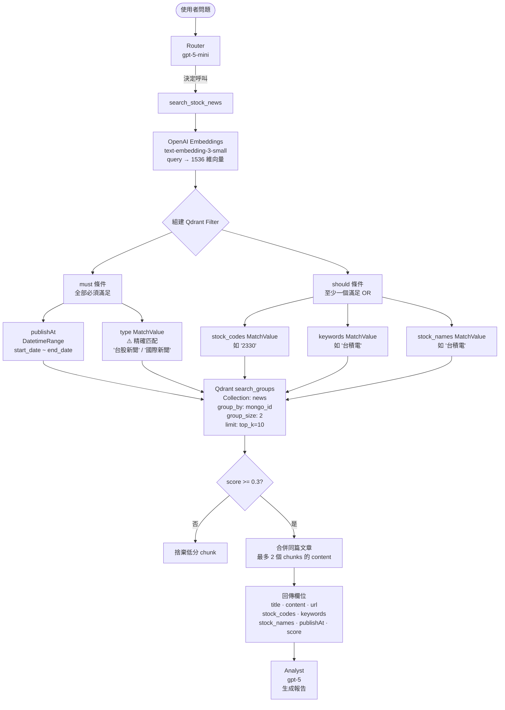
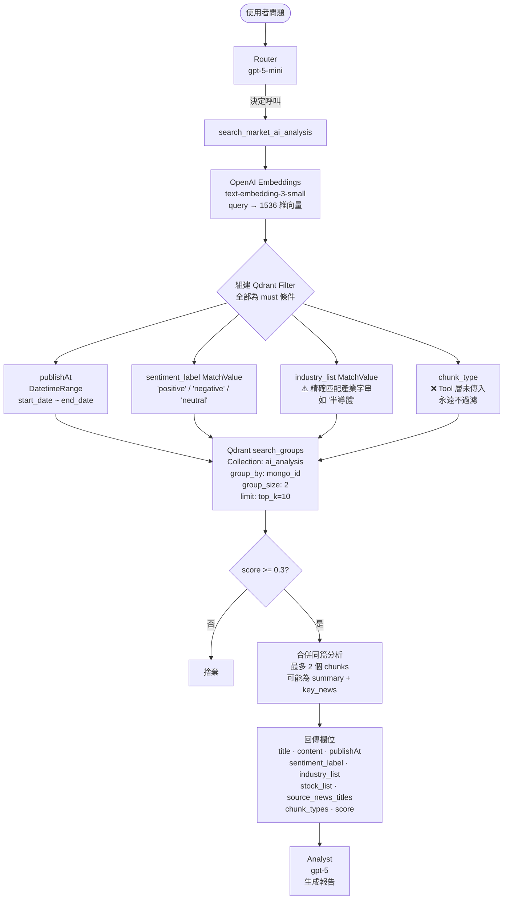
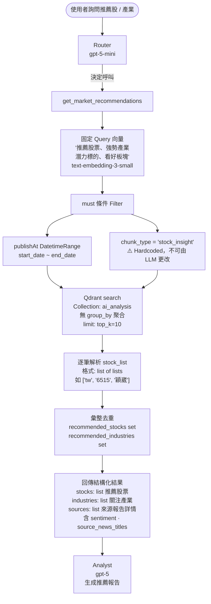
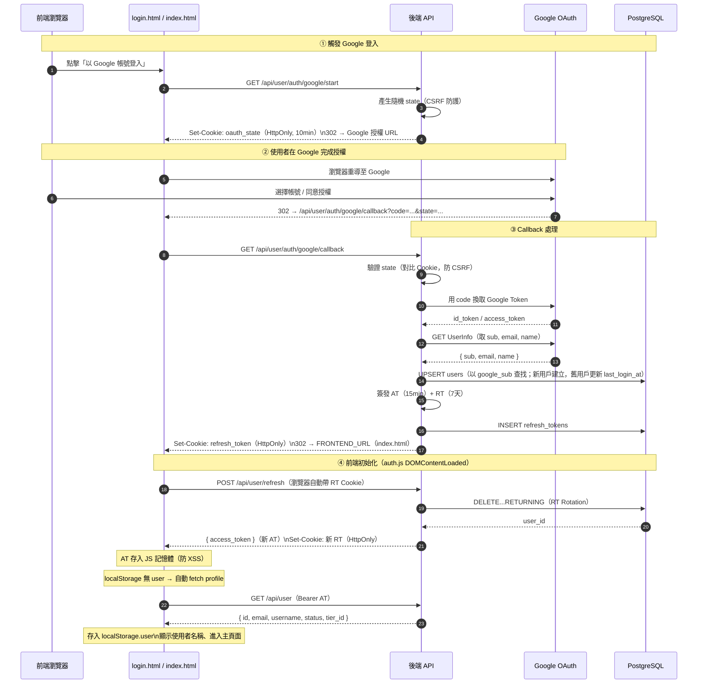
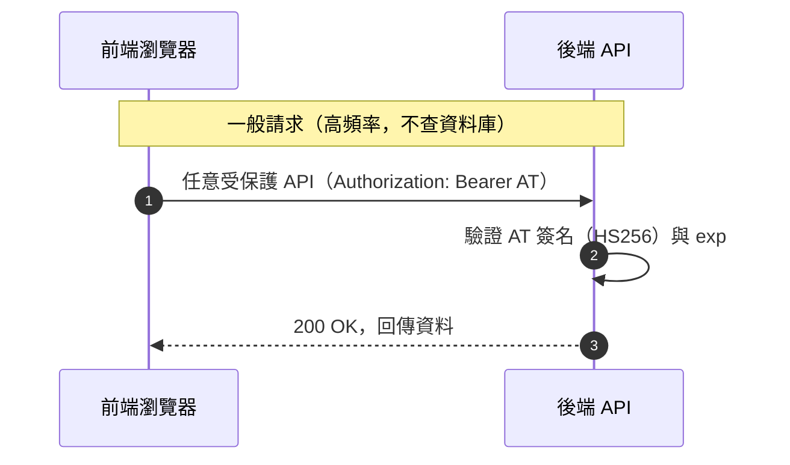
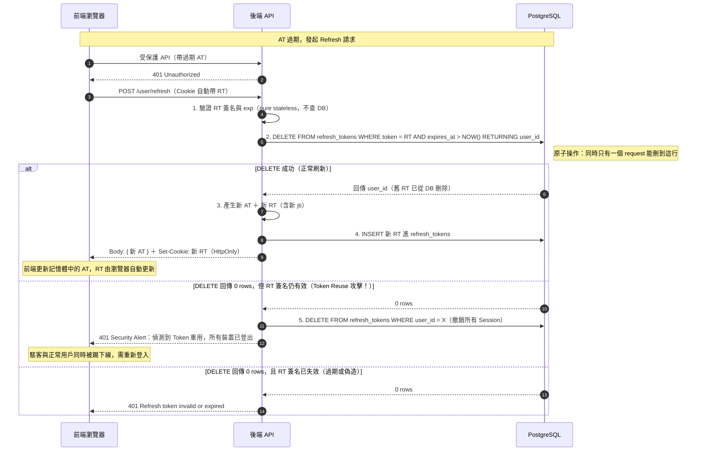
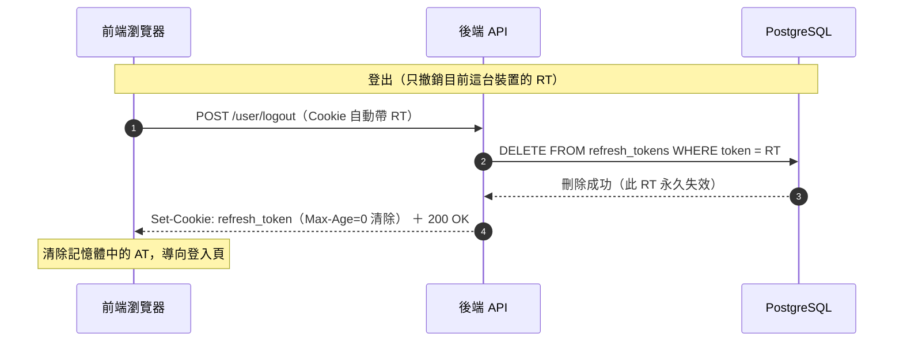

# 📈 Stock Insight Chat

[](https://github.com/WilliamTsai1227/Stock-Insight-Chat)
[](https://github.com/WilliamTsai1227/Stock-Insight-Chat)

> **股市洞察生成式聊天系統** —— 結合即時新聞、AI 產業分析與企業財報的智慧對話助手。

##  系統概覽

Stock Insight Chat 是一套專為投資者設計的 AI 智能對話系統。它不僅能理解使用者的提問，更能主動調用專業工具，從海量的新聞數據與 AI 分析報告中檢索關鍵片段（RAG），並結合企業歷史財報，提供具備深度見解的投資分析。

---

## 優化

本節整理近期對**延遲、穩定性與行動端體驗**的調整與對應程式位置，便於維運與 code review。

### 後端架構重構（`app/backend/api/chat.py`）

- **`asyncio.Queue` 生產者–消費者模式**：`POST /api/chat/messages` 以背景任務 **`background_agent_runner()`**（生產者）執行 LangGraph（`agent_app.astream_events`）、將 SSE 事件寫入 **`event_queue`**；**`event_generator()`**（消費者）僅負責 `yield` 佇列內容。Agent 回合與 HTTP 串流生命週期解耦。
- **前端斷線仍完成持久化**：消費者若因 **`asyncio.CancelledError`**（例如瀏覽器關閉連線）結束，**不會終止**已 `create_task` 的背景任務；生產者仍會跑到圖走完，並呼叫 **`_insert_assistant_message`** 等將助理訊息寫入 **PostgreSQL**，最後以 **`event_queue.put(None)`** 作為結束標記。

示意（節錄，`app/backend/api/chat.py`）：

```python
event_queue = asyncio.Queue()

async def background_agent_runner():
    try:
        async for event in agent_app.astream_events(...):
            # ... router / tools / analyst 事件 → event_queue.put(_sse(...))
        await event_queue.put(_sse("done", {...}))
        await _insert_assistant_message(...)
    finally:
        await event_queue.put(None)

asyncio.create_task(background_agent_runner())

async def event_generator():
    try:
        while True:
            msg = await event_queue.get()
            if msg is None:
                break
            yield msg
    except asyncio.CancelledError:
        # 前端斷線：背景任務仍繼續執行並寫入 DB
        raise
```

---

### 移動端與 UI 修復（frontend）

- **鍵盤／視區與 fixed 版面**：`.app-container` 使用 **`100vh` + `100dvh`** 與 **`width/max-width: 100%`**，減少行動瀏覽器網址列與虛擬鍵盤造成的溢出；`**@media (max-width: 1024px)**` 內對 **`.chat-input-area`**、`env(safe-area-inset-*)` 調整留白，並搭配側欄抽屜、`min-width: 0` 的 flex 子項等，緩解小螢幕跑版（`app/frontend/css/index.css`）。
- **智慧自動捲動**：`chat-messages` 的 `scroll` 監聽以距離底部的閾值更新 **`isUserScrolledUp`**；**`scrollToBottom`** 在非 **`force`** 時若使用者已往上讀舊訊息則不拉回底部；並以 **`targetChatId`** 對齊目前對話，**切換對話時**不會錯頻捲動（`app/frontend/js/index.js`）。
- **Google SSO 登入**：登入頁（`login.html`）移除 email/password 表單，改為單一「以 Google 帳號登入」按鈕。點擊後導向後端 `/api/user/auth/google/start`，完成 OAuth 流程後自動取得 AT 並 fetch 用戶資料（`app/frontend/js/login.js`、`app/frontend/js/auth.js`）。
- **複製回答（非 HTTPS 降級）**：優先 **`navigator.clipboard.writeText`**（需安全上下文）；否則以隱藏 **`textarea`** + **`document.execCommand('copy')`**，方便區網 **HTTP** 等環境仍可複製（`app/frontend/js/index.js` 內 **`copyToClipboard`**）。

---

### 大幅縮減 Context（降低延遲與用量）

檢索參數 **`RETRIEVAL_TOP_K`** 由 **15** 調為 **5**：每次工具（如向量搜尋新聞）取回並累積進 **`retrieved_data`**／注入 Analyst 的筆數上限跟著下降，進而減少 Token 與後續 Router／Analyst 成本（`app/backend/agent/chat.py` 頂部常數 **`RETRIEVAL_TOP_K`**，並由 **`call_tools` → search_news／search_ai_analysis 等 `top_k=`** 使用）。

---

### 「封印 Router 冗長總結」— 將整理交給 Analyst

過去 Router 在「不再呼叫工具」時可能輸出大段摘要，徒增 **輸入 token／延遲**（例如長時間卡在 Router 最後一步）。如今在 Router 的 **system_prompt**（**`call_router`** 內組字串）強制規則：

> 當已蒐集足夠資料、決定不呼叫任何工具時，**不得**自行撰寫新聞摘要或報告，**僅需**輸出固定短句：**「資料已備齊，交給 Analyst 進行分析」**。

實際長文交由 **`call_analyst`** 與 **【完整參考資料】** 區塊處理；trace 仍可透過 **`thought`** 顯示該句，避免 Router 預先生成冗長內容。程式位置：**`app/backend/agent/chat.py`** — **`call_router`** 組裝之 **`system_prompt`** 中「**嚴禁產出總結**」一條，以及 **`RETRIEVAL_TOP_K`** 與 **`call_tools`** 的對應關係。

---

### Router Context Explosion 修復（降低 Router Token 用量）

**根因（兩層）**：

1. **歷史層**：Router 每次呼叫收到完整 DB 歷史（`CONTEXT_CHAIN_MAX_HOPS` 控制），若歷史長則 prompt 肥大。
2. **同輪累積層**：同一個 user query 內，若 Router 重試多次（Router→Tools→Router→Tools），每輪的 ToolMessages 會**疊加**進 `state["messages"]`，第 3 次進 Router 時就包含前兩批工具結果，造成 token 暴增。

**核心洞察**：Router 的工作只是「判斷要叫哪些工具」與「工具是否找到資料」，不需要閱讀完整對話脈絡；Analyst 才需要完整歷史來撰寫分析報告。因此建立 **雙軌保護架構**：

```
ToolMessage（精簡 800 chars）  → state["messages"]      → Router 判斷用（slim context）
原始完整資料                    → state["retrieved_data"] → Analyst 分析用（完整正文）
```

**修改項目**：

1. **新增 `_slim_messages_for_router()`**（`app/backend/agent/chat.py`）  
   Router 只傳入「最近 `ROUTER_HISTORY_TURNS`（預設 2）輪歷史」+ 本輪精簡訊息；Analyst 節點的 `call_analyst` 維持接收完整 `messages`，不受影響。

   ```python
   # call_router 內（修改後）
   slim_msgs = _slim_messages_for_router(messages)  # 只留最近 2 輪歷史 + 本輪精簡版
   router_prompt = [SystemMessage(content=system_prompt)] + slim_msgs
   ```

2. **同輪 ToolMessages 只保留最新一批**（`_slim_messages_for_router` 內，方向 A）  
   Router 重試時，舊批次的 ToolMessages 從 Router prompt 中丟棄，只保留**最新一批**工具結果。所有 AIMessage（Router 的決策記錄）仍完整保留，讓 Router 知道自己已試過哪些工具。

   ```
   Before（Router 第 3 次）：
     HumanMsg | AIMsg(calls=A) | ToolMsg_A1 ToolMsg_A2 | AIMsg(calls=B) | ToolMsg_B1
   After：
     HumanMsg | AIMsg(calls=A) |                       | AIMsg(calls=B) | ToolMsg_B1
   ```

3. **`MAX_TOOL_ITEM_CHARS`：`1200` → `800`**（`app/backend/agent/chat.py`）  
   ToolMessage 的截斷上限再降；Router 只需確認「有無找到資料」，截斷版已足夠。Analyst 透過 `retrieved_data` 拿到未截斷原文，分析品質不變。

4. **`CONTEXT_CHAIN_MAX_HOPS` 預設值：`10` → `6`**（`app/backend/module/chat_context.py`）  
   從 DB 載出的歷史訊息數量上限降低。**注意**：若 `.env` 已設定此變數（如 `CONTEXT_CHAIN_MAX_HOPS=2`），則 `.env` 值優先，程式碼預設值不生效。

5. **DB 歷史中的 Analyst 回答截斷**（`app/backend/module/chat_context.py`）— **實測後補強**  
   即使 `CONTEXT_CHAIN_MAX_HOPS=2` 只載入 3 則歷史，每則 Analyst 報告本身就高達 10,000+ chars（~3000 tokens），仍會把後續 Router 基礎 prompt 拉高到 5000–6000 tokens。  
   在 `rows_to_langchain_messages()` 中對 `assistant` 角色截斷至 `HISTORY_ASSISTANT_MAX_CHARS`（預設 800 chars ≈ 200 tokens）：  

   ```python
   # 修改後
   if len(content) > HISTORY_ASSISTANT_MAX_CHARS:
       content = content[:HISTORY_ASSISTANT_MAX_CHARS] + "\n\n…（舊對話已截斷）"
   out.append(AIMessage(content=content))
   ```

   Router 與 Analyst 只需知道上一輪討論的主題即可；本輪 Analyst 的分析素材來自 `retrieved_data`（當輪新搜尋結果），不依賴舊報告內容，**分析品質不受影響**。

**可調整的環境變數**：

| 變數 | 預設（code） | 說明 |
|---|---|---|
| `ROUTER_HISTORY_TURNS` | `2` | Router 保留幾輪跨對話歷史（每輪 = 1 問 + 1 答） |
| `CONTEXT_CHAIN_MAX_HOPS` | `6`（`.env` 優先） | 從 DB 往上遞迴幾步載歷史訊息 |
| `HISTORY_ASSISTANT_MAX_CHARS` | `800` | DB 歷史中 Analyst 回答的截斷字元上限 |
| `FLASH_SKIP_ROUTER` | `1`（略過規劃 LLM） | 快捷：**`0`** 時會呼叫 Router（較慢，可細調檢索關鍵字） |
| `FLASH_ANALYST_MODEL` | `gpt-5-mini` | 快捷模式 Analyst 用模型 |
| `FLASH_ANALYST_MAX_TOKENS` | `2800` | 對應 API 的 **`max_completion_tokens`**。`gpt-5`／`gpt-5-mini` 會先消耗內部推理 token，數值過小時**可見正文可能只剩標題一二句**；設為空字串則不傳上限（較長但較慢） |
| `FLASH_RETRIEVAL_TOP_K` | `10` | 快捷 **`search_news`** 每輪向量取回上限（思考模式仍用程式內 `RETRIEVAL_TOP_K`） |
| `FLASH_REF_MAX_BODY_CHARS` | `2200` | 快捷注入 Analyst【完整參考資料】時每段正文長度上限 |
| `FLASH_DATE_RANGE_DAYS` | `80` | 快捷 `search_stock_news` 預設 `start_date`／`end_date` 區間跨度（回溯天數） |
| `FLASH_LLM_QUERY_REWRITE` | `0` | 快捷：`1` 時在檢索前用小模型（`FLASH_REWRITE_MODEL`）將使用者問句收成檢索用 query（JSON）。預設關閉以免額外延遲／成本 |
| `FLASH_REWRITE_DUAL_SEARCH` | `1` | 與 `FLASH_LLM_QUERY_REWRITE=1` 時：`1`＝原文與改寫結果**各搜一次並合併去重**（牆鐘時間通常接近兩次檢索中較慢者）；`0`＝僅依改寫結果搜一次 |
| `FLASH_REWRITE_MODEL` | `gpt-4o-mini` | 問句收成用模型 ID（請以你環境可用者為準） |
| `FLASH_REWRITE_MAX_COMPLETION_TOKENS` | `256` | 改寫請求的 `max_completion_tokens`（宜小以降低延遲） |
| `FLASH_REWRITE_TIMEOUT_SEC` | `12` | 改寫 LLM 逾時秒數；逾時時並行模式下仍會完成原版向量搜尋，改寫第二軌視同略過 |
| `FLASH_MERGED_RETRIEVE_CAP` | `max(k×2,16)`，`k`= `FLASH_RETRIEVAL_TOP_K` | **雙軌並搜**合併後最多保留幾段參考，避免 Analyst 前文過長拖慢收尾 |

**各參數控制範圍對照**：

| 參數 | 控制哪個 LLM | 說明 |
|---|---|---|
| `CONTEXT_CHAIN_MAX_HOPS` | Router + Analyst **共用** | 控制從 DB 撈幾則進 `state["messages"]`，兩者都受影響 |
| `HISTORY_ASSISTANT_MAX_CHARS` | Router + Analyst **共用** | DB 歷史舊報告截斷，避免舊 Analyst 回答膨脹後續 prompt |
| `ROUTER_HISTORY_TURNS` | **僅 Router** | 在已載入的 messages 裡再裁切 Router 看的歷史輪數 |
| 方向 A（同輪 ToolMessage 裁切） | **僅 Router** | Router 重試時只看最新一批工具結果，Analyst 不受影響 |

**預期效果（含本次補強）**：

| 指標 | 優化前 | 優化後（估計） |
|---|---|---|
| Router 第 1 次 prompt tokens（長對話） | ~6000 | ~2000（↓ ~67%，主因：舊報告截斷） |
| Router 同輪重試 token 累積 | 每批 +5k–10k | 每批 +1k–2k（↓ 約 80%，主因：方向 A） |
| Analyst prompt tokens | ~20k–43k | ~8k–15k |
| Analyst 分析品質 | ✅ | ✅ 不變（retrieved_data 雙軌保護） |

---

##  快速開始 (Quick Start)


### 0. 進入網站測試 (Frontend)
本專案前端為 **純 HTML/CSS/JS**，由 Docker 內的 **Nginx** 提供服務（`frontend`，預設對外 `80` port）。

- **登入頁**: [http://localhost/login.html](http://localhost/login.html)
- **主頁**: [http://localhost/index.html](http://localhost/index.html)
- **後端健康檢查**: [http://localhost:8000/](http://localhost:8000/)

#### 測試帳號 (Development Only)
> [!WARNING]
> 以下帳號僅供本機/開發測試使用，請勿用於正式環境或公開部署。

- **Username**: `test`
- **Email**: `test@mail.com`
- **Password**: `1qaz!QAZ`

### 1. 啟動基礎設施
透過 Docker Compose 啟動 Qdrant 向量資料庫與 PostgreSQL（請在**專案根目錄**執行，即與 `./deploy/` 同層）：

```bash
# 一般啟動（會沿用現有映像；若 Dockerfile 無變更就不會重做映像）
docker-compose -f ./deploy/docker-compose.yml up -d
```

若你希望**不依賴 build cache**，強迫從頭建置映像（例如懷疑某層仍是舊的，或確認後端有吃到最新程式）：

```bash
docker-compose -f ./deploy/docker-compose.yml build --no-cache
docker-compose -f ./deploy/docker-compose.yml up -d
```

> **`up --build` 與 `build --no-cache` 的差別：** `docker-compose … up --build -d` 會在必要時重建映像，但**預設仍會使用 Docker 的 layer cache**。只有對 `build`（或等同的 `--no-cache` 選項）下 `--no-cache` 時，才不會套用快取的建置層。Compose 並沒有 `up … --no-catch`；正確拼法是 **`--no-cache`**，且為 `build` 子命令的選項。

#### 常用 Docker Compose 指令速查
```bash
# 啟動所有服務 (背景執行)
docker-compose -f ./deploy/docker-compose.yml up -d

# 重建並啟動所有服務 (程式碼有更新時使用；仍會使用 build cache)
docker-compose -f ./deploy/docker-compose.yml up --build -d

# 不依 cache 強制重建映像後再起（等同上面兩行分開寫）
docker-compose -f ./deploy/docker-compose.yml build --no-cache
docker-compose -f ./deploy/docker-compose.yml up -d

# 追蹤單一服務 logs
docker-compose -f ./deploy/docker-compose.yml logs -f <service name>

# 停止容器 (保留容器/資料)
docker-compose -f ./deploy/docker-compose.yml stop

# 停止並移除容器/網路 (volume 預設保留)
docker-compose -f ./deploy/docker-compose.yml down
```

#### 重置本機 PostgreSQL（重新執行 `init_db.sql`）

PostgreSQL 官方映像**只在資料目錄為空的首次初始化**時，會執行 `docker-entrypoint-initdb.d` 內掛載的 `app/backend/database/init_db.sql`。若本機曾啟動過 Compose 並保留了具名 volume（例如 `db_data`），之後即使執行 `docker-compose … up --build`，**也不會再自動重跑**該腳本。

當你可以接受**清空本機資料庫與相關持久化資料**時，可先刪除 volumes 再啟動，讓 Postgres 重新初始化並套用 `init_db.sql`：

```bash
docker-compose -f ./deploy/docker-compose.yml down -v
docker-compose -f ./deploy/docker-compose.yml up --build -d
```

> [!WARNING]
> `down -v` 會一併刪除 Compose 檔案中宣告的**所有具名 volume**（含 `db_data` 與 Qdrant 的 `qdrant_storage` 等），向量與對話資料都會消失。僅在開發環境且確認可重建資料時使用。

**不建議**在每次「小幅度更新專案或 schema」都執行上述流程；日常 schema 演進應以 migration 或受控 SQL 更新為主，避免誤刪正式或需保留的資料。

### 1-1. 重啟後端服務 (Restarting Backend)
若你修改了後端程式碼（如 `chat.py` 或 `news.py`），需要重新構建 Image 並重啟容器：
```bash
docker-compose -f ./deploy/docker-compose.yml up -d --build backend
```
> [!TIP]
> 使用 `--build` 參數確保 Docker 讀取最新的程式碼變動。

### 2. 環境設定
在專案根目錄建立或編輯 `.env` 檔案，確保包含以下必要的配置：
```bash
# AI Provider
OPENAI_API_KEY=sk-your-key-here

# MongoDB (資料來源)
MONGO_URI=mongodb://localhost:27017
MONGO_DB=stock_insight

# Qdrant (向量目標)
QDRANT_HOST=localhost
QDRANT_PORT=6333

# ── 快捷模式（選用）：檢索前「問句收成」用小模型 ──詳見下方 #### 快捷模式 小節
# （程式預設收成關閉。若要開啟：取消下列三行前綴 `#`）
# （不啟用可整段省略，或將 FLASH_LLM_QUERY_REWRITE=0）
# FLASH_LLM_QUERY_REWRITE=1        # 1＝開啟：檢索前以小模型將使用者發話收成向量檢索用 query（JSON）；0／不設定＝關閉
# FLASH_REWRITE_DUAL_SEARCH=1       # 1＝收成開啟時：原文問句與收成後 query 各搜一次、結果合併去重（牆鐘通常不等於「改寫時間＋兩倍檢索」相加）；0＝只依收成後問句搜一次
# FLASH_REWRITE_MODEL=gpt-4o-mini   # 收成步驟使用的模型 ID（請改為你環境可用的便宜／小模型）
```

**問句收成三變數說明**：下表「範例設定」為「若你要啟用問句收成」時常見的 `.env` 寫法，**並非程式必填**；程式內預設值仍以本節下方完整表格為準。

| 變數 | 範例設定 | 意義 |
|------|----------|------|
| `FLASH_LLM_QUERY_REWRITE` | `1` | **要不要**在向量新聞檢索**之前**，多打一個「小／便宜」的 LLM，把使用者隨口的說法收成較適合向量庫用的檢索 `query`（程式要求模型回傳 JSON，含 `{"query":"..."}`）。`1`＝開；`0` 或不設定＝不做這一步（為程式預設）。 |
| `FLASH_REWRITE_DUAL_SEARCH` | `1` | 當 `FLASH_LLM_QUERY_REWRITE` 為開時：**要不要**跑「雙軌」檢索——**同時**以使用者原文問句搜向量庫、並等小模型收成；若收成結果與原文不同，再以收成後的 `query` 搜第二次，並把兩批結果**合併**、依 **`mongo_id` 去重**。`1`＝並行／雙軌（牆鐘時間通常比「收成完才開始第一次檢索」省很多，但向量查詢約變為兩次）；`0`＝只吃收成後那條 `query` **搜一次**。 |
| `FLASH_REWRITE_MODEL` | `gpt-4o-mini` | **收成這一步**要呼叫哪個 Chat 模型（請選帳號上相對**便宜、快**的名稱，且須與 OpenAI／供應商 API 所列一致）。**最後作答**仍可另由 `FLASH_ANALYST_MODEL` 指定模型，不一定要與收成用同一顆。 |

小提醒：**變數行尾的空白**在大多數環境不影響解析；若想檔案整齊，可去掉值後多餘空白（例如 `gpt-4o-mini ` → `gpt-4o-mini`）。

#### 雙軌檢索策略（`FLASH_REWRITE_DUAL_SEARCH`）

> 僅在 **`FLASH_LLM_QUERY_REWRITE=1`**（問句收成已開啟）時有意義；收成關閉時此變數不生效。

| 值 | 模式 | 行為 |
|----|------|------|
| **`1`**（預設） | **雙軌／並行** | **同時**做：① 用**原文**搜向量庫 ② 用 `FLASH_REWRITE_MODEL`（預設 `gpt-4o-mini`）收成問句。若收成成功且結果與原文**字串不同**（各先 `.strip()` 比對），再以收成後的 `query` **搜第二次**；兩批結果經 `_merge_news_retrieved` **合併、去重**。牆鐘時間通常接近「較慢的那條路」，而不是「收成時間 + 兩次檢索」完全相加。 |
| **`0`** | **單軌／循序** | **先**等收成完成，**只**用收成後的 `query` 搜**一次**（收成失敗／逾時／解析失敗則退回原文）。較省向量查詢次數，但無「原文並行保底」；牆鐘 ≈ 收成時間 + 一次檢索。 |

**何時會跑第二次搜尋？**（雙軌 `=1` 時，三者須同時成立；實作見 `app/backend/agent/flash_pipeline.py`）

1. 收成 LLM **成功回覆**（未逾時、未 API 錯誤）
2. 從 JSON 解析出的 `query` **非空**
3. 收成字串 **≠** 使用者原文（純字串相等比較，非語意相似度）

若 LLM 回傳與原文相同、解析失敗或逾時，則**不**跑第二次，僅保留第一次（原文）搜尋結果 `r_orig` 作為保底。

**雙軌流程圖**（`FLASH_LLM_QUERY_REWRITE=1` 且 `FLASH_REWRITE_DUAL_SEARCH=1`）：

```
使用者問句
    │
    ├─ 第 1 次搜尋（原文）─────────→ r_orig  [最多 FLASH_RETRIEVAL_TOP_K 篇，預設 10]
    │
    └─ 4o-mini 收成 → 若 query 與原文不同
           │
           └─ 第 2 次搜尋（收成 query）→ r_rw   [最多 FLASH_RETRIEVAL_TOP_K 篇]
                    │
                    ▼
         _merge_news_retrieved(r_orig, r_rw, cap=FLASH_MERGED_RETRIEVE_CAP)
                    │
         ┌──────────┴──────────┐
         │ 1. 先保留 r_orig 全部 │
         │ 2. 再補 r_rw 新篇     │
         │ 3. 依 mongo_id 去重   │
         │ 4. 最多 cap 篇        │  ← 預設 max(TOP_K×2, 16)，TOP_K=10 時為 20
         └──────────┬──────────┘
                    ▼
         build_flash_analyst_messages（每篇正文截 FLASH_REF_MAX_BODY_CHARS 字）
                    ▼
              FLASH_ANALYST_MODEL 作答（預設 gpt-5-mini）
```

**合併去重重點**（`_merge_news_retrieved`，`app/backend/agent/flash_pipeline.py`）：

| 問題 | 答案 |
|------|------|
| 第一次結果會被採納嗎？ | **會**，且排在前面、優先保留 |
| 第二次結果呢？ | **會**，只補第一次沒有的新聞 |
| 兩次都搜到同一篇？ | **只留第一次那份**（依 `mongo_id` 去重；無 `mongo_id` 時退而用 `title` + `publishAt`） |
| 會重新依分數排序嗎？ | **不會**，維持「第一次順序 + 第二次新增」 |
| 最多幾篇？ | `FLASH_MERGED_RETRIEVE_CAP`（預設 `max(FLASH_RETRIEVAL_TOP_K×2, 16)`） |

> **設計取捨**：雙軌的本質是 **第一次當主結果 + 第二次當補充召回**，不是「第二次取代第一次」。若收成 query 幾乎每次都與原文不同，牆鐘時間通常**不會**比單軌（收成 → 只搜一次）更快，但會多一次向量查詢；換取的是原文保底與更廣的召回。想壓低成本可設 `FLASH_REWRITE_DUAL_SEARCH=0`。

#### 快捷模式（`response_mode: flash`）相關 `.env` 變數（選用）

下列變數**僅影響快捷模式**；程式內皆已有預設值，**不必**為了啟用快捷而強制寫入 `.env`。只有當你要**覆寫**預設（換模型、調速度／品質權衡、改檢索區間等）時，再在專案根目錄的 `.env` 中新增即可。修改後請重啟後端（或重建容器）讓環境變數生效。

**內建預設（與程式一致）** — 若你希望 `.env` 與目前程式預設對齊，可照下表填寫：

| 變數 | 建議填入（= 目前程式預設） | 簡短說明 |
|------|---------------------------|----------|
| `FLASH_SKIP_ROUTER` | `1` | `1`＝略過 Router LLM（較快）；`0`＝啟動 Router 協助改寫檢索關鍵字（較慢） |
| `FLASH_ANALYST_MODEL` | `gpt-5-mini` | 快捷模式 Analyst 使用的模型 |
| `FLASH_ANALYST_MAX_TOKENS` | `2800` | 對應 **`max_completion_tokens`**。`gpt-5-mini` 等會先耗用推理 token，設太小會**只剩標題／半句可見正文**。**不設定**或**空白**＝不傳上限 |
| `FLASH_RETRIEVAL_TOP_K` | `10` | **`search_news`（快捷）** 每輪取回筆數；思考模式不依此變數 |
| `FLASH_REF_MAX_BODY_CHARS` | `2200` | 每段「參考正文」注入 Analyst【完整參考資料】前的截斷上限；字數愈少通常愈快 |
| `FLASH_DATE_RANGE_DAYS` | `80` | 快捷兩工具預設 `start_date`／`end_date` 的回溯天數；不寫入時同樣為 `80` |
| `FLASH_LLM_QUERY_REWRITE` | `0` | `1`＝檢索前以小模型收成 query；預設關閉 |
| `FLASH_REWRITE_DUAL_SEARCH` | `1` | `1`＝並行／雙軌搜尋＋合併去重（較不保證最便宜，但不把延遲變成「改寫＋檢索」完全相加） |
| `FLASH_REWRITE_MODEL` | `gpt-4o-mini` | 收成用模型 |
| `FLASH_REWRITE_MAX_COMPLETION_TOKENS` | `256` | 收成回覆 token 上限 |
| `FLASH_REWRITE_TIMEOUT_SEC` | `12` | 收成逾時（秒） |
| `FLASH_MERGED_RETRIEVE_CAP` | `max(FLASH_RETRIEVAL_TOP_K×2,16)` | 雙軌合併後參考上限 |

> **為什麼回答只有一兩行？**  
> `.env` 若仍是 **`FLASH_ANALYST_MAX_TOKENS=900`**（或其他過小數值），在 **`gpt-5-mini`** 上很常發生：**`max_completion_tokens` 多半先被內部推理用掉**，對使用者可見的段落幾乎寫不完，看起來像只有標題＋半截句子。請改 **`2800` 或以上**、或**刪除此變數／留空**讓程式用新預設或不設上限。

**什麼時候才需要在 `.env` 加上述變數？**

- **想換模型**：例如 `FLASH_ANALYST_MODEL=gpt-4o-mini`（以你帳號／供應商實際可用模型為準）。
- **想要品質、可接受較慢**：例如 `FLASH_SKIP_ROUTER=0`、將 `FLASH_ANALYST_MAX_TOKENS` 調大、將 `FLASH_RETRIEVAL_TOP_K` 調大。
- **想再壓低延遲**：例如略降 `FLASH_RETRIEVAL_TOP_K`、`FLASH_REF_MAX_BODY_CHARS`。若曾開 **`FLASH_LLM_QUERY_REWRITE=1`**，可改 **`FLASH_REWRITE_DUAL_SEARCH=0`**（只搜一次較便宜）或將 **`FLASH_MERGED_RETRIEVE_CAP`** 調小。（**請勿對 `gpt-5-mini`** 將 `FLASH_ANALYST_MAX_TOKENS` 設得過低，否則可見正文極易被截斷。）

**結論**：不必為了「有預設值」而把整張表複製進 `.env`；依需求只覆寫少數鍵即可。其餘 Router／歷史載入相關變數仍見前文「可調整的環境變數」表格。

### 3. Python 環境安裝
建議使用 **Python 3.11** 版本（Python 3.13 仍有套件相容性問題）：
```bash
# 建立虛擬環境
python3.11 -m venv venv
source venv/bin/activate

# 安裝依賴
pip install -r app/backend/requirements.txt
```

### 4. 執行資料遷移 (Migration)

將 MongoDB 內文稿轉為 Qdrant 向量點並建立索引。**依目的不同**，分成兩種流程（請擇一參照）：

---

#### 情境一：清空並重建 Qdrant（Hybrid 結構對了，但資料庫要換空／改 schema）

適用：**第一次建庫**、**升級過 `setup_qdrant.py` 定義後需整庫對齊**、**確認要刪掉既有向量再重灌**。注意：`--reset` 會**刪除** `news` 與 `ai_analysis` 底下**所有 points**。

```bash
# 1) 刪除既有 collection，依腳本重建（互動確認 y）
python3 app/backend/scripts/setup_qdrant.py --reset

# 2) 確認 Mongo 文稿切分與程式無誤（不呼叫 Embedding API、不寫入 Qdrant）
python3 app/backend/scripts/migrate_to_qdrant.py --dry-run --limit 10

# 3) 正式寫入向量（數量可自行調整：100 為各 collection 至多處理的「最新 N 篇」，依 mongo sort）
python3 app/backend/scripts/migrate_to_qdrant.py --limit 100

# 4) 可選：跑過濾／聚合檢查
python3 app/backend/scripts/test_qdrant_filter.py
```

完成情境一後，Qdrant 即為**結構與資料皆由腳本當時版本決定的一套乾淨庫**。若之後只新增 Mongo 文檔、未改動切分程式，通常改走**情境二**即可補資料。

---

#### 情境二：日常維運（collection 已在、不重灌整庫）

**什麼時候執行 `setup_qdrant.py`（不加 `--reset`）？**

| 時機 | 說明 |
| :--- | :--- |
| **新環境／剛架起 Qdrant、尚無 collection** | 只做「建 bucket + payload 索引」，不刪資料。 |
| **從 repo 拉了新版 `setup_qdrant.py`、多了欄位要建索引** | 再跑一次可補 `create_payload_index`；collection 若已存在則跳過重建。 |
| **想確認 Hybrid 是否正常** | 可看腳本輸出的**結構驗證**區塊。 |

**不一定要每天跑**；Qdrant 若已存在且無 schema 異動可略過。

**什麼時候執行 `migrate_to_qdrant.py`？**

| 指令 | 時機 |
| :--- | :--- |
| `--dry-run --limit 10` | 改過切分、`chunk_news_document`／payload 映射後想**先看切長相**；或大額 migrate 前先抽查。Dry run **不embedding、不 upsert**。 |
| `--limit N`（或進階的 `--collection`） | Mongo 有新的新聞／分析要進向量庫時，**例行補資料**；同一 `(mongo_id, chunk_type, chunk_idx)` 的 point id **固定**，重跑等同 **upsert 覆寫**，可當增量或修正後重灌部分篇數。 |

**日常若不想清空重來**，較務實的順序為：

```bash
# （可選）僅在未建過 collection／要補新索引時
python3 app/backend/scripts/setup_qdrant.py

# （推薦在改過遷移邏輯後）先看切分
python3 app/backend/scripts/migrate_to_qdrant.py --dry-run --limit 10

# 實際寫入或更新向量（調整 limit 視資料量而定）
python3 app/backend/scripts/migrate_to_qdrant.py --limit 100

# （可選）檢索自測
python3 app/backend/scripts/test_qdrant_filter.py
```

**Hybrid 檢索**之**首次建庫**，或自**舊版「僅單一向量」**升級時，請優先遵循 **情境一**。其他細節見 `specifications/tools_spec.md` §1.1 與下方「遷移進階用法」。執行前請先完成 **§3**（`pip install -r app/backend/requirements.txt`）與 Qdrant 服務可連線。

#### 遷移進階用法
```bash
# 只遷移特定 collection
python3 app/backend/scripts/migrate_to_qdrant.py --collection news --limit 500
python3 app/backend/scripts/migrate_to_qdrant.py --collection ai_analysis --limit 200

# 全量遷移
python3 app/backend/scripts/migrate_to_qdrant.py --limit 99999

# 重建 Collection (⚠️ 清除所有現有資料)
python3 app/backend/scripts/setup_qdrant.py --reset
```

#### `setup_qdrant.py`：重複執行、提示訊息與結構驗證

- **可多次執行**：若 Qdrant 裡 **`news` / `ai_analysis` 已存在**，腳本會**略過 `create_collection`**（不會再多建同名 collection）；仍會依序呼叫 `create_payload_index`。已存在的索引若建立失敗，會印出「可能已存在」類訊息並繼續。
- **剛做完 `--reset` 再跑一次一般初始化**：接下來再執行 `python3 app/backend/scripts/setup_qdrant.py` 時會顯示 **collection「已存在、略過建立」**，這代表上一輪已建好，**不是** Hybrid 設定失敗；若需確認實際 schema，請以腳本尾段的 **結構驗證** 區塊為準（或見 Dashboard）。
- **`--reset`**：互動確認 `y` 後會**刪除**上述兩個 collection（**內含所有 points**），再依腳本定義重建 **dense（`dense`，1536 維）+ sparse BM25（`text`）** 與 payload 索引。**刪檔後須重新執行 `migrate_to_qdrant.py` 才有向量資料。**
- **結構驗證輸出**（每次跑完每個 collection 的索引步驟後）：會列印 **`status`、`points_count`**、**`dense` 維度是否為 1536**、**是否存在 `text` sparse**、 **`payload_schema` 是否涵蓋腳本預期的索引欄位**（若有額外欄位會以 ℹ️ 標示）。若 `payload_schema` 為空（少數情境），腳本會說明可能原因，並仍以向量區塊為主判斷。
- **資料持久化**：若 Docker Compose **未使用 `down -v` 刪除 Qdrant volume**，即使重建容器，`news`／`ai_analysis` 仍可能在 volume 裡存活，這與腳本的「已存在」行為一致。

### 5. 驗證資料 (Qdrant Dashboard)
遷移完成後，你可以透過瀏覽器存取 Qdrant 內建的控制台來檢查資料：
*   **Dashboard 地址**: [http://localhost:6333/dashboard](http://localhost:6333/dashboard)
*   可在界面中直接查看 `news` 與 `ai_analysis` 的 Points、Payload 與向量數值。

---

## 🧪 測試工具 (Testing)
本專案提供後端工具函式的自動化測試，確保檢索邏輯正常：
```bash
# 執行所有工具測試
pytest test/backend/tools/ -s

# 或執行個別測試
# 1. 新聞檢索測試
pytest test/backend/tools/test_news_tool.py -s
# 2. AI 分析報告測試
pytest test/backend/tools/test_ai_analysis_tool.py -s
# 3. 推薦標的提取測試 (New)
python test/backend/tools/test_recommendations_tool.py
# 4. Agent 綜合對話測試
python app/backend/agent/chat.py
```

---

## 向量儲存結構 (Qdrant Schema)

系統採用 **Qdrant** 作為核心向量資料庫，支援高效的語義搜尋與動態過濾。以下是目前規劃的 Collection 結構設計：

### Collections 總覽

| Collection | 中文名稱 | 內容摘要 |
| :--- | :--- | :--- |
| `news` | 股市新聞 | 爬蟲新聞依語意段落切分後入庫 |
| `ai_analysis` | AI 產業分析 | LLM 產出之統整／趨勢分析，依語意角色拆成多向量 |

### 1. 通用規格

| 項目 | 設定值 |
| :--- | :--- |
| 向量模型 (Embedding) | OpenAI `text-embedding-3-small`（1536 維） |
| 距離計算法 (Distance Metric) | `Cosine Similarity` |
| 時區規範 | `Asia/Taipei`（UTC+8） |

### 2. Collection: `news`（股市新聞）

收錄每日爬蟲抓取的最新股市動態，依語意段落進行精細切分。

| 欄位 (Payload Key) | 資料型態 | 索引類型 | 說明 |
| :--- | :--- | :--- | :--- |
| `mongo_id` | String | - | 對應 MongoDB 原始新聞 ID |
| `title` | String | - | 新聞標題 |
| `publishAt` | String (ISO) | **Datetime** | 發布時間 (支援時間區間過濾) |
| `source` | String | Keyword | 來源 (如: anue) |
| `category` | String | Keyword | 文章分類 (如: headline) |
| `type` | String | Keyword | 新聞類型 (如: 台股新聞, 國際新聞) |
| `stock_codes` | Array[String] | Keyword | 提及之股票代碼 (如: ["3017", "2330"]) |
| `stock_names` | Array[String] | Keyword | 提及之股票名稱 (如: ["奇鋐", "台積電"]) |
| `keywords` | Array[String] | Keyword | 新聞關鍵字 (如: ["水冷散熱", "AI伺服器"]) |
| `chunk_type` | String | Keyword | `full` (短文不切) 或 `partial` (長文切分後) |
| `chunk_idx` | Integer | Integer | 當前片段序號 |
| `total_chunks` | Integer | Integer | 該文章總片段數 |
| `content` | String | - | 文字片段內容 (含標題前綴) |
| `url` | String | - | 原始新聞連結 |
| `collection_type` | String | Keyword | 固定為 `news` |

### 3. Collection: `ai_analysis`（AI 產業分析）

收錄由 LLM 產出的深度統整與產業趨勢分析，按欄位語意角色拆分為多個向量。

| 欄位 (Payload Key) | 資料型態 | 索引類型 | 說明 |
| :--- | :--- | :--- | :--- |
| `mongo_id` | String | Keyword | 對應 MongoDB 原始分析報告 ID (用於 group_by 聚合) |
| `title` | String | - | 報告標題 |
| `publishAt` | String (ISO) | **Datetime** | 生成時間 |
| `chunk_type` | String | Keyword | 語意角色: `summary` / `key_news` / `stock_insight` |
| `sentiment` | String | - | 原始情緒描述文字 |
| `sentiment_label` | String | Keyword | 情緒分類: `positive` / `negative` / `neutral` |
| `industry_list` | Array[String] | Keyword | 涉及產業 (如: 半導體、能源) |
| `stock_list` | Array | Keyword | 推薦或提及之股票 (如: [["tw","6515","穎崴"]]) |
| `category` | String | Keyword | 來源分類 (如: headline) |
| `is_summary` | Boolean | Bool | 是否為彙總報告 |
| `analysis_batch` | Integer | Integer | 分析批次編號 |
| `source_news_titles` | Array[String] | - | 引用的來源新聞標題 |
| `source_news_ids` | Array[String] | - | 引用的來源新聞 MongoDB IDs |
| `content` | String | - | 分析內容片段 |
| `collection_type` | String | Keyword | 固定為 `ai_analysis` |

---

## 🔍 Tool 搜尋流程圖 (Search Flow)

以下流程圖說明每個 LangChain Tool 如何與 Qdrant 資料庫互動，包含 Filter 條件、向量搜尋方式與回傳欄位。

> ⚠️ **注意**：`news.type`（`must` 精確匹配）與 `ai_analysis.industry_list`（`must` 精確匹配）為高風險過濾欄位；若 LLM 傳入的值與資料庫實際儲存字串不一致，將導致零結果。

### Tool 1：`search_stock_news` → Qdrant `news`


```mermaid
flowchart TD
    A([使用者問題]) --> B[Router\ngpt-5-mini]
    B -->|決定呼叫| C[search_stock_news]

    C --> D[OpenAI Embeddings\ntext-embedding-3-small\nquery → 1536 維向量]
    D --> E{組建 Qdrant Filter}

    E --> F[must 條件\n全部必須滿足]
    E --> G[should 條件\n至少一個滿足 OR]

    F --> F1["publishAt\nDatetimeRange\nstart_date ~ end_date"]
    F --> F2["type MatchValue\n⚠️ 精確匹配\n'台股新聞' / '國際新聞'"]

    G --> G1["stock_codes MatchValue\n如 '2330'"]
    G --> G2["keywords MatchValue\n如 '台積電'"]
    G --> G3["stock_names MatchValue\n如 '台積電'"]

    F1 & F2 & G1 & G2 & G3 --> H["Qdrant search_groups\nCollection: news\ngroup_by: mongo_id\ngroup_size: 2\nlimit: top_k=10"]

    H --> I{score >= 0.3?}
    I -- 否 --> J[捨棄低分 chunk]
    I -- 是 --> K["合併同篇文章\n最多 2 個 chunks 的 content"]

    K --> L["回傳欄位\ntitle · content · url\nstock_codes · keywords\nstock_names · publishAt · score"]
    L --> M[Analyst\ngpt-5\n生成報告]
```

### Tool 2：`search_market_ai_analysis` → Qdrant `ai_analysis`


```mermaid
flowchart TD
    A([使用者問題]) --> B[Router\ngpt-5-mini]
    B -->|決定呼叫| C[search_market_ai_analysis]

    C --> D[OpenAI Embeddings\ntext-embedding-3-small\nquery → 1536 維向量]
    D --> E{組建 Qdrant Filter\n全部為 must 條件}

    E --> E1["publishAt\nDatetimeRange\nstart_date ~ end_date"]
    E --> E2["sentiment_label MatchValue\n'positive' / 'negative' / 'neutral'"]
    E --> E3["industry_list MatchValue\n⚠️ 精確匹配產業字串\n如 '半導體'"]
    E --> E4["chunk_type\n❌ Tool 層未傳入\n永遠不過濾"]

    E1 & E2 & E3 & E4 --> F["Qdrant search_groups\nCollection: ai_analysis\ngroup_by: mongo_id\ngroup_size: 2\nlimit: top_k=10"]

    F --> G{score >= 0.3?}
    G -- 否 --> H[捨棄]
    G -- 是 --> I["合併同篇分析\n最多 2 個 chunks\n可能為 summary + key_news"]

    I --> J["回傳欄位\ntitle · content · publishAt\nsentiment_label · industry_list\nstock_list · source_news_titles\nchunk_types · score"]
    J --> K[Analyst\ngpt-5\n生成報告]
```

### Tool 3：`get_market_recommendations` → Qdrant `ai_analysis`


```mermaid
flowchart TD
    A([使用者詢問推薦股 / 產業]) --> B[Router\ngpt-5-mini]
    B -->|決定呼叫| C[get_market_recommendations]

    C --> D["固定 Query 向量\n'推薦股票、強勢產業\n潛力標的、看好板塊'\ntext-embedding-3-small"]

    D --> E[must 條件 Filter]
    E --> E1["publishAt DatetimeRange\nstart_date ~ end_date"]
    E --> E2["chunk_type = 'stock_insight'\n⚠️ Hardcoded，不可由 LLM 更改"]

    E1 & E2 --> F["Qdrant search\nCollection: ai_analysis\n無 group_by 聚合\nlimit: top_k=10"]

    F --> G["逐筆解析 stock_list\n格式: list of lists\n如 ['tw', '6515', '穎崴']"]
    G --> H["彙整去重\nrecommended_stocks set\nrecommended_industries set"]

    H --> I["回傳結構化結果\nstocks: list 推薦股票\nindustries: list 關注產業\nsources: list 來源報告詳情\n含 sentiment · source_news_titles"]
    I --> J[Analyst\ngpt-5\n生成推薦報告]
```

---

## 🛠️ 技術架構 (System Stack)

*   **後端系統**: Python FastAPI (非同步架構)
*   **向量檢索**: Qdrant (Rust-based Vector Database)
*   **數據儲存**: MongoDB Atlas (雲端全文存儲) & PostgreSQL (對話狀態管理)
*   **AI 核心**: OpenAI GPT-5 & GPT-5 mini (雙模型架構)
*   **工作排程**: LangGraph (Agent 邏輯編排與狀態隔離)
*   **文本切分**: LangChain `RecursiveCharacterTextSplitter` (語意段落感知)

---

## 🔐 JWT 認證架構 (Authentication Flow)

### Token 儲存位置

| Token | 前端儲存位置 | 說明 |
| :--- | :--- | :--- |
| **AT** (Access Token, 15 分鐘) | **JavaScript 記憶體變數** | 不寫入 localStorage / sessionStorage，防止 XSS 竊取；頁面刷新後消失，需靠 RT 重新換發 |
| **RT** (Refresh Token, 7 天) | **HttpOnly Cookie** | 瀏覽器自動帶上，JavaScript 無法讀取，防 XSS；`SameSite=Lax` 防 CSRF |

> **jti（JWT ID）**：每個 RT 在產生時都內嵌一個 `jti` 欄位，值為 `uuid4()` 隨機 UUID（128-bit，碰撞機率 ≈ 1/2¹²²）。後端以 RT 字串本身為 DB key，`DELETE ... RETURNING` 原子消費確保唯一性，jti 同時提供稽核索引能力。

---

### 前端無縫換 Token 三機制（`auth.js`）

為確保用戶在發送聊天時不因 Token 驗證而感受到等待，前端實作三重機制：

```
機制 A（主要路徑）─────────────────────────────────────────────────
 取得新 AT 後立即計算 exp - 60s
 → 設定 setTimeout(_silentRefresh, delay)
 → Timer 到期時在背景靜默呼叫 /refresh
 → 取得新 AT 存入記憶體，並重設下一輪 Timer
 → 用戶發聊天時 AT 已是新的，零等待

機制 B（Fallback）──────────────────────────────────────────────────
 authFetch 每次發請求前檢查 AT 剩餘秒數：
   ├─ exp - now ≤ 90s → 先呼叫 tryRefreshToken()，換完再發
   └─ 若 API 回傳 401（Timer 延遲未及換） → tryRefreshToken() → 重送請求
 瀏覽器分頁在背景被節流時 Timer 可能延誤，機制 B 作為補位防線

機制 C（並發鎖）────────────────────────────────────────────────────
 _isRefreshing flag + _refreshPromise 共用同一個 Promise
   ├─ 第一個觸發 /refresh 的請求：設 _isRefreshing = true，執行並記下 Promise
   └─ 同時間其他請求：等待同一個 Promise，共用換 Token 結果

 ⚠️ 無此鎖的風險：
   兩個並發 401 → 同時呼叫 /refresh（兩次）
   → 第一次：RT 旋轉成功，DB 舊 RT 被刪
   → 第二次：拿著已被消費的舊 RT → 後端判定 Reuse Attack
   → 後端撤銷所有 Session → 用戶被強制登出所有裝置
```

| 機制 | 實作位置 | 觸發條件 | 用戶感知 |
| :--- | :--- | :--- | :--- |
| A 主動 Timer | `_scheduleProactiveRefresh()` | AT exp - 60s | 無感知（背景執行） |
| B Request Interceptor | `authFetch()` | exp ≤ 90s 或收到 401 | 輕微等待（~200ms） |
| C 並發鎖 | `tryRefreshToken()` | 多個請求同時觸發 | 無影響（共用結果） |

---

### 流程一：Google SSO 登入


```mermaid
sequenceDiagram
    autonumber
    participant User as 前端瀏覽器
    participant FE as login.html / index.html
    participant API as 後端 API
    participant Google as Google OAuth
    participant DB as PostgreSQL

    Note over User, DB: ① 觸發 Google 登入
    User->>FE: 點擊「以 Google 帳號登入」
    FE->>API: GET /api/user/auth/google/start
    API->>API: 產生隨機 state（CSRF 防護）
    API-->>FE: Set-Cookie: oauth_state（HttpOnly, 10min）\n302 → Google 授權 URL

    Note over User, Google: ② 使用者在 Google 完成授權
    FE->>Google: 瀏覽器重導至 Google
    User->>Google: 選擇帳號 / 同意授權
    Google-->>FE: 302 → /api/user/auth/google/callback?code=...&state=...

    Note over API, DB: ③ Callback 處理
    FE->>API: GET /api/user/auth/google/callback
    API->>API: 驗證 state（對比 Cookie，防 CSRF）
    API->>Google: 用 code 換取 Google Token
    Google-->>API: id_token / access_token
    API->>Google: GET UserInfo（取 sub, email, name）
    Google-->>API: { sub, email, name }
    API->>DB: UPSERT users（以 google_sub 查找；新用戶建立，舊用戶更新 last_login_at）
    API->>API: 簽發 AT（15min）+ RT（7天）
    API->>DB: INSERT refresh_tokens
    API-->>FE: Set-Cookie: refresh_token（HttpOnly）\n302 → FRONTEND_URL（index.html）

    Note over FE, DB: ④ 前端初始化（auth.js DOMContentLoaded）
    FE->>API: POST /api/user/refresh（瀏覽器自動帶 RT Cookie）
    API->>DB: DELETE...RETURNING（RT Rotation）
    DB-->>API: user_id
    API-->>FE: { access_token }（新 AT）\nSet-Cookie: 新 RT（HttpOnly）
    Note over FE: AT 存入 JS 記憶體（防 XSS）

    Note over FE: localStorage 無 user → 自動 fetch profile
    FE->>API: GET /api/user（Bearer AT）
    API-->>FE: { id, email, username, status, tier_id }
    Note over FE: 存入 localStorage.user\n顯示使用者名稱、進入主頁面
```

---

### 流程二：一般 API 請求（Stateless AT 驗證）


```mermaid
sequenceDiagram
    autonumber
    participant User as 前端瀏覽器
    participant API as 後端 API

    Note over User, API: 一般請求（高頻率，不查資料庫）
    User->>API: 任意受保護 API（Authorization: Bearer AT）
    API->>API: 驗證 AT 簽名（HS256）與 exp
    API-->>User: 200 OK，回傳資料
```

---

### 流程三：RT Rotation（AT 過期後換發）


```mermaid
sequenceDiagram
    autonumber
    participant User as 前端瀏覽器
    participant API as 後端 API
    participant DB as PostgreSQL

    Note over User, DB: AT 過期，發起 Refresh 請求
    User->>API: 受保護 API（帶過期 AT）
    API-->>User: 401 Unauthorized

    User->>API: POST /user/refresh（Cookie 自動帶 RT）
    API->>API: 1. 驗證 RT 簽名與 exp（pure stateless，不查 DB）

    API->>DB: 2. DELETE FROM refresh_tokens WHERE token = RT AND expires_at > NOW() RETURNING user_id
    Note right of DB: 原子操作：同時只有一個 request 能刪到這行

    alt DELETE 成功（正常刷新）
        DB-->>API: 回傳 user_id（舊 RT 已從 DB 刪除）
        API->>API: 3. 產生新 AT ＋ 新 RT（含新 jti）
        API->>DB: 4. INSERT 新 RT 進 refresh_tokens
        API-->>User: Body: { 新 AT } ＋ Set-Cookie: 新 RT（HttpOnly）
        Note over User: 前端更新記憶體中的 AT，RT 由瀏覽器自動更新
    else DELETE 回傳 0 rows，但 RT 簽名仍有效（Token Reuse 攻擊！）
        DB-->>API: 0 rows
        API->>DB: 5. DELETE FROM refresh_tokens WHERE user_id = X（撤銷所有 Session）
        API-->>User: 401 Security Alert：偵測到 Token 重用，所有裝置已登出
        Note over User: 駭客與正常用戶同時被踢下線，需重新登入
    else DELETE 回傳 0 rows，且 RT 簽名已失效（過期或偽造）
        DB-->>API: 0 rows
        API-->>User: 401 Refresh token invalid or expired
    end
```

---

### 流程四：登出（單裝置）


```mermaid
sequenceDiagram
    autonumber
    participant User as 前端瀏覽器
    participant API as 後端 API
    participant DB as PostgreSQL

    Note over User, DB: 登出（只撤銷目前這台裝置的 RT）
    User->>API: POST /user/logout（Cookie 自動帶 RT）
    API->>DB: DELETE FROM refresh_tokens WHERE token = RT
    DB-->>API: 刪除成功（此 RT 永久失效）
    API-->>User: Set-Cookie: refresh_token（Max-Age=0 清除） ＋ 200 OK
    Note over User: 清除記憶體中的 AT，導向登入頁
```

> **多裝置支援**：每次登入都 INSERT 一筆獨立 RT，登出只刪自己那筆，其他裝置不受影響。若要強制登出所有裝置，可呼叫 `DELETE FROM refresh_tokens WHERE user_id = X`。

---

##  核心 API 規範 (Messaging API)

本系統的核心 API 採用高度透明的設計，提供完整的執行軌跡與效能數據。

### 1. 發送訊息與分析 (`getAIResponse`)
- **Endpoint**: `POST /api/getAIResponse`
- **功能**: 啟動 LangGraph 雙模型工作流，進行搜尋與投資分析。

#### **Request Body (JSON)**
| 參數名稱 | 型別 | 必填 | 說明 |
| :--- | :--- | :--- | :--- |
| `query` | string | 是 | 使用者的問題內容。 |
| `chat_id` | string | 否 | 傳入 UUID 以延續對話上下文；若為 `null` 則啟動新 session。 |
| `agent_config` | object | 否 | 包含 `enabled_tools` (list)，若為空則由 Agent 自行判斷工具。 |

#### **範例請求**
```json
{
  "query": "近期台積電表現如何？",
  "chat_id": null,
  "agent_config": {
    "enabled_tools": ["search_stock_news", "get_market_recommendations"]
  }
}
```

#### **Response Body (JSON)**
| 欄位名稱 | 說明 |
| :--- | :--- |
| `status` | 請求狀態 (`success` / `error`)。 |
| `chat_id` | 本次對話的 UUID，前端後續應帶回此 ID 以延續語境。 |
| `total_execution_time` | API 總執行耗時（秒）。 |
| `steps` | **核心執行軌跡 (ReAct Trace)**：包含所有 Router 的思考過程與 Analyst 的生成內容。 |
| `final_content` | 最後一個分析節點產出的報告內容（快捷讀區）。 |
| `retrieval_sources` | 條列本次檢索到的所有原始來源 Metadata (含 ID, URL, Preview)。 |

#### **ReAct 執行範例 (以台積電化學公司偵測為例)**
當問題較為複雜時，Agent 會啟動多次思考循環：
1. **Step 1 (Router)**: 搜尋台積電供應商名單。
2. **Step 2 (Router)**: 針對名單中的「台灣化學纖維」再次進行精確風險搜尋（ReAct）。
3. **Step 3 (Analyst)**: 整合多段資訊，產出最終報告。

---

###  核心模型架構 (Next-Gen AI Stack)
為了達到速度與品質的最佳平衡，系統採用雙模型動態協作：
- **Router LLM**: `GPT-5 mini` (負責極速意圖辨識、工具決策與 ReAct 導航)。
- **Analyst LLM**: `GPT-5` (負責旗艦級資料合成、深度投資見解與專業報告產出)。
- **Embedding**: `text-embedding-3-small` (高效能且低成本的向量轉換)。

---

##  對話歷史結構與溯源 (Chat History & Parent DAG Architecture)

系統捨棄了傳統的「陣列式」對話儲存，改採用進階的 **「自參照樹狀結構 (Self-referencing DAG)」**。透過 `messages` 表中的 `parent_id` 欄位，系統能夠精確掌握上下句的關聯性。

### 1. 解決的問題 (Why Parent ID?)
*   **支援「重新生成」(Regenerate)**：當使用者要求重新回答時，兩則 AI 回答會共用同一個 User 訊息的 `parent_id`，前端可藉此繪製版本切換 `< 1/2 >` UI。
*   **精確追問與溯源**：後端能得知使用者是在針對滿天飛的回答中的「哪一句話」進行追問，進而提供正確的 Context。
*   **防禦訊息超車 (Race Conditions)**：即便網路延遲導致資料庫寫入順序錯亂，憑藉 `parent_id` 依然能百分之百還原正確的時間線邏輯。

### 2. 歷史讀取策略 (Context Loading)
為了避免超出 LLM Token 上限，系統結合 **滑動視窗** 與 **動態摘要**：
1.  **遞迴回溯 (Recursive CTE)**：後端不使用 `ORDER BY created_at` 盲目撈取，而是從「最新的訊息」沿著 `parent_id` 往上遞迴 (最多 10 層)，撈出純淨無干擾（不含被放棄的分支）的對話邏輯鏈。
2.  **動態摘要注入 (`chats.summary`)**：對於超過 10 則的舊歷史，系統會在背景產生精短摘要寫回 `chats` 表，並作為 Context 的第一句話送給 LLM。

---

##  資料遷移與維護

系統內建完善的數據 ETL 工具，可確保 Qdrant 與 MongoDB 資料同步：

*   `setup_qdrant.py`: 自動初始化 Collection 與建立高性能索引（含 Datetime / Keyword / Integer / Bool 等），支援 `--reset` 全刪重建；**collection 若已存在則跳過新建但仍會補索引**；並在執行時輸出 **結構驗證**（`dense` 1536、`text` sparse、payload 索引欄位是否齊備）。細節見 **§4「`setup_qdrant.py`：重複執行、提示訊息與結構驗證」**。
*   `migrate_to_qdrant.py`: 具備**防重複機制**的遷移腳本。
    *   利用 `uuid5` 產生確定性 ID（基於 `mongo_id` + `chunk_type` + `chunk_idx`），確保資料變動時僅執行 `upsert`。
    *   支援 `--dry-run` 模式預覽切分結果。
    *   支援 `--collection` 指定遷移特定 collection。
    *   Batch Embedding (批次 256 筆)，大幅加速遷移效率。
    *   Exponential backoff 重試機制，提升穩定性。
*   `test_qdrant_filter.py`: 全面驗證 v2 metadata 的過濾/聚合功能。

---

##  資料切分與儲存策略 (Chunking & Storage Strategy)

為了確保 RAG (檢索增強生成) 的品質與系統的強健性，本專案採用**混合式切分策略**，針對不同資料性質使用最適合的方法：

### 1. 文本切分 (Chunking Strategy)

#### News Collection — 語意段落切分
*   **工具**: LangChain `RecursiveCharacterTextSplitter`
*   **參數**: `chunk_size=800`, `chunk_overlap=150`
*   **分隔符**: `["\n\n", "\n", "。", "，", "；", " ", ""]`（優先在段落與句號處斷開）
*   **智慧判斷**: 短文 (≤ 800 字) 不切分，直接作為單一 chunk (`chunk_type=full`)；長文才進行語意切分 (`chunk_type=partial`)
*   **上下文注入**: 每個片段開頭均加上 `[標題]` 前綴，確保 Embedding 具備主題背景

#### AI Analysis Collection — 按欄位語意角色拆分
*   **策略**: 每篇 AI 分析報告按欄位角色拆為最多 3 個獨立向量，**不做二次切割**
*   **Chunk 類型**:
    | chunk_type | 內容來源 | 搜尋場景 |
    | :--- | :--- | :--- |
    | `summary` | `article_title` + `summary` | 搜尋「某產業近況」 |
    | `key_news` | `important_news` | 搜尋「具體事件」 |
    | `stock_insight` | `potential_stocks_and_industries` | 搜尋「推薦個股」 |

### 2. 資料一致性與防重複 (Idempotency)
*   **確定性 ID 生成**: 系統使用 `uuid5` 演算法，根據 `mongo_id` + `chunk_type` + `chunk_idx` 產生固定 UUID。
*   **覆蓋更新 (Upsert)**: Qdrant 偵測到相同 ID 時會自動執行更新，這讓遷移腳本可以多次重複執行而不會造成資料庫重複寫入。

### 3. 資料精煉與同步 (Data Refinement & Sync)
*   **最新優先 (Newest First)**: 遷移腳本預設採用 `.sort("_id", -1)` 排序，確保優先搬移最新的新聞與分析資料。
*   **情緒標準化**: 保留原始情緒文字（`sentiment`），同時使用 Heuristic 比對產生分類標籤（`sentiment_label`）供 Qdrant filter 使用。
*   **時間格式統一**: 將所有時間轉換為 `Asia/Taipei` 時區的 ISO 8601 格式，以支援精確的時間區間檢索。
*   **Metadata 全量保留**: keywords、stock_names、source_news_titles 等欄位完整寫入 Qdrant payload。
*   **對應關係**:
    *   MongoDB `news` -> Qdrant `news`
    *   MongoDB `AI_news_analysis` -> Qdrant `ai_analysis`

---

## 🔍 RAG 檢索邏輯 (Retrieval Architecture)

系統採用兩階段檢索架構，平衡搜尋速度與資料完整性：

### 1. 第一階段：向量檢索 (Qdrant)
*   **目標**: 快速定位最相關的資料片段。
*   **搜尋方式**: 透過 `text-embeddings-3-small` 產生的 `query_vector` 進行 **Cosine Similarity (餘弦相似度)** 搜尋。
*   **去重聚合**: 使用 `search_groups(group_by="mongo_id")` 確保同一篇文章/報告不會因多 chunks 而重複出現。
*   **精準過濾 (Payload Filtering)**:
    *   `news` collection: 支援 `publishAt` (時間)、`stock_codes` (股票代碼)、`type` (新聞類型) 過濾
    *   `ai_analysis` collection: 支援 `publishAt` (時間)、`chunk_type` (語意角色)、`sentiment_label` (情緒)、`industry_list` (產業) 過濾
*   **智慧 chunk_type 路由**: `search_recommendations` 工具自動鎖定 `chunk_type=stock_insight`，精準命中潛力標的分析。
*   **輸出**: 回傳 Top-K 個不重複的文章/報告，每篇附帶完整 metadata。

### 2. 第二階段：全文提領 (MongoDB)
*   **目標**: 提供深度分析所需的完整上下文。
*   **觸發場景**:
    *   **場景 A (節省 Token)**: AI 僅需回答事實性問題，此時僅使用 Qdrant 片段。
    *   **場景 B (深度分析)**: 當需要總結長篇或對比細節時，由 `mongo_id` 指向 MongoDB 提領全文。

### 3. 專項工具：結構化推薦 (Recommendations)
*   **工具**: `get_market_recommendations`
*   **功能**: 專門搜尋 `chunk_type=stock_insight` 的向量，從 payload 中提取 `stock_list` 與 `industry_list`。
*   **策略**: 使用推薦關鍵字向量觸發關鍵報告，彙整並去重後產出潛力標的清單，同時附帶情緒標籤與來源溯源。

### 4. 時間同步機制 (Temporal Sync)
*   **邏輯**: Agent 會根據當下問題鎖定一個時間窗口（如：最近一週）。
*   **同步**: 將完全相同的 `start_date` 與 `end_date` 分發給 **新聞、分析與推薦** 三大工具，確保 RAG 產出的結論在時間維度上是嚴謹一致的。

---

##  Token 管理與會員等級設計 (Membership & Token Economics)

為了支撐商業化營運，系統設計了一套嚴謹的 Token 計量與會員等級系統。這不僅是資料庫欄位的增加，更涉及高併發下的數據一致性與效能平衡。

### 1. 會員等級與配額 (Subscription Tiers)
系統預設提供三種等級，透過 `subscription_tiers` 表定義（`init_db.sql` 種子＋migration **`V005__seed_subscription_tiers.sql`** 可對齊既有庫）：
*   **Free (免費版)**：每個月 **200k** Tokens，支援 10 個專案。
*   **Pro (中階版)**：每個月 **1M** Tokens，支援 20 個專案。
*   **Ultra (高級版)**：每個月 **5M** Tokens，`max_projects` 以高上限表示「實務上不限」（schema 仍為整數）。

註冊時 `tier_id` 預設指向 **`free`**；若 `tier_id` 為 NULL，後端配額邏輯以 **與 free 相同的每月上限**（`usage_quota.DEFAULT_FALLBACK_MONTHLY_LIMIT`）作為 fallback。

### 2. 已實作：配額模組與阻擋策略 (`app/backend/module/usage_quota.py`)

1.  **Pre-flight（送 OpenAI／進 LangGraph 前）**  
    `POST /api/chat/messages` 在寫入 user 訊息與啟動 Agent 前呼叫 `assert_preflight_llm_quota`：讀取 `user_usage_quotas.used_tokens` 與 `subscription_tiers.monthly_token_limit`（JOIN `users`）。若 **`used_tokens >= monthly_token_limit`**，直接 **HTTP 429**，不進圖、不開串流主流程。  
    同時會 **`ensure_quota_row_exists`**，避免舊帳號缺 `user_usage_quotas` 列。

2.  **原子條件遞增（每一輪 `on_chat_model_end`）**  
    `record_token_usage`（`token_usage.py`）在**同一個 DB transaction** 內先執行  
    `UPDATE user_usage_quotas ... WHERE used_tokens + delta <= monthly_limit`（見 `try_increment_used_tokens`）。  
    若本輪加總會超過上限，**不遞增、不寫 `token_usage_logs`**（並印 `[QUOTA]` 日誌）。  
    注意：LLM 該輪若已實際呼叫，供應商端成本仍可能已發生；Pre-flight 可降低「已滿額仍整段開打」的情況。

### 3. Token 管理架構 (Token Management Architecture)

設計上另含 **「雙軌制儲存」** 與可選的 **「預扣/結算」**（Redis 等）；目前 **權威計數在 PostgreSQL**。

#### A. 雙軌制儲存策略（目前狀態）
*   **PostgreSQL (已用於計數與流水)**：
    *   `user_usage_quotas`：每人每月累計 **`used_tokens`**（與 `subscription_tiers.monthly_token_limit` 比對）。
    *   `token_usage_logs`：每次 LLM 結算一列（對帳／模型用量／粗估成本）。
*   **Redis（規劃中，尚未接線）**：
    *   可作微秒級預檢或預留；目前以 Postgres 原子 `UPDATE … WHERE used_tokens + n <= limit` 為準。

#### B. 高併發與一致性（目前實作）
*   **條件式原子遞增**（與寫流水同一 transaction）：見 **§2** 與 `usage_quota.try_increment_used_tokens`。
*   **MQ / 非同步回寫 Worker**：尚未實作；高 QPS 時可再評估。

### 4. 即時限流與延伸 (Real-time Guardrails)

已落地：**進主對話前 Pre-flight 429**、**每輪結算條件更新**（§2）。  
以下仍屬加強方向：
*   **快取預檢**：Redis `INCRBY` 搭配 TTL／週 Key，降低熱門路徑讀 DB 頻率。
*   **預留模式（Reservation）**：先預扣再依實用量結算退回，適合超高併發。
*   **自然月重置**：目前 `current_period_start` 欄位存在於 schema；自動歸零可另加 cron 或於讀取時依月份重置（尚未實作）。

### 4-A. 手動配額重置與 `quota_reset_logs`（Insight-Monitor）

營運上若需**提前歸零某使用者的配額計數**（讓其可繼續發問），但**保留全部花費流水**，請使用姊妹專案 **[Insight-Monitor](../Insight-Monitor)** 的「配額重置」頁，或依下列 SQL 手動執行。

#### 三表分工

| 表 | 用途 | 重置時 |
|----|------|--------|
| `user_usage_quotas` | 當期配額計數（`used_tokens`） | **歸零**，`current_period_start` → NOW() |
| `token_usage_logs` | 永久 append-only 流水（Token、花費） | **不動** |
| `quota_reset_logs` | 每次重置前的區間摘要 | **INSERT 一筆** |

Stock-Insight-Chat **主程式不讀寫** `quota_reset_logs`；僅 Monitor 或維運 SQL 寫入。

#### Table Schema（`quota_reset_logs`）

見 `app/backend/database/init_db.sql` **§12-A**；既有庫請套用 migration **`V006__quota_reset_logs.sql`**：

```sql
CREATE TABLE IF NOT EXISTS quota_reset_logs (
    id UUID PRIMARY KEY DEFAULT gen_random_uuid(),
    user_id UUID NOT NULL REFERENCES users(id) ON DELETE CASCADE,
    reset_at TIMESTAMPTZ NOT NULL DEFAULT NOW(),
    previous_period_start TIMESTAMPTZ,
    previous_used_tokens BIGINT NOT NULL DEFAULT 0,
    period_total_tokens BIGINT,
    period_total_cost_usd NUMERIC(10, 6),
    note TEXT,
    reset_by VARCHAR(100) DEFAULT 'monitor'
);
CREATE INDEX IF NOT EXISTS idx_quota_reset_logs_user_reset_at
    ON quota_reset_logs(user_id, reset_at DESC);
```

#### SQL 建置（既有 RDS）

在 **Insight=#** 或任何連到本專案 DB 的客戶端（專案根目錄）：

```bash
# 本機 Docker db（若 compose 有啟 db 服務）
docker-compose -f ./deploy/docker-compose.yml exec db \
  psql -U postgres -d Insight \
  -f - < app/backend/database/migrations/V006__quota_reset_logs.sql

# 或 RDS／任意連線
psql "$DATABASE_URL" -f app/backend/database/migrations/V006__quota_reset_logs.sql
```

亦可於 psql 內直接貼上上方 **Table Schema** 的 `CREATE TABLE`／`CREATE INDEX`（`IF NOT EXISTS`，可重複執行）。

#### 重置語法（手動 psql）

將 `YOUR_USER_UUID` 換成 `users.id`（Monitor「使用者」頁可複製 UUID）：

```sql
BEGIN;

INSERT INTO user_usage_quotas (user_id, current_period_start, used_tokens)
VALUES (
    'YOUR_USER_UUID'::uuid,
    date_trunc('month', NOW() AT TIME ZONE 'UTC'),
    0
)
ON CONFLICT (user_id) DO NOTHING;

SELECT used_tokens, current_period_start
FROM user_usage_quotas
WHERE user_id = 'YOUR_USER_UUID'::uuid
FOR UPDATE;

INSERT INTO quota_reset_logs (
    user_id,
    previous_period_start,
    previous_used_tokens,
    period_total_tokens,
    period_total_cost_usd,
    note,
    reset_by
)
SELECT
    q.user_id,
    q.current_period_start,
    q.used_tokens,
    COALESCE(SUM(t.total_tokens), 0),
    COALESCE(SUM(t.cost_usd), 0),
    'manual reset via psql',
    'psql'
FROM user_usage_quotas q
LEFT JOIN token_usage_logs t
    ON t.user_id = q.user_id
   AND t.created_at >= q.current_period_start
   AND t.created_at < NOW()
WHERE q.user_id = 'YOUR_USER_UUID'::uuid
GROUP BY q.user_id, q.current_period_start, q.used_tokens;

UPDATE user_usage_quotas
SET
    used_tokens = 0,
    current_period_start = NOW(),
    updated_at = NOW()
WHERE user_id = 'YOUR_USER_UUID'::uuid;

COMMIT;
```

**效果**：使用者可再次發問（配額計數從 0 起算）；`token_usage_logs` 歷史花費完整保留；`quota_reset_logs` 留存該區間 Token／花費摘要供對帳。

#### 查詢各重置區間

```sql
SELECT reset_at, previous_period_start, previous_used_tokens,
       period_total_tokens, period_total_cost_usd, note
FROM quota_reset_logs
WHERE user_id = 'YOUR_USER_UUID'::uuid
ORDER BY reset_at DESC;
```

Monitor 實作細節見 [Insight-Monitor README](../Insight-Monitor/README.md#配額重置quota_reset_logs)。

### 5. Python Class 設計實踐（參考用）

仍以 **「單一權責」** 封裝為目標；目前生產路徑以 **`usage_quota`** 模組為準，而非下方範例類別：

```python
class TokenUsage:
    """封裝 Token 計算邏輯"""
    prompt_tokens: int
    completion_tokens: int
    model_weight: float = 1.0

    @property
    def total_billable(self) -> int:
        return int((self.prompt_tokens + self.completion_tokens) * self.model_weight)

class UsageManager:
    """處理與資料庫/快取的交互"""
    async def check_quota(self, user_id: str) -> bool:
        # 從 Redis 快速判斷
        pass

    async def record_usage(self, user_id: str, usage: TokenUsage):
        # 1. 寫入流水帳 (Log)
        # 2. 原子更新累計值 (Quota)
        # 3. 更新快取
        pass
```

---

##  專案進度
- [x] 資料庫 Schema 設計 (PostgreSQL+MongoDB)
- [x] Qdrant 向量結構規劃與初始化
- [x] 資料遷移腳本 (含排序、防重覆機制)
- [x] v2 混合式切分策略 (語意段落切分 + 欄位角色拆分)
- [x] Metadata 全量保留與精準過濾 (stock_codes, keywords, chunk_type, sentiment_label)
- [x] search_groups 聚合去重
- [x] Batch Embedding + Dry Run 預覽
- [x] LangGraph Agent 核心邏輯實現 (支援 ReAct 模式)
- [x] 前端對話介面開發 (Vanilla JS + HTML/CSS 玻璃擬態設計)
- [x] Router Context Explosion 修復（slim context + 雙軌保護架構，Router tokens ↓ ~75%）

---
*Last Update: 2026-05-19*
