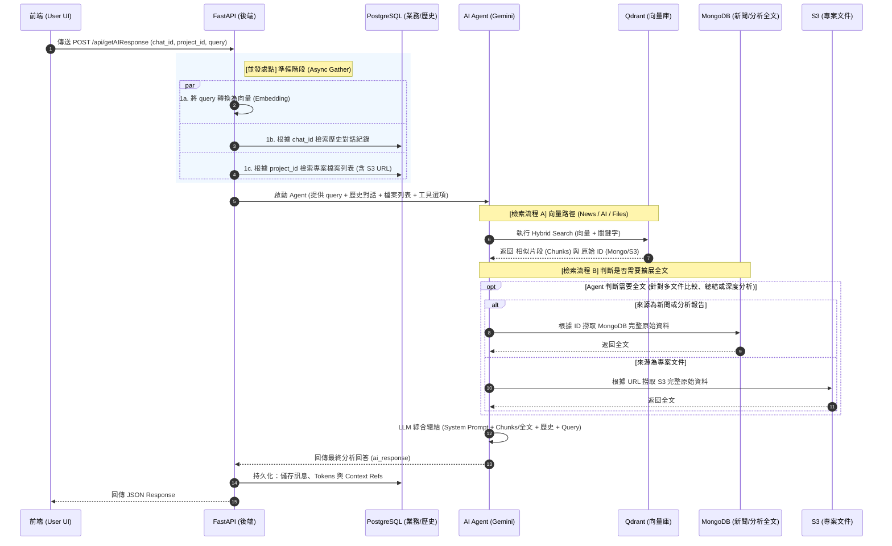

# API 規格說明書 (API Specification)

本文件定義了股市生成式聊天應用的各項 API 接口，採用「先上傳、後送出」的非同步機制。

---

## 1. 檔案上傳接口 (Upload API)

在送出對話訊息前，前端應先透過此接口上傳檔案或圖片，取得 `file_id`。

- **Method**: `POST`
- **URL**: `/api/files/upload`
* **Headers:**
    * `Authorization: Bearer <JWT_TOKEN>`
    * `Content-Type: multipart/form-data`

#### **Request Body (form-data)**
| 參數名稱 | 資料型別 | 必填 | 說明 |
| :--- | :--- | :--- | :--- |
| `file` | Binary | 是 | 欲上傳的原始檔案或圖片 |
| `project_id` | UUID | 是 | 所屬專案 ID |
| `chat_id` | UUID | 否 | 所屬對話 ID (若為專案層級上傳則留空) |

#### **Response (200 OK)**
```json
{
  "status": "success",
  "data": {
    "file_id": "file_chat_99",
    "file_name": "2330_analysis.pdf",
    "s3_url": "s3://bucket/...",
    "status": "processing"
  }
}
```

---

## 2. 訊息發送接口 (Message API)

此接口為系統的核心，負責彙整上下文並啟動 AI Agent 決策。

- **Method**: `POST`
- **URL**: `/api/getAIResponse`
* **Headers:**
    * `Authorization: Bearer <JWT_TOKEN>`
    * `Content-Type: application/json`

#### **Request Body (JSON)**
```json
{
  "project_id": "550e8400-e29b-41d4-a716-446655440000",
  "chat_id": "6ba7b810-9dad-11d1-80b4-00c04fd430c8",
  "query": "請根據這張圖和專案報告，幫我分析台積電的毛利趨勢。",
  "attachments": {
    "image_ids": ["img_001", "img_002"], 
    "file_ids": ["file_chat_99"], 
    "use_project_files": true 
  },
  "agent_config": {
    "tool_choice": "manual", 
    "enabled_tools": ["news_vector_search", "AI_analysis_vector_search", "file_retriever"]
  }
}
```

#### **欄位說明**
- **`project_id`**: 目前所屬的專案 ID。
- **`chat_id`**: 目前所屬的對話視窗 ID。
- **`query`**: 使用者的提問內容。
- **`attachments`**:
    - `image_ids` / `file_ids`: 針對特定檔案進行分析。預設為將專案內所有檔案餵給 LLM。
    - `use_project_files`: 預設為 `true`，自動檢索專案知識庫。
- **`agent_config`**: 
    - `tool_choice`: 預設為 `auto` (強烈建議)，除非手動指定工具。
    - `enabled_tools`: 前端勾選的功能，後端需驗證權限。

#### **Response (200 OK)**
```json
{
  "status": "success",
  "data": {
    "message_id": "postgresql_id",
    "ai_response": "根據分析，台積電在 2021-2023 年間成長顯著...",
    "project_id": "550e8400-e29b-41d4-a716-446655440000",
    "chat_id": "6ba7b810-9dad-11d1-80b4-00c04fd430c8",
    "sources": [
        { "id": "file_001(postgresql_id)", "type":"file", "title": "2024Q3營收報告.pdf", "chunks": 2 },
        { "id": "file_002(postgresql_id)", "type":"image", "title": "台積電股價圖.jpg" },
        { "id": "news_001(mongodb_id)", "type":"news", "title": "台積電近期新聞" },
        { "id": "ai_analysis_001(mongodb_id)","type":"ai_analysis", "title": "台積電AI分析報告" }
    ],
    "usage": {
        "prompt_tokens": 120500,
        "completion_tokens": 500,
        "is_cached": true 
    }
  }
}
```

#### **訊息生成流程圖 (Sequence Diagram)**


#### **待優化項目：Context Caching**
針對專案文件（文本 RAG），建議導入模型供應商（如 Google Gemini）的 **Context Caching** 技術。

- **原理**：將固定的大型文件（如專案知識庫）預先快取在模型伺服器端，避免每次對話重複計算與傳輸。
- **效益**：
    - **成本優化**：Cached Token 費用大幅降低（通常為 1 折）。
    - **效能提升**：反應時間（TTFT）大幅縮短。
- **實作方式**：調用 Gemini `cachedContents` 接口取得 `cache_name`，後續聊天僅需帶入此標籤。

---

## 3. 錯誤處理 (Error Handling)
| 狀態碼 | 錯誤原因 |
| :--- | :--- |
| 400 | 請求格式錯誤或缺漏 query |
| 401 | 未登入或 Token 過期 |
| 403 | 無權訪問該專案或特定檔案 |
| 404 | 找不到對應的 `project_id` 或 `chat_id` |
| 500 | AI 生成服務異常或資料庫連線失敗 |
