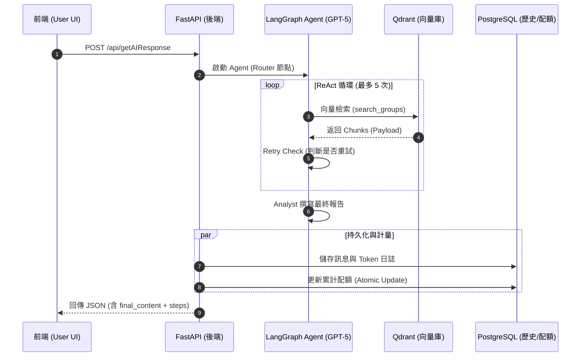

# API 規格說明書 (API Specification)

本文件定義了股市生成式聊天應用的各項 API 接口。

---

## 1. 認證與使用者接口 (Auth & User API - 🔴 待開發)

目前的後端實作尚未包含 JWT 認證邏輯，以下接口為第一階段計畫目標：

### 1.1 註冊與登入 (Auth)
- **POST** `/api/auth/register`: 建立新帳號。
- **POST** `/api/auth/login`: 取得 Access Token。

### 1.2 個人資訊 (User Profile)
- **GET** `/api/user/profile`: 返回等級與基本資料。
- **GET** `/api/user/usage`: 返回當前週期的 `used_tokens` 與上限。

---

## 2. 檔案管理接口 (File API - 🟢 已實作)

### 2.1 上傳檔案
- **Method**: `POST`
- **URL**: `/api/files/upload`
- **Body**: `multipart/form-data` (file)
- **Response**: 返回 `file_id` 與 `s3_url`。

---

## 3. 聊天與 Agent 接口 (Chat API - 🟢 已實作)

此接口為系統的核心，負責啟動 LangGraph Agent 進行決策。

### 3.1 獲取 AI 回應 (Get AI Response)
- **Method**: `POST`
- **URL**: `/api/getAIResponse`

#### **Request Body (JSON)**
```json
{
  "query": "最近台積電表現如何？",
  "chat_id": "UUID (Optional)",
  "agent_config": {
    "enabled_tools": ["search_stock_news", "search_market_ai_analysis"]
  }
}
```

#### **Response Body (JSON)**
```json
{
  "status": "success",
  "chat_id": "UUID",
  "final_content": "### 市場核心觀察\n台積電 (2330) 近期...",
  "steps": [
    {
      "node": "router",
      "thought": "為了精準回答，啟動 search_stock_news...",
      "tool_calls": [
        { "name": "search_stock_news", "query": "台積電", "start_date": "..." }
      ],
      "execution_time": 0.45
    },
    {
      "node": "analyst",
      "content": "### 市場核心觀察...",
      "execution_time": 2.1
    }
  ],
  "retrieval_sources": [
    {
      "title": "台積電法說會亮眼",
      "url": "https://...",
      "publishAt": "2026-04-18",
      "tool": "news"
    }
  ]
}
```

---

## 4. 訊息生成流程圖 (Sequence Diagram)



---

## 5. 錯誤處理 (Error Handling)
| 狀態碼 | 錯誤原因 |
| :--- | :--- |
| 400 | 請求格式錯誤或參數缺失 |
| 403 | Token 配額已達上限 (Over Quota) |
| 500 | AI 服務異常或資料庫連接失敗 |
