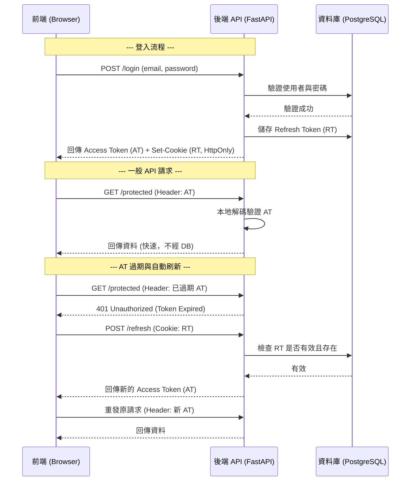

# 🔐 身份驗證與授權系統規格 (Auth System Specification)

## 1. 概述
本系統負責管理 Stock Insight Chat 的使用者帳戶安全性。採用基於 JWT (JSON Web Token) 的非狀態化驗證機制，並設計為可擴充以支援 OAuth2 (如 Google SSO)。

## 2. 核心技術選型
- **密碼加密**: Argon2 或 Bcrypt (強烈建議 Argon2)
- **驗證機制**: JWT (Header: `Authorization: Bearer <token>`)
- **權杖策略**: 
    - `access_token`: 效期 30 分鐘，用於 API 認證。
    - `refresh_token`: 效期 7 天，存於 `HttpOnly` Cookie，用於無感刷新。
- **資料庫實體**: `users`, `refresh_tokens`, `subscription_tiers`

## 3. 流程詳細設計

### A. 註冊流程 (Register)
1. 前端發送 `email`, `username`, `password`。
2. 後端檢查 Email/Username 是否重複。
3. 使用 Argon2 對密碼進行 Salted Hashing。
4. 寫入 `users` 表，並預設分配 `Free` 等級的 `tier_id`。
5. 初始化 `user_usage_quotas` (Token 配額)。

### B. 登入與權杖管理流程 (Login & Token Flow)

### C. 登出流程 (Logout)
1. 前端呼叫 `POST /logout` (帶上 Cookie RT)。
2. 後端從 DB 中刪除該 `refresh_tokens` 記錄。
3. 後端回傳 `Set-Cookie: refresh_token=; Max-Age=0` 指令。
4. 客戶端瀏覽器自動清除該 Cookie。

## 4. 各類情境處理 (Scenarios)

| 情境 | 系統反應 |
| :--- | :--- |
| **Access Token 被盜** | 駭客在短時間內（30min）可存取，但無法更換新 AT。 |
| **Refresh Token 被盜** | 只要使用者在其他地方登出或管理員刪除 RT，該權杖立即失效。 |
| **使用者修改密碼** | 成功後應刪除該使用者所有舊的 Refresh Tokens，強制所有裝置重新登入。 |
| **RT 過期 (7天)** | 瀏覽器會拒絕發送 Cookie 或後端回傳 401，使用者必須手動重新登入。 |

## 5. 安全性考量
- **HttpOnly & Secure**: 防止 XSS 攻擊透過 JS 讀取 Refresh Token。
- **CSRF Protection**: Access Token 透過 Authorization Header 傳遞，不受傳統 CSRF 攻擊影響。
- **Argon2id**: 使用當前最安全的雜湊演算法防止彩虹表攻擊。
- **UUIDs**: 所有使用者與 Token ID 均使用 UUID，防止 ID 遍歷攻擊。
