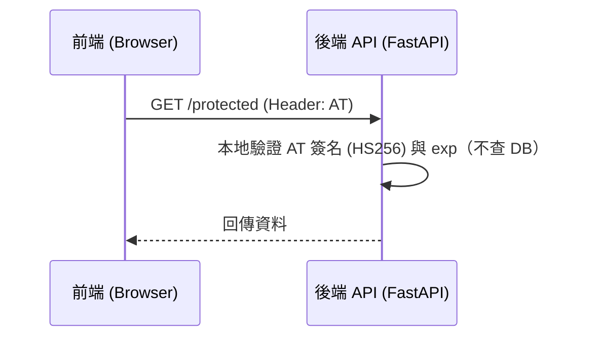
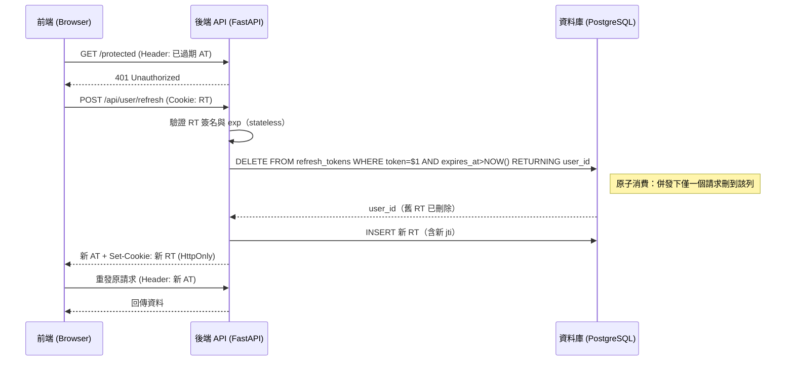

# 身份驗證與授權系統規格 (Auth System Specification)

## 1. 概述

本系統管理 Stock Insight Chat 的使用者帳戶。採用 **Google SSO（OAuth 2.0 / OIDC）** 作為唯一登入方式（**無本地密碼註冊/登入**），登入後由後端簽發自有 **JWT**（Access Token / Refresh Token）做後續 API 驗證。

Google SSO 端點與 `users` 表設計見 [`google_sso.md`](./google_sso.md)；完整登入時序與前端換發流程見 [`readme_full_details.md`](./readme_full_details.md) 的「JWT 認證架構」。

## 2. 技術選型

- **登入方式**: Google SSO（OAuth 2.0 / OIDC），以 `google_sub` 為身分主鍵
- **驗證機制**: JWT（Header: `Authorization: Bearer <token>`），HS256 簽名
- **權杖策略**:
    - `access_token`: 效期 15 分鐘，存於前端 JS 記憶體變數，stateless 驗證（不查 DB）
    - `refresh_token`: 效期 7 天，存於 `HttpOnly` Cookie（`SameSite=Lax`），用於換發 AT
- **資料庫實體**: `users`、`refresh_tokens`、`subscription_tiers`

## 3. 流程詳細設計

### A. 登入流程 (Google SSO)

1. 前端點擊「以 Google 帳號登入」→ `GET /api/user/auth/google/start`（後端產生 `state` 存入 HttpOnly Cookie，302 導向 Google）。
2. 使用者在 Google 完成授權，Google 302 回 `GET /api/user/auth/google/callback`。
3. 後端驗 `state`（CSRF 防護）、用 `code` 換 Google Token、取 UserInfo（`sub`/`email`/`name`）。
4. 以 `google_sub` upsert `users`；新用戶建立並分配 `Free` 等級 `tier_id`，同時確保 `user_usage_quotas` 有列。
5. 簽發 AT（15 分鐘）+ RT（7 天），RT 寫入 `refresh_tokens` 並設為 HttpOnly Cookie，302 回前端。
6. 前端以 `POST /api/user/refresh` 換取第一個 AT，並 `GET /api/user` 取得 profile。

### B. 一般 API 請求（Stateless AT 驗證）

```mermaid
sequenceDiagram
    participant Client as 前端 (Browser)
    participant API as 後端 API (FastAPI)

    Client->>API: GET /protected (Header: AT)
    API->>API: 本地驗證 AT 簽名 (HS256) 與 exp（不查 DB）
    API-->>Client: 回傳資料
```

### C. AT 過期與 RT Rotation

```mermaid
sequenceDiagram
    participant Client as 前端 (Browser)
    participant API as 後端 API (FastAPI)
    participant DB as 資料庫 (PostgreSQL)

    Client->>API: GET /protected (Header: 已過期 AT)
    API-->>Client: 401 Unauthorized
    Client->>API: POST /api/user/refresh (Cookie: RT)
    API->>API: 驗證 RT 簽名與 exp（stateless）
    API->>DB: DELETE FROM refresh_tokens WHERE token=$1 AND expires_at>NOW() RETURNING user_id
    Note right of DB: 原子消費：併發下僅一個請求刪到該列
    DB-->>API: user_id（舊 RT 已刪除）
    API->>DB: INSERT 新 RT（含新 jti）
    API-->>Client: 新 AT + Set-Cookie: 新 RT (HttpOnly)
    Client->>API: 重發原請求 (Header: 新 AT)
    API-->>Client: 回傳資料
```

若 `DELETE` 到 0 列但 RT 簽名仍有效，判定為 **Token Reuse Attack**，撤銷該用戶所有 session（`DELETE FROM refresh_tokens WHERE user_id=$1`）並回 401。

### D. 登出流程 (Logout)

1. 前端呼叫 `POST /api/user/logout`（Cookie 帶 RT）。
2. 後端 `DELETE FROM refresh_tokens WHERE token=$1`（僅刪目前這台裝置的 RT）。
3. 後端回傳 `Set-Cookie: refresh_token=; Max-Age=0` 清除 Cookie。

## 4. 各類情境處理 (Scenarios)

| 情境 | 系統反應 |
| :--- | :--- |
| **Access Token 被盜** | 最長 15 分鐘內可存取；無 RT 無法換發新 AT。 |
| **Refresh Token 被盜後被本人先使用** | 舊 RT 已被消費；盜用方持舊 RT refresh 時觸發 reuse 偵測，全 session 撤銷。 |
| **偵測到 Token Reuse** | 撤銷該用戶所有 RT，所有裝置需重新登入。 |
| **RT 過期 (7 天)** | `POST /refresh` 回 401，使用者需重新以 Google 登入。 |
| **多裝置** | 每次登入 INSERT 一筆獨立 RT；登出只刪自己那筆，其他裝置不受影響。 |

## 5. 安全性考量

- **AT 不落 localStorage**: 存於 JS 記憶體變數，降低 XSS 竊取風險；頁面刷新後由 RT 重新換發。
- **RT HttpOnly + SameSite=Lax**: JS 無法讀取（防 XSS），SameSite 降低 CSRF 風險；HTTPS 環境搭配 `COOKIE_SECURE=true`。
- **RT Rotation + Reuse 偵測**: 以 `DELETE ... RETURNING` 原子消費舊 RT，重放即撤銷全部 session。
- **OAuth state**: `state` 存 HttpOnly Cookie 並於 callback 比對，防 CSRF。
- **UUID 主鍵**: 使用者與 Token ID 均為 UUID，避免 ID 遍歷。
