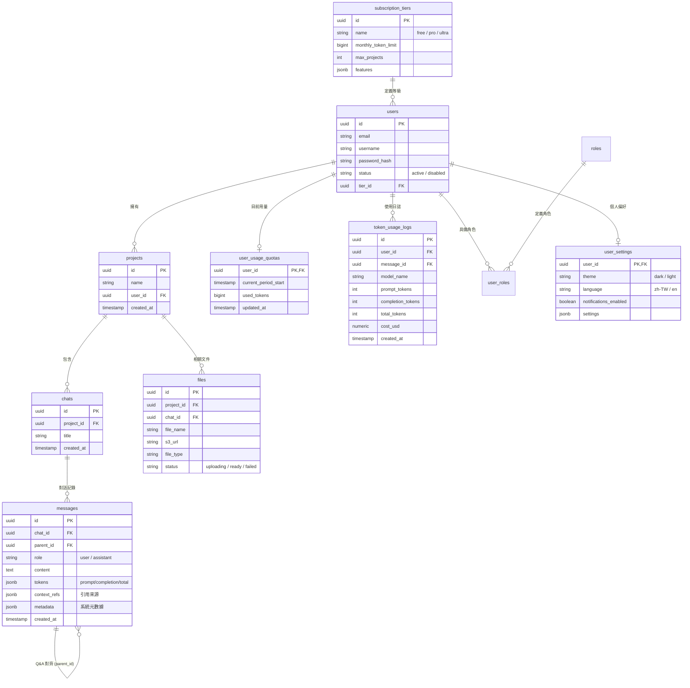

# 資料庫規格說明書 (Database Specification)

本專案使用 **PostgreSQL** 作為關聯式資料庫，用於管理會員、訂閱、專案、對話、訊息以及上傳的文件。向量數據則存儲於 **Qdrant**。

## 1. 實體關係圖 (ERD)

---

## 2. 資料表詳細定義

### 2.1 subscription_tiers (訂閱等級)
定義不同會員等級的權利與配額。

| 欄位名稱 | 資料型別 | 限制 | 說明 |
| :--- | :--- | :--- | :--- |
| id | UUID | PRIMARY KEY | 等級唯一識別碼 |
| name | VARCHAR(50) | UNIQUE, NOT NULL | 等級名稱 (free, pro, ultra) |
| monthly_token_limit | BIGINT | NOT NULL | 每月 Token 額度 |
| max_projects | INTEGER | DEFAULT 3 | 最大專案數 |
| features | JSONB | NULLABLE | 功能開關設定 |

### 2.2 users (使用者)
會員系統核心表。

| 欄位名稱 | 資料型別 | 限制 | 說明 |
| :--- | :--- | :--- | :--- |
| id | UUID | PRIMARY KEY | 使用者唯一識別碼 |
| email | VARCHAR(255) | UNIQUE, NOT NULL | 電子郵件 (登入帳號) |
| username | VARCHAR(100) | UNIQUE, NOT NULL | 顯示名稱 |
| password_hash | TEXT | NOT NULL | 加密後的密碼 |
| status | VARCHAR(20) | DEFAULT 'active' | 帳號狀態 (active, disabled) |
| tier_id | UUID | FK -> subscription_tiers.id | 目前等級 |

### 2.3 user_usage_quotas (當前用量)
紀錄使用者在當前計費週期內的即時累計用量。

| 欄位名稱 | 資料型別 | 限制 | 說明 |
| :--- | :--- | :--- | :--- |
| user_id | UUID | PRIMARY KEY, FK -> users.id | 使用者 ID |
| current_period_start | TIMESTAMP | NOT NULL | 當前週期開始時間 |
| used_tokens | BIGINT | DEFAULT 0 | 已消耗總 Token 數 |
| updated_at | TIMESTAMP | DEFAULT NOW() | 最後更新時間 |

### 2.4 projects (專案)
存放頂層容器資訊。

| 欄位名稱 | 資料型別 | 限制 | 說明 |
| :--- | :--- | :--- | :--- |
| id | UUID | PRIMARY KEY | 專案唯一識別碼 |
| name | VARCHAR(255) | NOT NULL | 專案名稱 |
| user_id | UUID | FK -> users.id, NOT NULL | 建立者 ID |
| created_at | TIMESTAMP | DEFAULT CURRENT_TIMESTAMP | 建立時間 |

### 2.5 files (檔案管理)
管理專案相關的附件與上傳文件。

| 欄位名稱 | 資料型別 | 限制 | 說明 |
| :--- | :--- | :--- | :--- |
| id | UUID | PRIMARY KEY | 檔案唯一識別碼 |
| project_id | UUID | FK -> projects.id | 所屬專案 |
| s3_url | TEXT | NOT NULL | 儲存路徑 |
| status | VARCHAR(20) | NOT NULL | 狀態 (ready, failed, etc.) |

### 2.6 messages (訊息)
存放每一筆對話記錄與 Token 消耗。

| 欄位名稱 | 資料型別 | 限制 | 說明 |
| :--- | :--- | :--- | :--- |
| id | UUID | PRIMARY KEY | 訊息唯一識別碼 |
| chat_id | UUID | FK -> chats.id | 所屬對話 ID |
| parent_id | UUID | FK -> messages.id | 父訊息 ID (用於追溯) |
| tokens | JSONB | NOT NULL | 消耗詳情 `{ "prompt": 100, "completion": 50 }` |
| context_refs | JSONB | NULLABLE | 檢索來源片段 |
| created_at | TIMESTAMP | DEFAULT CURRENT_TIMESTAMP | 發送時間 |
