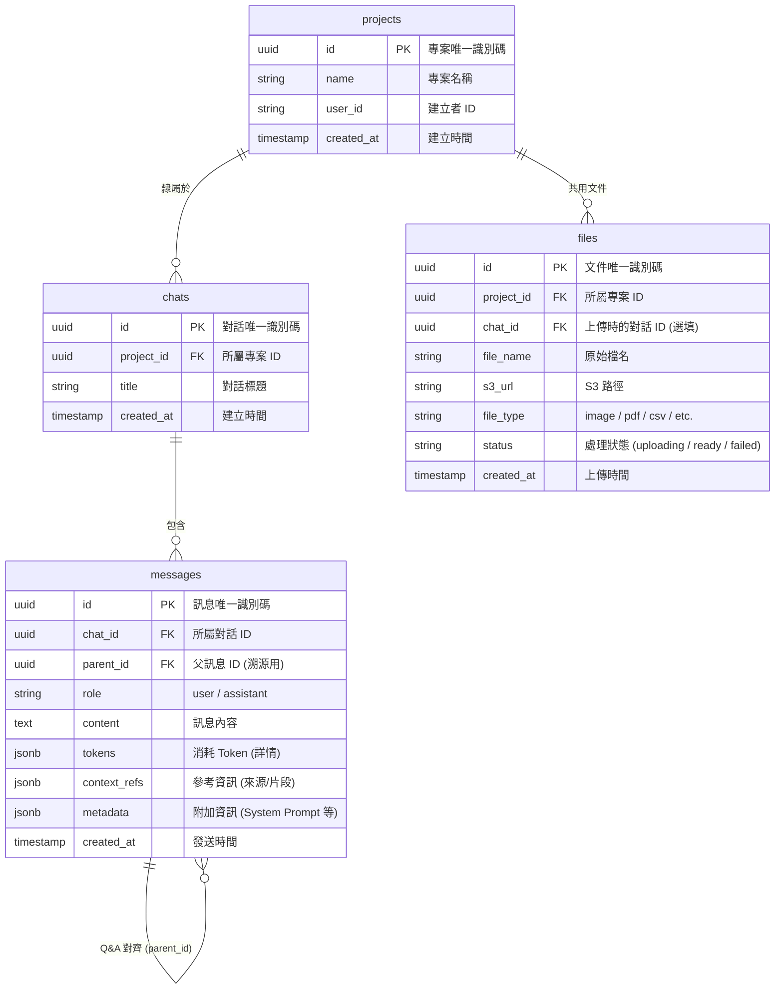

# 資料庫規格說明書 (Database Specification)

本專案使用 **PostgreSQL** 作為關聯式資料庫，用於管理專案、對話、訊息以及上傳的文件。

## 1. 實體關係圖 (ERD)

---

## 2. 資料表詳細定義

### 2.1 projects (專案)
存放頂層容器資訊。

| 欄位名稱 | 資料型別 | 限制 | 說明 |
| :--- | :--- | :--- | :--- |
| id | UUID | PRIMARY KEY, DEFAULT gen_random_uuid() | 專案唯一識別碼 |
| name | VARCHAR(255) | NOT NULL | 專案名稱 |
| user_id | VARCHAR(255) | NOT NULL | 建立者 ID (由 Auth 服務提供) |
| created_at | TIMESTAMP | DEFAULT CURRENT_TIMESTAMP | 建立時間 |

### 2.2 chats (對話)
隸屬於專案下的各個對話視窗。

| 欄位名稱 | 資料型別 | 限制 | 說明 |
| :--- | :--- | :--- | :--- |
| id | UUID | PRIMARY KEY, DEFAULT gen_random_uuid() | 對話唯一識別碼 |
| project_id | UUID | FK -> projects.id, NOT NULL, ON DELETE CASCADE | 所屬專案 ID |
| title | VARCHAR(255) | NOT NULL | 對話標題 |
| created_at | TIMESTAMP | DEFAULT CURRENT_TIMESTAMP | 建立時間 |

### 2.3 messages (訊息)
存放每一筆對話記錄。

| 欄位名稱 | 資料型別 | 限制 | 說明 |
| :--- | :--- | :--- | :--- |
| id | UUID | PRIMARY KEY, DEFAULT gen_random_uuid() | 訊息唯一識別碼 |
| chat_id | UUID | FK -> chats.id, NOT NULL, ON DELETE CASCADE | 所屬對話 ID |
| parent_id | UUID | FK -> messages.id, NULLABLE | 指向觸發本則回覆的父訊息 ID |
| role | VARCHAR(50) | NOT NULL | 角色 (user / assistant) |
| content | TEXT | NOT NULL | 訊息內容 |
| tokens | JSONB | NOT NULL | 消耗的 Token 詳情 `{ "prompt": 100, "completion": 50, "is_cached": true }` |
| context_refs | JSONB | NULLABLE | 檢索到的來源與片段 (方案 B) |
| metadata | JSONB | NULLABLE | 系統與對話元數據 `{ "system": "...", "ref_id": "...", "params": "{}" }` |
| created_at | TIMESTAMP | DEFAULT CURRENT_TIMESTAMP | 訊息發送時間 |

### 2.4 files (專案文件)
專案共用的知識庫文件（RAG 用）。

| 欄位名稱 | 資料型別 | 限制 | 說明 |
| :--- | :--- | :--- | :--- |
| id | UUID | PRIMARY KEY, DEFAULT gen_random_uuid() | 文件唯一識別碼 |
| project_id | UUID | FK -> projects.id, NOT NULL, ON DELETE CASCADE | 所屬專案 ID |
| chat_id | UUID | FK -> chats.id, NULLABLE, ON DELETE SET NULL | 上傳時的對話 ID |
| file_name | VARCHAR(255) | NOT NULL | 原始檔名 |
| s3_url | TEXT | NOT NULL | 存放於 S3 的路徑 |
| file_type | VARCHAR(50) | NOT NULL | 檔案類型 (image, pdf, etc.) |
| status | VARCHAR(50) | NOT NULL | 處理狀態 (uploading, ready, failed) |
| created_at | TIMESTAMP | DEFAULT CURRENT_TIMESTAMP | 上傳時間 |
