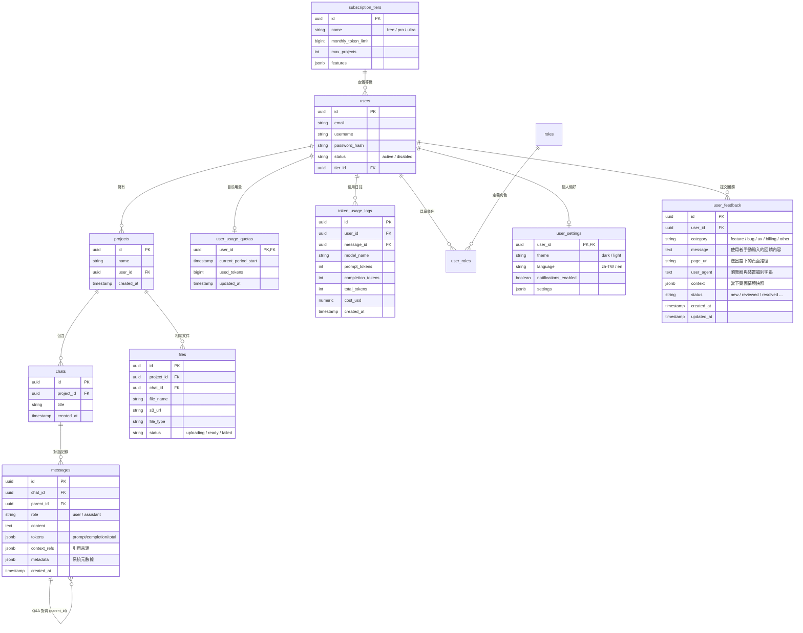
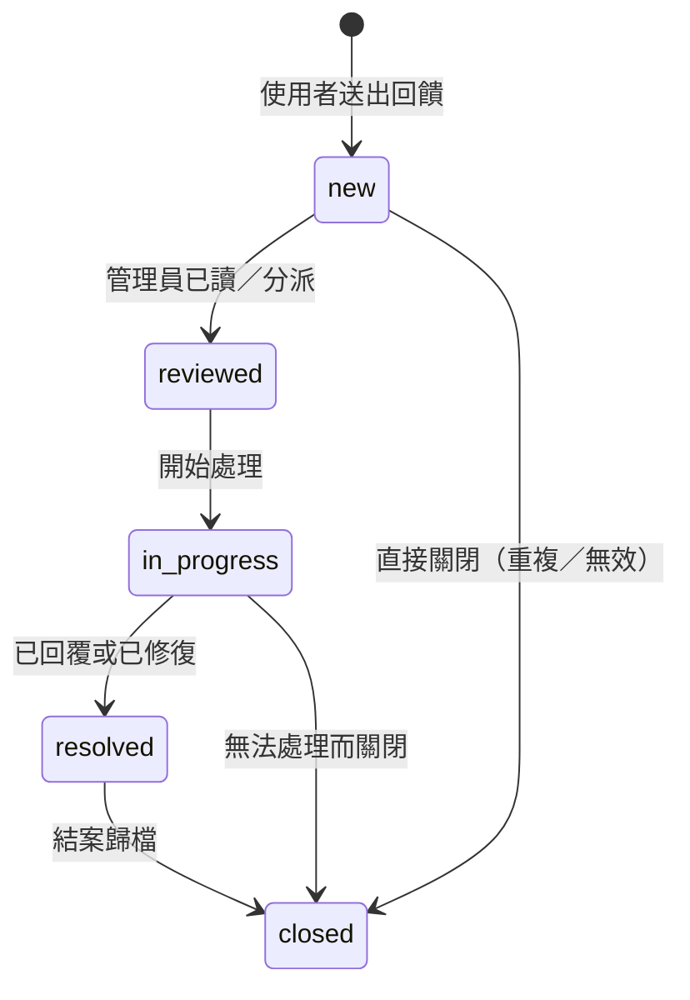

# 資料庫規格說明書 (Database Specification)

本專案使用 **PostgreSQL** 作為關聯式資料庫，用於管理會員、訂閱、專案、對話、訊息以及上傳的文件。向量數據則存儲於 **Qdrant**。

> **開發時如何進 Docker 改 SQL、套用 migration、重置本機 DB**：請見 [`sql_dev_handbook.md`](./sql_dev_handbook.md)。

## 1. 實體關係圖 (ERD)


```mermaid
erDiagram
    subscription_tiers ||--o{ users : "定義等級"
    users ||--o{ projects : "擁有"
    users ||--o| user_usage_quotas : "目前用量"
    users ||--o{ token_usage_logs : "使用日誌"
    users ||--o{ user_roles : "具備角色"
    roles ||--o{ user_roles : "定義角色"
    users ||--o| user_settings : "個人偏好"
    users ||--o{ user_feedback : "提交回饋"
    projects ||--o{ chats : "包含"
    projects ||--o{ files : "相關文件"
    chats ||--o{ messages : "對話記錄"
    messages ||--o{ messages : "Q&A 對齊 (parent_id)"

    subscription_tiers {
        uuid id PK
        string name "free / pro / ultra"
        bigint monthly_token_limit
        int max_projects
        jsonb features
    }

    users {
        uuid id PK
        string email
        string username
        string password_hash
        string status "active / disabled"
        uuid tier_id FK
    }

    user_usage_quotas {
        uuid user_id PK, FK
        timestamp current_period_start
        bigint used_tokens
        timestamp updated_at
    }

    token_usage_logs {
        uuid id PK
        uuid user_id FK
        uuid message_id FK
        string model_name
        int prompt_tokens
        int completion_tokens
        int total_tokens
        numeric cost_usd
        timestamp created_at
    }

    user_settings {
        uuid user_id PK, FK
        string theme "dark / light"
        string language "zh-TW / en"
        boolean notifications_enabled
        jsonb settings
    }

    projects {
        uuid id PK
        string name
        uuid user_id FK
        timestamp created_at
    }

    files {
        uuid id PK
        uuid project_id FK
        uuid chat_id FK
        string file_name
        string s3_url
        string file_type
        string status "uploading / ready / failed"
    }

    chats {
        uuid id PK
        uuid project_id FK
        string title
        timestamp created_at
    }

    messages {
        uuid id PK
        uuid chat_id FK
        uuid parent_id FK
        string role "user / assistant"
        text content
        jsonb tokens "prompt/completion/total"
        jsonb context_refs "引用來源"
        jsonb metadata "系統元數據"
        timestamp created_at
    }

    user_feedback {
        uuid id PK
        uuid user_id FK
        string category "feature / bug / ux / billing / other"
        text message "使用者手動輸入的回饋內容"
        string page_url "送出當下的頁面路徑"
        text user_agent "瀏覽器與裝置識別字串"
        jsonb context "當下頁面情境快照"
        string status "new / reviewed / resolved ..."
        timestamp created_at
        timestamp updated_at
    }
```

---

## 2. 資料表詳細定義

### 2.1 subscription_tiers (訂閱等級)
定義不同會員等級的權利與配額。

| 欄位名稱 | 資料型別 | 限制 | 說明 |
| :--- | :--- | :--- | :--- |
| id | UUID | PRIMARY KEY | 等級唯一識別碼 |
| name | VARCHAR(50) | UNIQUE, NOT NULL | 等級名稱 (free, pro, ultra) |
| monthly_token_limit | BIGINT | NOT NULL | 每月 Token 額度 |
| max_projects | INTEGER | DEFAULT 3 | 最大專案數 |
| features | JSONB | NULLABLE | 功能開關設定 |

### 2.2 users (使用者)
會員系統核心表。

| 欄位名稱 | 資料型別 | 限制 | 說明 |
| :--- | :--- | :--- | :--- |
| id | UUID | PRIMARY KEY | 使用者唯一識別碼 |
| email | VARCHAR(255) | UNIQUE, NOT NULL | 電子郵件 (登入帳號) |
| username | VARCHAR(100) | UNIQUE, NOT NULL | 顯示名稱 |
| password_hash | TEXT | NOT NULL | 加密後的密碼 |
| status | VARCHAR(20) | DEFAULT 'active' | 帳號狀態 (active, disabled) |
| tier_id | UUID | FK -> subscription_tiers.id | 目前等級 |

### 2.3 user_usage_quotas (當前用量)
紀錄使用者在當前計費週期內的即時累計用量。

| 欄位名稱 | 資料型別 | 限制 | 說明 |
| :--- | :--- | :--- | :--- |
| user_id | UUID | PRIMARY KEY, FK -> users.id | 使用者 ID |
| current_period_start | TIMESTAMP | NOT NULL | 當前週期開始時間 |
| used_tokens | BIGINT | DEFAULT 0 | 已消耗總 Token 數 |
| updated_at | TIMESTAMP | DEFAULT NOW() | 最後更新時間 |

### 2.4 projects (專案)
存放頂層容器資訊。

| 欄位名稱 | 資料型別 | 限制 | 說明 |
| :--- | :--- | :--- | :--- |
| id | UUID | PRIMARY KEY | 專案唯一識別碼 |
| name | VARCHAR(255) | NOT NULL | 專案名稱 |
| user_id | UUID | FK -> users.id, NOT NULL | 建立者 ID |
| created_at | TIMESTAMP | DEFAULT CURRENT_TIMESTAMP | 建立時間 |

### 2.5 files (檔案管理)
管理專案相關的附件與上傳文件。

| 欄位名稱 | 資料型別 | 限制 | 說明 |
| :--- | :--- | :--- | :--- |
| id | UUID | PRIMARY KEY | 檔案唯一識別碼 |
| project_id | UUID | FK -> projects.id | 所屬專案 |
| s3_url | TEXT | NOT NULL | 儲存路徑 |
| status | VARCHAR(20) | NOT NULL | 狀態 (ready, failed, etc.) |

### 2.6 messages (訊息)
存放每一筆對話記錄與 Token 消耗。

| 欄位名稱 | 資料型別 | 限制 | 說明 |
| :--- | :--- | :--- | :--- |
| id | UUID | PRIMARY KEY | 訊息唯一識別碼 |
| chat_id | UUID | FK -> chats.id | 所屬對話 ID |
| parent_id | UUID | FK -> messages.id | 父訊息 ID (用於追溯) |
| tokens | JSONB | NOT NULL | 消耗詳情 `{ "prompt": 100, "completion": 50 }` |
| context_refs | JSONB | NULLABLE | 檢索來源片段 |
| created_at | TIMESTAMP | DEFAULT CURRENT_TIMESTAMP | 發送時間 |

### 2.7 user_feedback (使用者建議回饋)

存放登入使用者透過 `POST /api/user/feedback` 提交的建議、問題回報與使用體驗回饋。使用者只需填「類型」與「內容」；其餘欄位由前端自動附帶，方便日後排查。

| 欄位名稱 | 資料型別 | 限制 | 說明 |
| :--- | :--- | :--- | :--- |
| id | UUID | PRIMARY KEY | 回饋唯一識別碼 |
| user_id | UUID | FK -> users.id, NOT NULL, ON DELETE CASCADE | 提交者；刪除帳號時一併清除 |
| category | VARCHAR(32) | NOT NULL | 回饋類型（見下方列舉） |
| message | TEXT | NOT NULL | 使用者手動輸入的回饋正文（10～2000 字） |
| page_url | VARCHAR(500) | NULLABLE | 送出當下的頁面路徑（前端自動帶入） |
| user_agent | TEXT | NULLABLE | 瀏覽器 User Agent 字串（前端自動帶入，最多 512 字元） |
| context | JSONB | DEFAULT `'{}'` | 送出當下的頁面情境快照（前端自動帶入） |
| status | VARCHAR(20) | NOT NULL, DEFAULT `'new'` | 回饋處理狀態（見下方列舉） |
| created_at | TIMESTAMPTZ | DEFAULT CURRENT_TIMESTAMP | 使用者第一次送出的時間 |
| updated_at | TIMESTAMPTZ | DEFAULT CURRENT_TIMESTAMP | 這筆回饋最後一次被修改的時間 |

**索引**

| 索引名稱 | 欄位 | 用途 |
| :--- | :--- | :--- |
| idx_user_feedback_user_created_at | (user_id, created_at DESC) | 查某使用者的回饋歷史 |
| idx_user_feedback_status_created_at | (status, created_at DESC) | 後台依處理狀態篩選待辦 |

#### category 列舉值

| 值 | 前端顯示 | 說明 |
| :--- | :--- | :--- |
| `feature` | 功能建議 | 希望新增或改進的功能 |
| `bug` | 問題回報 | 錯誤、異常、功能失效 |
| `ux` | 使用體驗 | 介面、流程、易用性 |
| `billing` | 方案與計費 | 訂閱、配額、付款相關 |
| `other` | 其他 | 不屬於以上類別 |

#### status 列舉值與工單流程設計

`status` 欄位**刻意設計成可支援多種工單狀態**，而非只有「已送出／未送出」二元值。回饋在本質上是一張**內部工單**：使用者提交後，團隊需要追蹤「是否已讀、是否處理中、是否已回覆、是否結案」。預先定義完整狀態流，可避免日後做管理後台時再改 schema 或做資料遷移。

**目前實際行為**

- `POST /api/user/feedback` 建立回饋時，**固定寫入 `'new'`**（資料表 `DEFAULT 'new'` 與 API 邏輯一致）
- 使用者端**不會**也**不應**修改 `status`
- 其餘狀態保留給**日後管理後台**（例如 Insight-Monitor）以 `UPDATE` 推進工單

**狀態一覽**

| 狀態 | 目前是否使用 | 說明 |
| :--- | :---: | :--- |
| `new` | ✅ 是 | 剛收到，尚未處理（**預設值**；API 建立時固定寫入） |
| `reviewed` | ❌ 日後 | 已閱讀／已分派給負責人 |
| `in_progress` | ❌ 日後 | 處理中（調查、修復、回覆草稿等） |
| `resolved` | ❌ 日後 | 已解決或已回覆使用者 |
| `closed` | ❌ 日後 | 關閉，不再追蹤（例如重複回報、無法重現、使用者撤回） |

**典型狀態流（日後後台）**


```mermaid
stateDiagram-v2
    [*] --> new : 使用者送出回饋
    new --> reviewed : 管理員已讀／分派
    reviewed --> in_progress : 開始處理
    in_progress --> resolved : 已回覆或已修復
    resolved --> closed : 結案歸檔
    new --> closed : 直接關閉（重複／無效）
    in_progress --> closed : 無法處理而關閉
```

狀態不必嚴格線性；上圖表示常見路徑，實際後台可允許合理跳轉（例如 `new` → `closed`）。

**與索引的關係**

索引 `idx_user_feedback_status_created_at (status, created_at DESC)` 正是為「依狀態篩選待辦、最新的在前」預留，例如：

```sql
SELECT * FROM user_feedback
WHERE status = 'new'
ORDER BY created_at DESC;
```

回饋量尚小時不加索引也能跑；此索引是為後台待辦清單的**預期熱點查詢**提早準備。

**型別選擇：為何用 `VARCHAR(20)` 而非 PostgreSQL `ENUM`？**

- 日後新增狀態（例如 `spam`、`duplicate`）只需改應用層約束，**不必** `ALTER TYPE` 或重建 enum
- 與專案其他狀態欄位（如 `users.status`、`files.status`）風格一致
- 20 字元已足夠容納上述狀態名稱

> **注意**：此 `status` 是「回饋工單的處理狀態」，與 HTTP 回應狀態碼（如 201、422）無關。狀態變更時應更新 `updated_at`，`created_at` 保持不變。

#### message 與 context 的差異

兩者分工不同：**message 是使用者說的話；context 是系統記的環境**。

| | message | context |
| :--- | :--- | :--- |
| **誰填** | 使用者手動輸入 | 前端自動帶入 |
| **型別** | 純文字 `TEXT` | 結構化 JSON `JSONB` |
| **用途** | 回饋的**主要內容** | 回饋發生時的**環境快照**，方便排查 |

**message 範例**（使用者輸入）：

> 「送出訊息後串流中斷，畫面卡住不動。」

**context 範例**（前端 `window.getFeedbackPageContext()` 自動附帶）：

```json
{
  "chat_id": "abc-123",
  "project_id": "def-456",
  "chat_mode": "general",
  "response_mode": "think"
}
```

使用者不必手動描述「當時在一般對話模式、chat id 是 xxx」——這些由 `context` 記錄。後端限制 `context` 最多 20 個 key。

#### user_agent 是什麼？

**User Agent（UA）** 是瀏覽器送給伺服器的一行字串，描述使用的裝置、瀏覽器與作業系統。

範例：

```
Mozilla/5.0 (Macintosh; Intel Mac OS X 10_15_7) AppleWebKit/537.36 (KHTML, like Gecko) Chrome/120.0.0.0 Safari/537.36
```

用途：當回饋涉及「某瀏覽器才會壞」或「手機版排版異常」時，可依 UA 快速判斷環境，無需再向使用者追問。前端以 `navigator.userAgent` 自動帶入。

#### created_at 與 updated_at 的差異

| 欄位 | 意義 |
| :--- | :--- |
| **created_at** | 使用者**第一次送出**回饋的時間（建立後不應修改） |
| **updated_at** | 這筆回饋**最後一次被修改**的時間（例如後台更新 `status`） |

新建時兩者設為同一時間；日後若後台變更處理狀態，應只更新 `updated_at`。

#### 一筆完整回饋範例

| 欄位 | 範例值 |
| :--- | :--- |
| category | `bug` |
| message | 「Think 模式回答到一半就停了」 |
| page_url | `/` |
| user_agent | `Mozilla/5.0 ... Chrome/120...` |
| context | `{"chat_id":"xxx","chat_mode":"general","response_mode":"think"}` |
| status | `new` |
| created_at | `2026-06-10T08:30:00+00:00` |
| updated_at | `2026-06-10T08:30:00+00:00` |

聯絡方式不需另存：提交者身分與 `users.email` 已可關聯查詢。
