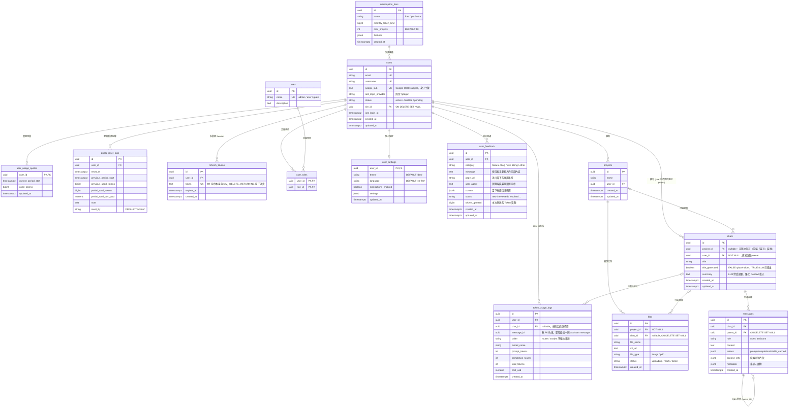
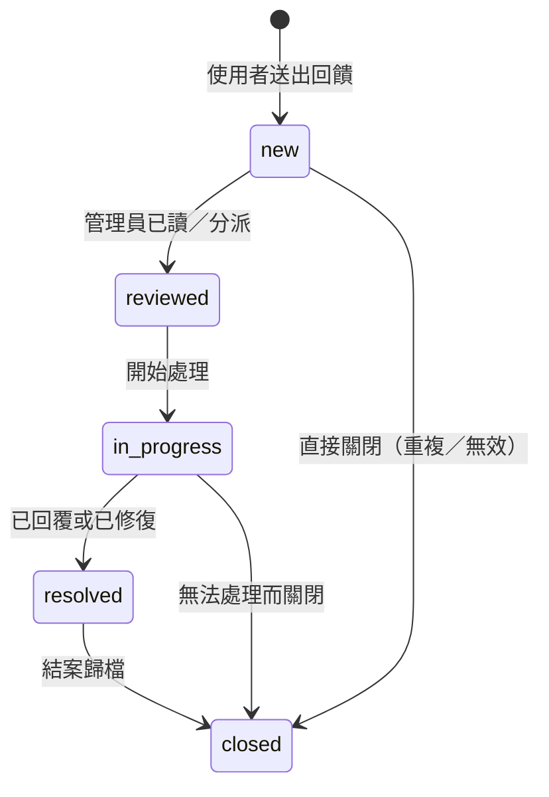

# 資料庫規格說明書 (Database Specification)

本專案使用 **PostgreSQL** 作為關聯式資料庫，管理會員（Google SSO）、訂閱配額、專案、對話、訊息、Token 計量與使用者回饋。向量數據存儲於 **Qdrant**，新聞／分析原文存儲於 **MongoDB**。

> - **權威來源**：實際 schema 以 [`app/backend/database/init_db.sql`](../app/backend/database/init_db.sql) 與 [`migrations/`](../app/backend/database/migrations/)（V002～V008）為準，本文件與其對齊。
> - **開發時如何進 Docker 改 SQL、套用 migration、重置本機 DB**：請見 [`sql_dev_handbook.md`](./sql_dev_handbook.md)。
> - 所有時間欄位皆為 **`TIMESTAMPTZ`**（UTC 儲存）。

## 1. 實體關係圖 (ERD)


```mermaid
erDiagram
    subscription_tiers ||--o{ users : "定義等級"
    users ||--o| user_usage_quotas : "當期用量"
    users ||--o{ token_usage_logs : "LLM 流水帳"
    users ||--o{ quota_reset_logs : "配額重置紀錄"
    users ||--o{ refresh_tokens : "多裝置 Session"
    users ||--o{ user_roles : "具備角色"
    roles ||--o{ user_roles : "定義角色"
    users ||--o| user_settings : "個人偏好"
    users ||--o{ user_feedback : "提交回饋"
    users ||--o{ projects : "擁有"
    users ||--o{ chats : "擁有 (chat 可不屬於任何 project)"
    projects |o--o{ chats : "可選歸屬"
    projects ||--o{ files : "相關文件"
    chats |o--o{ files : "可選關聯"
    chats ||--o{ messages : "對話記錄"
    chats |o--o{ token_usage_logs : "按對話統計"
    messages ||--o{ messages : "Q&A 對齊 (parent_id)"

    subscription_tiers {
        uuid id PK
        string name "free / pro / ultra"
        bigint monthly_token_limit
        int max_projects "DEFAULT 10"
        jsonb features
        timestamptz created_at
    }

    users {
        uuid id PK
        string email UK
        string username UK
        text google_sub UK "Google OIDC subject，身分主鍵"
        string last_login_provider "固定 'google'"
        string status "active / disabled / pending"
        uuid tier_id FK "ON DELETE SET NULL"
        timestamptz last_login_at
        timestamptz created_at
        timestamptz updated_at
    }

    user_usage_quotas {
        uuid user_id PK, FK
        timestamptz current_period_start
        bigint used_tokens
        timestamptz updated_at
    }

    refresh_tokens {
        uuid id PK
        uuid user_id FK
        text token UK "RT 字串本身為 key，DELETE...RETURNING 原子消費"
        timestamptz expires_at
        timestamptz created_at
    }

    token_usage_logs {
        uuid id PK
        uuid user_id FK
        uuid chat_id FK "nullable，按對話統計費用"
        uuid message_id "無 FK 約束，關聯最後一則 assistant message"
        string caller "router / analyst 等輪次來源"
        string model_name
        int prompt_tokens
        int completion_tokens
        int total_tokens
        numeric cost_usd
        timestamptz created_at
    }

    quota_reset_logs {
        uuid id PK
        uuid user_id FK
        timestamptz reset_at
        timestamptz previous_period_start
        bigint previous_used_tokens
        bigint period_total_tokens
        numeric period_total_cost_usd
        text note
        string reset_by "DEFAULT 'monitor'"
    }

    roles {
        uuid id PK
        string name UK "admin / user / guest"
        text description
    }

    user_roles {
        uuid user_id PK, FK
        uuid role_id PK, FK
    }

    user_settings {
        uuid user_id PK, FK
        string theme "DEFAULT 'dark'"
        string language "DEFAULT 'zh-TW'"
        boolean notifications_enabled
        jsonb settings
        timestamptz updated_at
    }

    projects {
        uuid id PK
        string name
        uuid user_id FK
        timestamptz created_at
        timestamptz updated_at
    }

    chats {
        uuid id PK
        uuid project_id FK "nullable：可獨立存在（前端「最近」區塊）"
        uuid user_id FK "NOT NULL：直接記錄 owner"
        string title
        boolean title_generated "FALSE=placeholder，TRUE=LLM 已產出"
        text summary "LLM 對話摘要，優化 Context 載入"
        timestamptz created_at
        timestamptz updated_at
    }

    messages {
        uuid id PK
        uuid chat_id FK
        uuid parent_id FK "ON DELETE SET NULL"
        string role "user / assistant"
        text content
        jsonb tokens "prompt/completion/total/is_cached"
        jsonb context_refs "檢索來源片段"
        jsonb metadata "系統元數據"
        timestamptz created_at
    }

    files {
        uuid id PK
        uuid project_id FK "NOT NULL"
        uuid chat_id FK "nullable, ON DELETE SET NULL"
        string file_name
        text s3_url
        string file_type "image / pdf ..."
        string status "uploading / ready / failed"
        timestamptz created_at
    }

    user_feedback {
        uuid id PK
        uuid user_id FK
        string category "feature / bug / ux / billing / other"
        text message "使用者手動輸入的回饋內容"
        string page_url "送出當下的頁面路徑"
        text user_agent "瀏覽器與裝置識別字串"
        jsonb context "當下頁面情境快照"
        string status "new / reviewed / resolved ..."
        bigint tokens_granted "本次發放的 Token 獎勵"
        timestamptz created_at
        timestamptz updated_at
    }
```

---

## 2. 資料表詳細定義

### 2.1 subscription_tiers (訂閱等級)

定義會員等級的權利與配額。`init_db.sql` 內建種子資料（migration `V005` 可對齊既有庫）：

| name | monthly_token_limit | max_projects |
| :--- | ---: | ---: |
| free | 200,000 | 10 |
| pro | 1,000,000 | 20 |
| ultra | 5,000,000 | 999,999（實務上不限） |

| 欄位名稱 | 資料型別 | 限制 | 說明 |
| :--- | :--- | :--- | :--- |
| id | UUID | PRIMARY KEY | 等級唯一識別碼 |
| name | VARCHAR(50) | UNIQUE, NOT NULL | 等級名稱 (free, pro, ultra) |
| monthly_token_limit | BIGINT | NOT NULL | 每月 Token 額度 |
| max_projects | INTEGER | DEFAULT 10 | 最大專案數 |
| features | JSONB | DEFAULT '{}' | 功能開關設定 |
| created_at | TIMESTAMPTZ | DEFAULT CURRENT_TIMESTAMP | 建立時間 |

### 2.2 users (使用者)

會員系統核心表。**僅支援 Google SSO 登入**（無密碼欄位）；`google_sub`（Google OIDC subject）為身分主鍵，登入時以 `WHERE google_sub = $1` 查找。詳見 [`google_sso.md`](./google_sso.md)。

| 欄位名稱 | 資料型別 | 限制 | 說明 |
| :--- | :--- | :--- | :--- |
| id | UUID | PRIMARY KEY | 使用者唯一識別碼 |
| email | VARCHAR(255) | UNIQUE, NOT NULL | 電子郵件（取自 Google UserInfo） |
| username | VARCHAR(100) | UNIQUE, NOT NULL | 顯示名稱 |
| google_sub | TEXT | UNIQUE, NOT NULL | Google OIDC subject，身分主鍵 |
| last_login_provider | VARCHAR(32) | DEFAULT 'google' | 登入供應商（目前固定 google） |
| status | VARCHAR(20) | DEFAULT 'active' | 帳號狀態 (active, disabled, pending) |
| tier_id | UUID | FK → subscription_tiers.id, ON DELETE SET NULL | 目前等級；NULL 時後端以 free 等級額度 fallback |
| last_login_at | TIMESTAMPTZ | NULLABLE | 最後登入時間 |
| created_at | TIMESTAMPTZ | DEFAULT CURRENT_TIMESTAMP | 建立時間 |
| updated_at | TIMESTAMPTZ | DEFAULT CURRENT_TIMESTAMP | 更新時間 |

### 2.3 user_usage_quotas (當前用量)

使用者在當前計量週期內的即時累計用量。**高頻更新的計數器**，與 `token_usage_logs`（append-only 流水）分表以兼顧效能與對帳。配額檢查邏輯見 [`usage_quota.py`](../app/backend/module/usage_quota.py)：Pre-flight 429 + 原子條件遞增 `UPDATE ... WHERE used_tokens + delta <= limit`。

| 欄位名稱 | 資料型別 | 限制 | 說明 |
| :--- | :--- | :--- | :--- |
| user_id | UUID | PRIMARY KEY, FK → users.id, ON DELETE CASCADE | 使用者 ID（一人一列） |
| current_period_start | TIMESTAMPTZ | NOT NULL | 當前週期開始時間（月初，UTC） |
| used_tokens | BIGINT | DEFAULT 0 | 已消耗總 Token 數 |
| updated_at | TIMESTAMPTZ | DEFAULT CURRENT_TIMESTAMP | 最後更新時間 |

### 2.4 refresh_tokens (JWT 刷新權杖)

RT Rotation 的核心表。每次登入 INSERT 一筆獨立 RT（**多裝置支援**）；refresh 時以 `DELETE ... WHERE token = $1 AND expires_at > NOW() RETURNING user_id` **原子消費**，併發下僅一個請求成功——DELETE 到 0 列但簽名仍有效即判定 Token Reuse Attack，撤銷該用戶所有 session。完整流程見 [`auth_system_spec.md`](./auth_system_spec.md)。

| 欄位名稱 | 資料型別 | 限制 | 說明 |
| :--- | :--- | :--- | :--- |
| id | UUID | PRIMARY KEY | 識別碼 |
| user_id | UUID | FK → users.id, NOT NULL, ON DELETE CASCADE | 所屬使用者 |
| token | TEXT | UNIQUE, NOT NULL | RT 字串本身（內含 jti 供稽核） |
| expires_at | TIMESTAMPTZ | NOT NULL | 過期時間（7 天） |
| created_at | TIMESTAMPTZ | DEFAULT CURRENT_TIMESTAMP | 簽發時間 |

### 2.5 token_usage_logs (Token 使用流水帳)

**Append-only** 對帳／報表用流水；每次 LLM 輪次結束寫一列（同一 `chat_id` 可多列），不在串流途中寫入。

| 欄位名稱 | 資料型別 | 限制 | 說明 |
| :--- | :--- | :--- | :--- |
| id | UUID | PRIMARY KEY | 識別碼 |
| user_id | UUID | FK → users.id, NOT NULL, ON DELETE CASCADE | 使用者 |
| chat_id | UUID | FK → chats.id, ON DELETE SET NULL | 所屬對話（V002 加入，按對話統計費用） |
| message_id | UUID | NULLABLE，**無 FK 約束** | 關聯最後一則 assistant message（若有） |
| caller | VARCHAR(50) | NULLABLE | LLM 輪次來源：router、analyst 等（V004 加入） |
| model_name | VARCHAR(100) | NULLABLE | 模型名稱 |
| prompt_tokens | INTEGER | DEFAULT 0 | 輸入 Token |
| completion_tokens | INTEGER | DEFAULT 0 | 輸出 Token |
| total_tokens | INTEGER | DEFAULT 0 | 總 Token |
| cost_usd | NUMERIC(10, 6) | NULLABLE | 粗估成本（美元） |
| created_at | TIMESTAMPTZ | DEFAULT CURRENT_TIMESTAMP | 寫入時間 |

### 2.6 quota_reset_logs (配額重置紀錄)

由姊妹專案 **Insight-Monitor** 或維運 SQL 寫入；**本專案主程式不讀寫此表**（V006 加入）。記錄每次手動重置 `user_usage_quotas` 前的區間摘要，供對帳；重置時只歸零 `used_tokens`，`token_usage_logs` 永久保留。

| 欄位名稱 | 資料型別 | 限制 | 說明 |
| :--- | :--- | :--- | :--- |
| id | UUID | PRIMARY KEY | 識別碼 |
| user_id | UUID | FK → users.id, NOT NULL, ON DELETE CASCADE | 使用者 |
| reset_at | TIMESTAMPTZ | NOT NULL, DEFAULT NOW() | 重置時間 |
| previous_period_start | TIMESTAMPTZ | NULLABLE | 重置前的週期起點 |
| previous_used_tokens | BIGINT | NOT NULL, DEFAULT 0 | 重置前累計用量 |
| period_total_tokens | BIGINT | NULLABLE | 該區間流水加總 Token |
| period_total_cost_usd | NUMERIC(10, 6) | NULLABLE | 該區間流水加總成本 |
| note | TEXT | NULLABLE | 備註 |
| reset_by | VARCHAR(100) | DEFAULT 'monitor' | 操作來源 |

### 2.7 roles / user_roles (權限角色)

RBAC 基礎表（目前保留供後台擴充）。

| 表 | 欄位 | 說明 |
| :--- | :--- | :--- |
| roles | id (UUID PK)、name (VARCHAR(50) UNIQUE)、description (TEXT) | 角色定義：admin / user / guest |
| user_roles | user_id + role_id（複合 PK，皆 FK ON DELETE CASCADE） | 使用者↔角色多對多關聯 |

### 2.8 user_settings (使用者偏好)

| 欄位名稱 | 資料型別 | 限制 | 說明 |
| :--- | :--- | :--- | :--- |
| user_id | UUID | PRIMARY KEY, FK → users.id, ON DELETE CASCADE | 使用者 |
| theme | VARCHAR(20) | DEFAULT 'dark' | 主題 (dark / light) |
| language | VARCHAR(10) | DEFAULT 'zh-TW' | 語言 (zh-TW / en) |
| notifications_enabled | BOOLEAN | DEFAULT TRUE | 通知開關 |
| settings | JSONB | DEFAULT '{}' | 其他偏好 |
| updated_at | TIMESTAMPTZ | DEFAULT CURRENT_TIMESTAMP | 更新時間 |

### 2.9 projects (專案)

| 欄位名稱 | 資料型別 | 限制 | 說明 |
| :--- | :--- | :--- | :--- |
| id | UUID | PRIMARY KEY | 專案唯一識別碼 |
| name | VARCHAR(255) | NOT NULL | 專案名稱 |
| user_id | UUID | FK → users.id, NOT NULL, ON DELETE CASCADE | 建立者 |
| created_at | TIMESTAMPTZ | DEFAULT CURRENT_TIMESTAMP | 建立時間 |
| updated_at | TIMESTAMPTZ | DEFAULT CURRENT_TIMESTAMP | 更新時間 |

### 2.10 chats (對話)

`project_id` 為 **nullable**：chat 可獨立存在於 project 之外（對應前端 sidebar「最近」區塊）；因此另設 `user_id` **NOT NULL** 直接記錄 owner，確保無 project 的 chat 仍可做 ownership 驗證。

| 欄位名稱 | 資料型別 | 限制 | 說明 |
| :--- | :--- | :--- | :--- |
| id | UUID | PRIMARY KEY | 對話唯一識別碼 |
| project_id | UUID | FK → projects.id, NULLABLE, ON DELETE CASCADE | 所屬專案（可為空） |
| user_id | UUID | FK → users.id, NOT NULL, ON DELETE CASCADE | 擁有者 |
| title | VARCHAR(255) | NOT NULL | 對話標題 |
| title_generated | BOOLEAN | NOT NULL, DEFAULT FALSE | FALSE=placeholder（截斷 query），TRUE=LLM 已產出正式標題 |
| summary | TEXT | NULLABLE | LLM 產生的對話摘要，優化 Context 載入 |
| created_at | TIMESTAMPTZ | DEFAULT CURRENT_TIMESTAMP | 建立時間 |
| updated_at | TIMESTAMPTZ | DEFAULT CURRENT_TIMESTAMP | 更新時間 |

### 2.11 messages (訊息)

透過 `parent_id` 自參照實現 Parent DAG 結構：支援重新生成（多個 assistant 共用同一 parent）、精確溯源與 Recursive CTE 上下文載入（見 [`chat_context.py`](../app/backend/module/chat_context.py)）。

| 欄位名稱 | 資料型別 | 限制 | 說明 |
| :--- | :--- | :--- | :--- |
| id | UUID | PRIMARY KEY | 訊息唯一識別碼 |
| chat_id | UUID | FK → chats.id, NOT NULL, ON DELETE CASCADE | 所屬對話 |
| parent_id | UUID | FK → messages.id, ON DELETE SET NULL | 父訊息：assistant 指向對應 user；user 指向前一則訊息以串成主線 |
| role | VARCHAR(50) | NOT NULL | user / assistant |
| content | TEXT | NOT NULL | 訊息內容 |
| tokens | JSONB | NOT NULL, DEFAULT `{"prompt":0, "completion":0, "total":0, "is_cached": false}` | Token 消耗詳情 |
| context_refs | JSONB | NULLABLE | 檢索來源片段（溯源） |
| metadata | JSONB | NULLABLE | 系統元數據（如 System Prompt） |
| created_at | TIMESTAMPTZ | DEFAULT CURRENT_TIMESTAMP | 發送時間 |

### 2.12 files (檔案管理)

| 欄位名稱 | 資料型別 | 限制 | 說明 |
| :--- | :--- | :--- | :--- |
| id | UUID | PRIMARY KEY | 檔案唯一識別碼 |
| project_id | UUID | FK → projects.id, NOT NULL, ON DELETE CASCADE | 所屬專案 |
| chat_id | UUID | FK → chats.id, NULLABLE, ON DELETE SET NULL | 關聯對話（可為空） |
| file_name | VARCHAR(255) | NOT NULL | 檔案名稱 |
| s3_url | TEXT | NOT NULL | 儲存路徑 |
| file_type | VARCHAR(50) | NOT NULL | 類型 (image, pdf, etc.) |
| status | VARCHAR(50) | NOT NULL | 狀態 (uploading, ready, failed) |
| created_at | TIMESTAMPTZ | DEFAULT CURRENT_TIMESTAMP | 上傳時間 |

### 2.13 user_feedback (使用者建議回饋)

存放登入使用者透過 `POST /api/user/feedback` 提交的建議、問題回報與使用體驗回饋。使用者只需填「類型」與「內容」；其餘欄位由前端自動附帶，方便日後排查。

| 欄位名稱 | 資料型別 | 限制 | 說明 |
| :--- | :--- | :--- | :--- |
| id | UUID | PRIMARY KEY | 回饋唯一識別碼 |
| user_id | UUID | FK → users.id, NOT NULL, ON DELETE CASCADE | 提交者；刪除帳號時一併清除 |
| category | VARCHAR(32) | NOT NULL | 回饋類型（見下方列舉） |
| message | TEXT | NOT NULL | 使用者手動輸入的回饋正文（10～2000 字） |
| page_url | VARCHAR(500) | NULLABLE | 送出當下的頁面路徑（前端自動帶入） |
| user_agent | TEXT | NULLABLE | 瀏覽器 User Agent 字串（前端自動帶入，最多 512 字元） |
| context | JSONB | DEFAULT `'{}'` | 送出當下的頁面情境快照（前端自動帶入，最多 20 個 key） |
| status | VARCHAR(20) | NOT NULL, DEFAULT `'new'` | 回饋處理狀態（見下方列舉） |
| tokens_granted | BIGINT | NOT NULL, DEFAULT `0` | 本次回饋發放的 Token 獎勵（正常提交為 2500；供每日次數稽核；V008 加入） |
| created_at | TIMESTAMPTZ | DEFAULT CURRENT_TIMESTAMP | 使用者第一次送出的時間 |
| updated_at | TIMESTAMPTZ | DEFAULT CURRENT_TIMESTAMP | 這筆回饋最後一次被修改的時間 |

#### category 列舉值

| 值 | 前端顯示 | 說明 |
| :--- | :--- | :--- |
| `feature` | 功能建議 | 希望新增或改進的功能 |
| `bug` | 問題回報 | 錯誤、異常、功能失效 |
| `ux` | 使用體驗 | 介面、流程、易用性 |
| `billing` | 方案與計費 | 訂閱、配額、付款相關 |
| `other` | 其他 | 不屬於以上類別 |

#### status 列舉值與工單流程設計

`status` 欄位**刻意設計成可支援多種工單狀態**，而非只有「已送出／未送出」二元值。回饋在本質上是一張**內部工單**：使用者提交後，團隊需要追蹤「是否已讀、是否處理中、是否已回覆、是否結案」。預先定義完整狀態流，可避免日後做管理後台時再改 schema 或做資料遷移。

**目前實際行為**

- `POST /api/user/feedback` 建立回饋時，**固定寫入 `'new'`**（資料表 `DEFAULT 'new'` 與 API 邏輯一致）
- 使用者端**不會**也**不應**修改 `status`
- 其餘狀態保留給**日後管理後台**（例如 Insight-Monitor）以 `UPDATE` 推進工單

**狀態一覽**

| 狀態 | 目前是否使用 | 說明 |
| :--- | :---: | :--- |
| `new` | ✅ 是 | 剛收到，尚未處理（**預設值**；API 建立時固定寫入） |
| `reviewed` | ❌ 日後 | 已閱讀／已分派給負責人 |
| `in_progress` | ❌ 日後 | 處理中（調查、修復、回覆草稿等） |
| `resolved` | ❌ 日後 | 已解決或已回覆使用者 |
| `closed` | ❌ 日後 | 關閉，不再追蹤（例如重複回報、無法重現、使用者撤回） |

**典型狀態流（日後後台）**


```mermaid
stateDiagram-v2
    [*] --> new : 使用者送出回饋
    new --> reviewed : 管理員已讀／分派
    reviewed --> in_progress : 開始處理
    in_progress --> resolved : 已回覆或已修復
    resolved --> closed : 結案歸檔
    new --> closed : 直接關閉（重複／無效）
    in_progress --> closed : 無法處理而關閉
```

狀態不必嚴格線性；上圖表示常見路徑，實際後台可允許合理跳轉（例如 `new` → `closed`）。

**型別選擇：為何用 `VARCHAR(20)` 而非 PostgreSQL `ENUM`？**

- 日後新增狀態（例如 `spam`、`duplicate`）只需改應用層約束，**不必** `ALTER TYPE` 或重建 enum
- 與專案其他狀態欄位（如 `users.status`、`files.status`）風格一致
- 20 字元已足夠容納上述狀態名稱

#### message 與 context 的差異

兩者分工不同：**message 是使用者說的話；context 是系統記的環境**。

| | message | context |
| :--- | :--- | :--- |
| **誰填** | 使用者手動輸入 | 前端自動帶入 |
| **型別** | 純文字 `TEXT` | 結構化 JSON `JSONB` |
| **用途** | 回饋的**主要內容** | 回饋發生時的**環境快照**，方便排查 |

**context 範例**（前端 `window.getFeedbackPageContext()` 自動附帶）：

```json
{
  "chat_id": "abc-123",
  "project_id": "def-456",
  "chat_mode": "general",
  "response_mode": "think"
}
```

聯絡方式不需另存：提交者身分與 `users.email` 已可關聯查詢。

---

## 3. 索引設計 (Performance Indexing)

索引皆定義於 `init_db.sql` §15（token_usage_logs 複合索引另見 V003）。

| 索引 | 欄位 | 對應熱點查詢 |
| :--- | :--- | :--- |
| idx_users_email | users(email) | 登入／帳號查找 |
| idx_token_usage_logs_user_chat | (user_id, chat_id) | 某使用者某對話 SUM／GROUP BY model_name |
| idx_token_usage_logs_user_created_at | (user_id, created_at DESC) | 使用者時間區間報表 |
| idx_token_usage_logs_chat_created_at | (chat_id, created_at DESC) | 某對話時間序明細 |
| idx_token_usage_logs_created_at | (created_at DESC) | 全站／管理端時間掃描（搭配 LIMIT） |
| idx_quota_reset_logs_user_reset_at | (user_id, reset_at DESC) | 查使用者最近重置紀錄 |
| idx_projects_user_id / idx_projects_updated_at | user_id · updated_at DESC | sidebar 專案列表 |
| idx_chats_project_id / idx_chats_user_id / idx_chats_created_at / idx_chats_updated_at | — | sidebar 對話列表（最近排序） |
| idx_messages_chat_id / idx_messages_parent_id / idx_messages_created_at | — | 對話流讀取、parent_id 遞迴回溯 |
| **idx_messages_chat_id_created_at_desc** | (chat_id, created_at DESC) | **Cursor-based 歷史分頁**：`WHERE chat_id=$1 AND created_at<$2 ORDER BY created_at DESC LIMIT N`，複合索引一次走完 filter + sort，避免 in-memory sort |
| idx_files_project_id / idx_files_chat_id | — | 檔案列表 |
| idx_user_feedback_user_created_at | (user_id, created_at DESC) | 使用者回饋歷史 |
| idx_user_feedback_status_created_at | (status, created_at DESC) | 後台依狀態篩選待辦（`WHERE status='new' ORDER BY created_at DESC`） |

---

## 4. Migration 歷史

| 版本 | 內容 |
| :--- | :--- |
| V002 | `token_usage_logs` 加入 `chat_id`（FK → chats） |
| V003 | `token_usage_logs` 複合索引 |
| V004 | `token_usage_logs` 加入 `caller`（router / analyst 輪次來源） |
| V005 | `subscription_tiers` 種子資料（free / pro / ultra） |
| V006 | 新增 `quota_reset_logs` 表 |
| V007 | 新增 `user_feedback` 表 |
| V008 | `user_feedback` 加入 `tokens_granted` |

新環境直接執行 `init_db.sql`（已含所有變更、冪等）；既有環境依序套用 `migrations/`。
