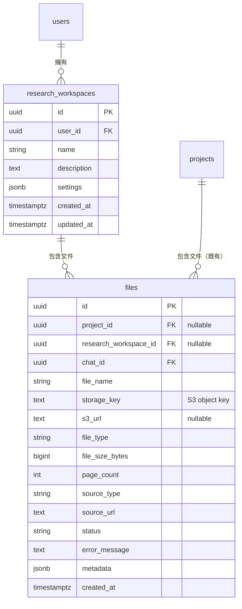

# 深度研究（Deep Search）功能規格

> **⚠️ §1–20 為計畫開發，§21 才是目前線上的實作**
>
> §1–20 描述的是 **NotebookLM 式的持久化知識庫**（`research_workspaces` + Qdrant + S3），
> 這部分**尚未實作**；實作時請以該段為準，並同步更新
> [`database_spec.md`](./database_spec.md)、[`api_spec.md`](./api_spec.md)、[`feature_mapping.md`](./feature_mapping.md)。
>
> 目前**已經上線的是另一條路線**：[§21 現況實作](#21-現況實作openai-agents-sdk-mvp) ——
> 以 OpenAI Agents SDK 的 hosted tools 做一次性研究，**完全不落地**。
> 兩者共用「深度研究」這個名字與側邊欄入口，但架構、儲存與範圍都不同。

---

## 目錄

1. [產品定位](#1-產品定位)
2. [MVP 範圍與後續階段](#2-mvp-範圍與後續階段)
3. [系統架構](#3-系統架構)
4. [技術選型](#4-技術選型)
5. [儲存分工](#5-儲存分工)
6. [PostgreSQL 資料庫設計](#6-postgresql-資料庫設計)
7. [Qdrant 向量庫設計](#7-qdrant-向量庫設計)
8. [S3 原始文件儲存](#8-s3-原始文件儲存)
9. [背景 Ingest Worker](#9-背景-ingest-worker)
10. [法律文件切分策略](#10-法律文件切分策略)
11. [API 設計](#11-api-設計)
12. [Agent 與問答（Phase 1b）](#12-agent-與問答phase-1b)
13. [前端深度研究頁面](#13-前端深度研究頁面)
14. [環境變數](#14-環境變數)
15. [雲端架構（Production）](#15-雲端架構production)
16. [技術難點與對策](#16-技術難點與對策)
17. [實作路線圖](#17-實作路線圖)
18. [Migration SQL（既有 DB）](#18-migration-sql既有-db)
19. [模組結構建議](#19-模組結構建議)
20. [與現有系統的關係](#20-與現有系統的關係)
21. [現況實作（OpenAI Agents SDK MVP）](#21-現況實作openai-agents-sdk-mvp) ← **目前線上的版本**

---

## 1. 產品定位

深度研究功能類似 **NotebookLM**，提供獨立的「研究空間」，讓使用者：

- 上傳多份文件（MVP 先限 **法律 PDF**）建立專屬知識庫
- 對文件提問，LLM 以 **Grounded RAG** 回答並附引用
- （後續）產出摘要、報告（Word/PPT）、語音對答 Agent 等衍生產物

**與現有 `projects`（股市專案）完全分離**：深度研究有自己的 `research_workspaces` 容器，不綁定 `projects` 表。

---

## 2. MVP 範圍與後續階段

### 2.1 Phase 1 — MVP（優先實作）

| 做 | 不做 |
|----|------|
| 前端「深度研究」獨立頁面 | 與 `projects` 整合 |
| 上傳法律 PDF | 網址 / 貼上文字來源 |
| 上傳 API、刪除 API | PPT / Word 報告產出 |
| S3 儲存完整原始 PDF | 語音 Agent |
| 背景 ingest → Qdrant | GraphRAG / PageIndex 完整整合 |
| 研究空間 CRUD | 協作分享 |

### 2.2 Phase 1b — Grounded 問答

- `chat_mode=research` 對話模式
- Agent 工具 `search_research_documents`
- 引用溯源（`context_refs`）

### 2.3 Phase 1.5 — 檢索增強

- 文件樹索引（PageIndex 式 ToC，存 PostgreSQL JSONB）
- Parent-Child chunk
- Query rewrite + reranker

### 2.4 Phase 2 — 衍生產物

- Word / PPT 報告產出
- URL 網頁來源擷取
- Study Guide、FAQ、Mind Map

### 2.5 Phase 3 — 語音 Agent

- 角色 + 情境設定（模擬面試、架構審議、報告答辩）
- STT / TTS 即時對話
- 可讀取研究空間內文件作為上下文

---

## 3. 系統架構

### 3.1 整體資料流（MVP）

```
┌─────────────┐     POST upload      ┌──────────────┐
│  前端深度研究  │ ──────────────────→ │  FastAPI     │
│  頁面         │ ← 202 file_id      │  Upload API  │
└─────────────┘                     └──────┬───────┘
       │ 輪詢 status                        │
       │                                   ▼
       │                          ┌────────────────┐
       │                          │ AWS S3          │
       │                          │ 完整原始 PDF     │
       │                          └──────┬─────────┘
       │                                   │
       │                          ┌──────▼─────────┐
       │                          │ PostgreSQL      │
       │                          │ files + workspace│
       │                          └──────┬─────────┘
       │                                   │
       │                          ┌──────▼─────────┐
       │                          │ asyncio Worker  │
       │                          │ S3 GetObject    │
       │                          │ PyMuPDF parse   │
       │                          │ clause split    │
       │                          │ OpenAI embed    │
       │                          │ BM25 sparse     │
       │                          └──────┬─────────┘
       │                                   ▼
       │                          ┌────────────────┐
       └─────────────────────────→│ Qdrant          │
                                  │ research_documents│
                                  └────────────────┘
```

### 3.2 與現有 Stock-Insight-Chat 的關係

| 現有元件 | 深度研究如何複用 |
|----------|------------------|
| `qdrant_hybrid.py` | 直接套用 hybrid dense + BM25 RRF |
| `setup_qdrant.py` | 新增 `research_documents` collection |
| SSE 生產者–消費者（`chat.py`） | 問答階段複用；ingest 進度可先用輪詢 |
| `messages.context_refs` | 引用溯源機制 |
| LangGraph Router→Tools→Analyst | Phase 1b 新增 research 工具 |
| `projects` / 股市 Agent | **此功能完全獨立，不修改** |

---

## 4. 技術選型

### 4.1 文件切分：向量 RAG vs GraphRAG vs PageIndex

**結論：分層互補，MVP 以 Qdrant 混合 RAG 為主。**

| 方案 | 適用場景 | MVP 決策 |
|------|----------|----------|
| **Qdrant 混合 RAG**（Dense + BM25） | 跨文件語意 + 關鍵字搜尋 | ✅ **主力**（已有基礎設施） |
| **PageIndex 式文件樹** | 單份長文件精準定位（法律、財報） | Phase 1.5 加補 |
| **Microsoft GraphRAG** | 多文件實體關係推理 | Phase 3+ 可選，初期 ROI 低 |

**Hybrid Retrieval Pipeline（Phase 1.5 目標）：**

```
User Query
    │
    ├─① Qdrant Hybrid Search (research_workspace_id filter, top_k=8)
    │
    ├─② Tree Navigation（若 query 指向特定文件/章節）
    │
    └─③ Reranker → 合併去重 → 注入 Analyst
```

### 4.2 背景處理

| 方案 | 決策 |
|------|------|
| Celery + Redis | ❌ MVP 不引入，基礎設施過重 |
| `asyncio.create_task` fire-and-forget | ❌ 重啟會丟 job |
| **FastAPI lifespan + asyncio worker + PostgreSQL queue** | ✅ **採用** |

Worker 以 `SELECT ... FOR UPDATE SKIP LOCKED` 取 `status='processing'` 的 file，之後拆成獨立 container 也適用。

### 4.3 文件解析

| 工具 | 用途 |
|------|------|
| **PyMuPDF (fitz)** | PDF 文字抽取、頁碼、outline/bookmark |
| **LangChain RecursiveCharacterTextSplitter** | fallback 語意切分 |
| unstructured.io | Phase 2 複雜表格/混排 |
| OCR（Azure DI / Tesseract） | Phase 1.5 掃描版 PDF |

### 4.4 報告產出（Phase 2）

| 輸出 | 工具 |
|------|------|
| Word (.docx) | python-docx + Jinja2 模板 |
| PPT (.pptx) | python-pptx |
| PDF | WeasyPrint 或 LibreOffice headless |

### 4.5 語音 Agent（Phase 3）

| 層 | 選型 |
|----|------|
| STT | OpenAI Whisper API / Deepgram |
| TTS | OpenAI TTS / ElevenLabs |
| 即時通訊 | WebRTC（Daily.co / LiveKit）或 WebSocket |
| Agent | 現有 LangGraph + 角色 system prompt |

---

## 5. 儲存分工

| 儲存 | 內容 | 說明 |
|------|------|------|
| **AWS S3** | 使用者上傳的**完整原始 PDF** | 唯一真相來源（Source of Truth） |
| **Qdrant** | chunk 向量 + 檢索用 payload（含 chunk 原文） | MVP 不在 PG 存 chunk 全文 |
| **PostgreSQL** | 研究空間、file 級 metadata、`storage_key` | 不存 chunk 全文 |

**MVP 不需要的表：**

- `document_chunks` — chunk 全文在 Qdrant payload
- `ingest_jobs` — 用 `files.status` + `files.metadata` 追蹤進度
- `document_trees` — Phase 1.5 再加

---

## 6. PostgreSQL 資料庫設計

### 6.1 新建：`research_workspaces`

一個使用者可有多個研究空間，每個空間可掛多份文件。

```sql
CREATE TABLE IF NOT EXISTS research_workspaces (
    id UUID PRIMARY KEY DEFAULT gen_random_uuid(),
    user_id UUID NOT NULL REFERENCES users(id) ON DELETE CASCADE,
    name VARCHAR(255) NOT NULL DEFAULT '未命名研究',
    description TEXT,
    settings JSONB DEFAULT '{}',
    created_at TIMESTAMPTZ DEFAULT CURRENT_TIMESTAMP,
    updated_at TIMESTAMPTZ DEFAULT CURRENT_TIMESTAMP
);

CREATE INDEX IF NOT EXISTS idx_research_workspaces_user_id
    ON research_workspaces(user_id);
```

### 6.2 修改：沿用 `files` 表（不新建 `research_files`）

**理由：**

- 上傳、刪除、狀態機邏輯可共用
- 用 `project_id` / `research_workspace_id` 互斥，避免重複 schema
- 現有 `project.py` 的 `WHERE project_id = $1` 查詢不受影響

**完整 schema（新環境 `init_db.sql` 目標狀態）：**

```sql
CREATE TABLE IF NOT EXISTS files (
    id UUID PRIMARY KEY DEFAULT gen_random_uuid(),
    project_id UUID REFERENCES projects(id) ON DELETE CASCADE,
    research_workspace_id UUID REFERENCES research_workspaces(id) ON DELETE CASCADE,
    chat_id UUID REFERENCES chats(id) ON DELETE SET NULL,
    file_name VARCHAR(255) NOT NULL,
    storage_key TEXT NOT NULL,              -- S3 object key（主識別）
    s3_url TEXT,                            -- 可 NULL；按需產 presigned URL
    file_type VARCHAR(50) NOT NULL,
    file_size_bytes BIGINT,
    page_count INTEGER,
    source_type VARCHAR(30) DEFAULT 'upload',  -- upload | url | paste
    source_url TEXT,
    status VARCHAR(50) NOT NULL,
    error_message TEXT,
    metadata JSONB DEFAULT '{}',
    created_at TIMESTAMPTZ DEFAULT CURRENT_TIMESTAMP,
    CONSTRAINT chk_files_owner_exclusive CHECK (
        (project_id IS NOT NULL AND research_workspace_id IS NULL)
        OR (project_id IS NULL AND research_workspace_id IS NOT NULL)
    )
);

CREATE INDEX IF NOT EXISTS idx_files_project_id ON files(project_id);
CREATE INDEX IF NOT EXISTS idx_files_research_workspace_id ON files(research_workspace_id);
CREATE INDEX IF NOT EXISTS idx_files_chat_id ON files(chat_id);
```

### 6.3 `files.status` 狀態機

**完整流程：**

```
uploading → parsing → chunking → embedding → ready
                                              ↘ failed
```

**MVP 簡化版：**

```
uploading → processing → ready | failed
```

**進度細節存 `metadata`：**

```json
{
  "progress_pct": 72,
  "stage": "embedding",
  "chunk_count": 128,
  "processed_chunks": 92
}
```

### 6.4 ERD（深度研究相關）



### 6.5 後續階段才需要的表（參考）

<details>
<summary>Phase 1.5+ 可選表（點擊展開）</summary>

```sql
-- ingest job 獨立追蹤（若 files.status 不足時）
CREATE TABLE ingest_jobs (
    id UUID PRIMARY KEY DEFAULT gen_random_uuid(),
    file_id UUID NOT NULL REFERENCES files(id) ON DELETE CASCADE,
    status VARCHAR(30) NOT NULL DEFAULT 'queued',
    progress_pct SMALLINT DEFAULT 0,
    error_message TEXT,
    retry_count SMALLINT DEFAULT 0,
    created_at TIMESTAMPTZ DEFAULT CURRENT_TIMESTAMP
);

-- chunk 元資料（若需 citation API 不經 Qdrant）
CREATE TABLE document_chunks (
    id UUID PRIMARY KEY DEFAULT gen_random_uuid(),
    file_id UUID NOT NULL REFERENCES files(id) ON DELETE CASCADE,
    chunk_idx INTEGER NOT NULL,
    parent_chunk_id UUID REFERENCES document_chunks(id),
    content_preview TEXT NOT NULL,
    page_start INTEGER,
    page_end INTEGER,
    text[] section_path,
    uuid qdrant_point_id,
    UNIQUE(file_id, chunk_idx)
);

-- PageIndex 式文件樹
CREATE TABLE document_trees (
    id UUID PRIMARY KEY DEFAULT gen_random_uuid(),
    file_id UUID NOT NULL REFERENCES files(id) ON DELETE CASCADE,
    tree_json JSONB NOT NULL,
    UNIQUE(file_id)
);

-- 衍生產物
CREATE TABLE artifacts (
    id UUID PRIMARY KEY DEFAULT gen_random_uuid(),
    project_id UUID REFERENCES research_workspaces(id) ON DELETE CASCADE,
    artifact_type VARCHAR(50) NOT NULL,
    title VARCHAR(255),
    storage_key TEXT,
    content_json JSONB,
    status VARCHAR(30) DEFAULT 'generating',
    created_at TIMESTAMPTZ DEFAULT CURRENT_TIMESTAMP
);
```

</details>

---

## 7. Qdrant 向量庫設計

### 7.1 Collection：`research_documents`

沿用現有 hybrid 設定（`dense` + BM25 sparse `text`），與 `app/backend/tools/qdrant_hybrid.py` 一致。

需在 `app/backend/scripts/setup_qdrant.py` 新增 collection 定義。

### 7.2 Point Payload Schema

```python
{
    "research_workspace_id": "uuid",    # 必須 — 所有查詢都 filter
    "user_id": "uuid",
    "file_id": "uuid",
    "file_name": "勞動契約.pdf",
    "chunk_idx": 3,
    "chunk_type": "clause",             # clause | section | partial
    "page_start": 12,
    "page_end": 13,
    "section_path": ["第三章 保密", "第15條"],
    "content": "完整 chunk 原文...",       # 問答時直接取
    "token_count": 420,
}
```

### 7.3 Payload Indexes

| 欄位 | 類型 | 用途 |
|------|------|------|
| `research_workspace_id` | keyword | 隔離查詢（必須） |
| `file_id` | keyword | 刪除 / 單文件查詢 |
| `user_id` | keyword | 權限 |
| `chunk_type` | keyword | 過濾條款/段落 |
| `chunk_idx` | integer | 排序 |

### 7.4 檢索策略

- Hybrid RRF 融合（dense + BM25）
- `query_filter`：`research_workspace_id = $workspace_id`
- 可選 `file_id` filter（使用者指定文件範圍）
- Group by `file_id`，`group_size=3`（避免單一文件霸佔結果）
- `top_k` 預設 8

### 7.5 刪除

```python
await qdrant.delete(
    collection_name="research_documents",
    points_selector=Filter(
        must=[FieldCondition(key="file_id", match=MatchValue(value=file_id))]
    ),
)
```

### 7.6 嵌入格式

```python
text_for_embedding = f"[{file_name}][{section_path}] {chunk_text}"
```

使用 OpenAI `text-embedding-3-small`（1536 維）+ FastEmbed `Qdrant/bm25` sparse。

---

## 8. S3 原始文件儲存

### 8.1 設計原則

- **S3 存完整原始 PDF**，作為唯一真相來源
- **DB 只存 `storage_key`**，不存公開 URL
- Bucket 設 **private**，前端預覽/下載用 **Presigned URL**（15–60 分鐘有效）

### 8.2 Object Key 命名規則

```
research/{research_workspace_id}/{file_id}/{sanitized_filename}
```

範例：

```
research/a1b2c3d4-.../f4e5d6a7-.../勞動契約_v2.pdf
```

- 用 `file_id` 避免同名覆蓋
- filename 需 sanitize（去除 `../`、特殊字元）

### 8.3 上傳流程

```
1. 驗證 PDF + 大小 + workspace ownership
2. INSERT files (status='uploading', storage_key=...)
3. S3 PutObject（串流上傳，不整包讀進記憶體）
4. UPDATE status='processing'
5. return 202 + file_id
```

**API 負責 S3 上傳；Worker 從 S3 讀取再 ingest。**

### 8.4 刪除流程

```
1. 驗證 ownership
2. Qdrant delete by file_id
3. S3 DeleteObject(storage_key)
4. DELETE FROM files
```

S3 刪除失敗時：記 log，仍刪 PG（或標記 `metadata.pending_s3_delete` 供 retry）。

### 8.5 開發環境：MinIO（S3 相容）

本地開發不必連真 AWS，`docker-compose` 加 MinIO：

```yaml
minio:
  image: minio/minio
  command: server /data --console-address ":9001"
  ports:
    - "9000:9000"
    - "9001:9001"
  environment:
    MINIO_ROOT_USER: minioadmin
    MINIO_ROOT_PASSWORD: minioadmin
  volumes:
    - minio_data:/data
```

Backend 設定 `S3_ENDPOINT_URL=http://minio:9000` 即可，boto3 程式碼與 AWS 相同。

### 8.6 Python 模組介面

```
app/backend/module/s3_storage.py
```

```python
def build_storage_key(workspace_id: str, file_id: str, filename: str) -> str: ...

async def upload_fileobj(file_obj, storage_key: str, content_type: str) -> None: ...

async def download_bytes(storage_key: str) -> bytes: ...

async def delete_object(storage_key: str) -> None: ...

def generate_presigned_download_url(storage_key: str, expires_sec: int = 3600) -> str: ...
```

依賴：`boto3>=1.34.0`；MVP 用 `asyncio.to_thread()` 包同步 boto3。

### 8.7 安全與成本

| 項目 | 建議 |
|------|------|
| Bucket Policy | private，禁止 public read |
| Presigned URL | 僅通過 ownership 驗證後發放 |
| SSE | 正式環境開 `AES256` 或 `aws:kms` |
| Lifecycle | 可清 orphan prefix |
| 成本估算 | 50MB × 1000 份 ≈ 50GB ≈ $1–2/月 |

---

## 9. 背景 Ingest Worker

### 9.1 啟動方式

在 FastAPI `lifespan` 內 `asyncio.create_task(research_ingest_worker_loop())`：

```python
@asynccontextmanager
async def lifespan(app: FastAPI):
    await create_pool()
    _warmup_sparse_bm25()
    worker_task = asyncio.create_task(research_ingest_worker_loop())
    yield
    worker_task.cancel()
    await close_pool()
```

### 9.2 Worker 主迴圈

```python
async def research_ingest_worker_loop():
    while True:
        async with pool.acquire() as conn:
            row = await conn.fetchrow("""
                SELECT id, storage_key, file_name, research_workspace_id, user_id
                FROM files
                WHERE status = 'processing'
                ORDER BY created_at
                FOR UPDATE SKIP LOCKED
                LIMIT 1
            """)
            if not row:
                await asyncio.sleep(1)
                continue
            try:
                await process_research_file(row)
                await conn.execute(
                    "UPDATE files SET status='ready' WHERE id=$1", row["id"]
                )
            except Exception as e:
                await conn.execute(
                    "UPDATE files SET status='failed', error_message=$2 WHERE id=$1",
                    row["id"], str(e),
                )
```

### 9.3 `process_research_file` 步驟

```
1. S3 GetObject → PDF bytes
2. PyMuPDF 逐頁抽文字
3. 法律文件切分（見 §10）
4. OpenAI dense embedding + FastEmbed BM25 sparse
5. Upsert Qdrant research_documents
6. UPDATE files.page_count, metadata.chunk_count, status
```

### 9.4 前端進度

MVP 以輪詢 `GET /api/research/files/{file_id}` 查看 `status` / `metadata.progress_pct`。  
Phase 1b 可加 SSE：`GET /api/research/jobs/{file_id}/stream`。

---

## 10. 法律文件切分策略

### 10.1 三階段 Fallback

| 優先級 | 策略 | 適用 |
|--------|------|------|
| 1 | **條款級切分** | 有「第 X 條」等結構的法律文件 |
| 2 | **章節級切分** | PDF outline / 「第 X 章」 |
| 3 | **語意切分 fallback** | 無明確結構的長文 |

### 10.2 Stage 1：條款級（優先）

```python
CLAUSE_PATTERNS = [
    r"第[一二三四五六七八九十百零\d]+條",
    r"第\s*\d+\.\d+\s*款",
    r"Article\s+\d+",
    r"^\(\d+\)",
]
```

- PyMuPDF 逐頁抽文字，保留 `page_num`
- regex 找條款邊界 → 每條一 chunk
- payload：`section_path: ["第三章", "第15條"]`, `chunk_type: "clause"`

### 10.3 Stage 2：章節級

- 偵測 `第X章`、`Chapter N`、PDF bookmark
- 每章一 chunk，或章 → 段二層

### 10.4 Stage 3：語意 Fallback

```python
RecursiveCharacterTextSplitter(
    chunk_size=1000,
    chunk_overlap=150,
    separators=["\n\n", "\n", "。", "；", " ", ""]
)
```

### 10.5 掃描版 PDF

MVP 回 `failed` + `error_message: "掃描版 PDF 尚不支援，請提供文字版"`。OCR 留 Phase 1.5。

### 10.6 注意事項

- 單 chunk 控制在 ~2000 中文字內（Qdrant payload 大小限制）
- 交叉引用（「依第 5.2 條」）Phase 1.5 用文件樹處理
- Parent-Child chunk（章節摘要 + 條款全文）Phase 1.5

---

## 11. API 設計

所有端點需 `Authorization: Bearer <AT>`，`user_id` 從 JWT 取得。

### 11.1 研究空間

#### `POST /api/research/workspaces`

建立研究空間。

**Request:**

```json
{
  "name": "勞動契約審閱",
  "description": "2026 Q2 供應商合約"
}
```

**Response `201`:**

```json
{
  "status": "success",
  "data": {
    "id": "uuid",
    "name": "勞動契約審閱",
    "created_at": "2026-06-05T10:00:00Z"
  }
}
```

---

#### `GET /api/research/workspaces`

列出當前使用者的研究空間。

**Response `200`:**

```json
{
  "status": "success",
  "data": {
    "workspaces": [
      {
        "id": "uuid",
        "name": "勞動契約審閱",
        "file_count": 3,
        "created_at": "2026-06-05T10:00:00Z",
        "updated_at": "2026-06-05T12:00:00Z"
      }
    ]
  }
}
```

---

#### `GET /api/research/workspaces/{workspace_id}`

研究空間詳情 + 文件列表。

**Response `200`:**

```json
{
  "status": "success",
  "data": {
    "id": "uuid",
    "name": "勞動契約審閱",
    "description": "...",
    "files": [
      {
        "file_id": "uuid",
        "file_name": "勞動契約.pdf",
        "file_type": "application/pdf",
        "file_size_bytes": 2048576,
        "page_count": 45,
        "status": "ready",
        "created_at": "2026-06-05T10:00:00Z"
      },
      {
        "file_id": "uuid",
        "file_name": "保密協議.pdf",
        "status": "processing",
        "metadata": {"progress_pct": 67, "stage": "embedding"}
      }
    ]
  }
}
```

---

#### `DELETE /api/research/workspaces/{workspace_id}`

刪除研究空間（CASCADE 刪 files → 需同步刪 S3 + Qdrant）。

---

### 11.2 文件上傳 / 刪除（MVP 核心）

#### `POST /api/research/workspaces/{workspace_id}/files/upload`

**Request:** `multipart/form-data`

| 欄位 | 類型 | 必填 |
|------|------|------|
| `file` | Binary | ✅ |

**限制（MVP）：**

- MIME：僅 `application/pdf`
- 大小：50MB（`RESEARCH_UPLOAD_MAX_BYTES`）
- 每 workspace 文件數：依 subscription tier

**Response `202`:**

```json
{
  "status": "success",
  "data": {
    "file_id": "uuid",
    "file_name": "勞動契約.pdf",
    "file_type": "application/pdf",
    "file_size_bytes": 2048576,
    "status": "processing",
    "research_workspace_id": "uuid"
  }
}
```

---

#### `GET /api/research/files/{file_id}`

查詢文件狀態 / 進度。

**Response `200`:**

```json
{
  "status": "success",
  "data": {
    "file_id": "uuid",
    "file_name": "勞動契約.pdf",
    "status": "ready",
    "page_count": 45,
    "file_size_bytes": 2048576,
    "metadata": {
      "chunk_count": 128,
      "progress_pct": 100
    },
    "error_message": null,
    "created_at": "2026-06-05T10:00:00Z"
  }
}
```

---

#### `GET /api/research/files/{file_id}/download-url`

取得 Presigned 下載 URL（Phase 1b）。

**Response `200`:**

```json
{
  "status": "success",
  "data": {
    "download_url": "https://s3.amazonaws.com/...",
    "expires_in_sec": 3600
  }
}
```

---

#### `DELETE /api/research/files/{file_id}`

刪除文件 + Qdrant points + S3 object + PG row。

**Response `200`:**

```json
{
  "status": "success",
  "message": "File and all indexed data deleted."
}
```

**刪除順序：**

1. 驗證 `(file.research_workspace_id → workspace.user_id) == current_user`
2. Qdrant delete by `file_id`
3. S3 DeleteObject(`storage_key`)
4. `DELETE FROM files WHERE id = $1`

---

### 11.3 Ingest 進度 SSE（Phase 1b，可選）

#### `GET /api/research/files/{file_id}/stream`

**SSE Events:**

```
event: progress
data: {"progress_pct": 45, "stage": "chunking", "message": "正在切分第 23 頁"}

event: completed
data: {"file_id": "uuid", "chunk_count": 128, "duration_sec": 42}

event: error
data: {"error": "PDF parsing failed", "retry_available": true}
```

---

### 11.4 網路來源（Phase 2，暫不實作）

<details>
<summary>POST /api/research/workspaces/{id}/sources/url（計畫中）</summary>

```json
{
  "url": "https://example.com/article",
  "title": "可選自訂標題"
}
```

</details>

---

### 11.5 衍生產物 API（Phase 2，暫不實作）

<details>
<summary>POST /api/research/projects/{id}/artifacts（計畫中）</summary>

支援 `artifact_type`：`summary` | `faq` | `study_guide` | `report_docx` | `report_pptx` | `mind_map` | `audio_overview`

</details>

---

### 11.6 語音 Agent API（Phase 3，暫不實作）

<details>
<summary>語音情境與 Session API（計畫中）</summary>

- `POST /api/research/projects/{id}/voice-scenarios`
- `POST /api/research/voice-scenarios/{id}/sessions`
- WebSocket：`wss://.../ws/voice/{session_id}`

</details>

---

## 12. Agent 與問答（Phase 1b）

### 12.1 對話模式

擴展現有 `POST /api/chat/messages`，新增 `chat_mode=research`：

```json
{
  "chat_id": "uuid",
  "content": "這份合約的保密條款與上一份有什麼不同？",
  "chat_mode": "research",
  "response_mode": "thinking",
  "research_options": {
    "research_workspace_id": "uuid",
    "file_ids": ["uuid1", "uuid2"],
    "enable_web_search": false,
    "retrieval_top_k": 8
  }
}
```

### 12.2 Research Agent 工具

| Tool | 用途 | 階段 |
|------|------|------|
| `search_research_documents` | Qdrant hybrid 搜尋 workspace 文件 | Phase 1b |
| `navigate_document_tree` | PageIndex 式樹狀導航 | Phase 1.5 |
| `get_document_summary` | 讀取文件/章節摘要 | Phase 1.5 |
| `tavily_global_search` | 網路搜尋（已有） | 可選 |
| `compare_document_sections` | 跨文件段落比對 | Phase 1.5 |

### 12.3 SSE 事件（沿用現有 + citation）

```
event: tool_start
data: {"tool": "search_research_documents", "input": {"query": "保密條款"}}

event: citation
data: {"refs": [
  {"file_id": "uuid", "file_name": "合約_v2.pdf", "page": 12,
   "section": "3.2 保密義務", "chunk_id": "uuid", "excerpt": "..."}
]}

event: token
data: {"content": "兩份合約的保密條款主要差異如下..."}
```

### 12.4 跨文件比對 Query 改寫

```
原始：「這三份合約的保密條款有什麼不同？」
  ↓ LLM 改寫
子查詢 1：「合約 A 保密條款」
子查詢 2：「合約 B 保密條款」
子查詢 3：「合約 C 保密條款」
  ↓ 各搜一次 → 合併 → Analyst 比較
```

可複用現有 `FLASH_LLM_QUERY_REWRITE` 模式。

---

## 13. 前端深度研究頁面

### 13.1 頁面結構（MVP）

```
/research.html（或 index.html 內嵌視圖）
├── 左側：研究空間列表
├── 中間：文件列表 + 上傳區
│   ├── <input type="file" accept=".pdf">
│   ├── 文件卡片（名稱、大小、狀態、進度條）
│   └── 刪除按鈕
└── 右側：（Phase 1b）對話區
```

### 13.2 前端行為

| 行為 | 實作 |
|------|------|
| 上傳 | `FormData` → `POST .../files/upload` |
| 進度 | 輪詢 `GET .../files/{id}` 每 2 秒，直到 `ready` / `failed` |
| 刪除 | `DELETE .../files/{id}` + 更新列表 |
| DOM 操作 | **禁止 innerHTML**，使用 `textContent` / `createElement` |

### 13.3 導航入口

在現有 sidebar 新增「深度研究」入口，與「股市專案」並列。

---

## 14. 環境變數

```env
# AWS S3
AWS_ACCESS_KEY_ID=...
AWS_SECRET_ACCESS_KEY=...
AWS_REGION=ap-northeast-1
S3_BUCKET_NAME=stock-insight-research
S3_ENDPOINT_URL=              # 開發用 MinIO：http://minio:9000
S3_PRESIGNED_URL_EXPIRES_SEC=3600

# 深度研究
RESEARCH_UPLOAD_MAX_BYTES=52428800    # 50MB
RESEARCH_MAX_FILES_PER_WORKSPACE=50   # 依 tier 調整
RESEARCH_COLLECTION_NAME=research_documents
RESEARCH_RETRIEVAL_TOP_K=8
```

需在 [`env.md`](./env.md) 同步登錄（實作時）。

---

## 15. 雲端架構（Production）

> **完整 AWS 上線 Runbook**（Route 53、WAF、ALB、ECS Fargate、RDS、Qdrant、S3、成本、檢查清單）見 **[`aws_production_deploy.md`](./aws_production_deploy.md)**。

### 15.1 開發環境（docker-compose 擴展）

```yaml
services:
  backend:     # 現有 FastAPI + ingest worker
  db:          # 現有 PostgreSQL
  qdrant:      # 現有 Qdrant
  frontend:    # 現有 Nginx
  minio:       # 新增 — S3 相容（開發用）
  # redis:     # Phase 2+ 若拆 Celery 再加
```

### 15.2 生產環境（AWS 範例）

```
CloudFront + S3 (Frontend static)
        │
ALB → ECS Fargate
        ├─ api-service (FastAPI)
        └─ worker-service (ingest, queue-driven)
        │
   RDS PostgreSQL    S3 (research-docs)    Qdrant Cloud
```

| 元件 | 選型 |
|------|------|
| API | ECS Fargate / Cloud Run |
| Worker | ECS Fargate（獨立 scale） |
| DB | RDS PostgreSQL Multi-AZ |
| 原始文件 | S3 private bucket + SSE |
| 向量 | Qdrant Cloud 或 EC2 自架 |
| 開發 S3 | MinIO |

---

## 16. 技術難點與對策

### 16.1 長文件 / 法律文件

| 難點 | 對策 |
|------|------|
| 條款被切斷 | Clause-level 切分 + Phase 1.5 Parent-Child |
| 交叉引用 | Phase 1.5 文件樹 + cross-ref metadata |
| 掃描 PDF | MVP 回 failed；Phase 1.5 OCR |
| 處理時間長 | 非同步 worker + 進度輪詢/SSE |
| 表格/附錄 | Phase 2 unstructured.io |

### 16.2 多文件精準檢索

| 難點 | 對策 |
|------|------|
| 跨文件比較 | Multi-query + LLM rerank |
| 相似條款 | BM25 + dense 雙軌（已有 hybrid） |
| 引用不精準 | chunk metadata 含 page/section |
| top_k 過多/过少 | Adaptive top_k + score threshold |

### 16.3 非同步可靠性

| 難點 | 對策 |
|------|------|
| Worker crash | PG queue + retry（最多 3 次） |
| 重複上傳 | content_hash 去重（Phase 1.5） |
| 大文件 OOM | Streaming parse（page-by-page） |
| S3 刪除失敗 | log + metadata.pending_s3_delete |

### 16.4 報告產出（Phase 2）

| 難點 | 對策 |
|------|------|
| LLM 幻覺 | 每段必須附 citation |
| PPT 排版 | 預定義 template |
| Token 超限 | 大綱先行 + 逐章填充 |

### 16.5 語音 Agent（Phase 3）

| 難點 | 對策 |
|------|------|
| STT→RAG→LLM→TTS 延遲 | 預載 workspace summary |
| 打斷 | VAD + streaming TTS |
| 成本 | 獨立計量，ultra tier |

---

## 17. 實作路線圖

| 階段 | 交付物 | 預估 |
|------|--------|------|
| **Phase 1a MVP** | Migration + S3 module + upload/delete API + ingest worker + Qdrant collection + 前端上傳頁 | 4–6 週 |
| **Phase 1b 問答** | `chat_mode=research` + search tool + citation UI | 2–3 週 |
| **Phase 1.5 增強** | 文件樹 + clause Parent-Child + rerank | 3 週 |
| **Phase 2 衍生** | Word/PPT + URL 來源 + Study Guide | 4 週 |
| **Phase 3 語音** | Voice scenario + WebSocket + STT/TTS | 4 週 |

**Phase 1a 建議實作順序：**

1. Migration（下一個可用版本，如 V009）+ 更新 `init_db.sql`
2. `module/s3_storage.py`
3. `research/chunker.py` + `research/ingest_worker.py`
4. `setup_qdrant.py` 加 `research_documents`
5. `api/research.py` router
6. `app.py` lifespan 啟動 worker
7. 前端 `research.html` + 上傳 UI
8. （Phase 1b）Agent 工具 + 對話

---

## 18. Migration SQL（既有 DB）

> 執行前請備份。詳見 [`sql_dev_handbook.md`](./sql_dev_handbook.md)。

**檔案：** `app/backend/database/migrations/V009__deep_search_research_workspaces_and_files.sql`

> 版本號取下一個可用值：既有 migration 已到 **V008**（`V006` 已被 `quota_reset_logs` 佔用），實作時請確認並遞增。

```sql
-- ============================================================
-- Migration V009: 深度研究 — research_workspaces + 擴充 files
-- ============================================================

BEGIN;

-- 1. 研究空間
CREATE TABLE IF NOT EXISTS research_workspaces (
    id UUID PRIMARY KEY DEFAULT gen_random_uuid(),
    user_id UUID NOT NULL REFERENCES users(id) ON DELETE CASCADE,
    name VARCHAR(255) NOT NULL DEFAULT '未命名研究',
    description TEXT,
    settings JSONB DEFAULT '{}',
    created_at TIMESTAMPTZ DEFAULT CURRENT_TIMESTAMP,
    updated_at TIMESTAMPTZ DEFAULT CURRENT_TIMESTAMP
);

CREATE INDEX IF NOT EXISTS idx_research_workspaces_user_id
    ON research_workspaces(user_id);

-- 2. files.project_id 改 nullable
ALTER TABLE files ALTER COLUMN project_id DROP NOT NULL;

-- 3. files 新增欄位
ALTER TABLE files
    ADD COLUMN IF NOT EXISTS research_workspace_id UUID
        REFERENCES research_workspaces(id) ON DELETE CASCADE,
    ADD COLUMN IF NOT EXISTS file_size_bytes BIGINT,
    ADD COLUMN IF NOT EXISTS page_count INTEGER,
    ADD COLUMN IF NOT EXISTS storage_key TEXT,
    ADD COLUMN IF NOT EXISTS source_type VARCHAR(30) DEFAULT 'upload',
    ADD COLUMN IF NOT EXISTS source_url TEXT,
    ADD COLUMN IF NOT EXISTS error_message TEXT,
    ADD COLUMN IF NOT EXISTS metadata JSONB DEFAULT '{}';

-- 4. s3_url 改 nullable（改以 storage_key + presigned URL 為主）
ALTER TABLE files ALTER COLUMN s3_url DROP NOT NULL;

-- 5. 互斥約束（若尚無同名 constraint）
DO $$
BEGIN
    IF NOT EXISTS (
        SELECT 1 FROM pg_constraint WHERE conname = 'chk_files_owner_exclusive'
    ) THEN
        ALTER TABLE files ADD CONSTRAINT chk_files_owner_exclusive CHECK (
            (project_id IS NOT NULL AND research_workspace_id IS NULL)
            OR (project_id IS NULL AND research_workspace_id IS NOT NULL)
        );
    END IF;
END $$;

CREATE INDEX IF NOT EXISTS idx_files_research_workspace_id
    ON files(research_workspace_id);

COMMIT;
```

> **注意：** 若既有 `files` 資料列同時有 `project_id`，不需變更；新研究文件只填 `research_workspace_id`。

---

## 19. 模組結構建議

```
app/backend/
├── api/
│   ├── research.py              # 研究空間 + 文件 API
│   └── file.py                  # 保留給 project（既有 stub）
├── module/
│   └── s3_storage.py            # S3 上傳/下載/刪除/presigned
├── research/
│   ├── __init__.py
│   ├── chunker.py               # 法律文件切分
│   ├── ingest_worker.py         # 背景 ingest 主迴圈
│   └── qdrant_indexer.py        # embed + upsert Qdrant
├── agent/
│   └── research_chat.py         # Phase 1b: research 對話管線
└── scripts/
    └── setup_qdrant.py          # 加 research_documents collection

app/frontend/
├── html/
│   └── research.html            # 深度研究頁面
├── js/
│   └── research.js
└── css/
    └── research.css
```

**依賴新增：**

```
boto3>=1.34.0
pymupdf>=1.24.0
```

---

## 20. 與現有系統的關係

| 項目 | 影響 |
|------|------|
| `projects` 表 | **不修改業務邏輯** |
| `project.py` GET files | 不變，`WHERE project_id = $1` 自然排除研究文件 |
| `files` 表 | 擴充欄位；`project_id` 改 nullable |
| 既有 `POST /api/files/upload` stub | 保留給 project；研究走 `/api/research/*` |
| 股市 Agent / Qdrant news | **完全獨立**，新 collection `research_documents` |
| `feature_mapping.md` | 實作後新增「深度研究」列 |

---

## 21. 現況實作（OpenAI Agents SDK MVP）

> 這一段描述的是**目前線上跑的東西**，與上面 §1–20 的知識庫規劃是兩條獨立路線。
> 本段的定位是**功能驗證**：先把「上傳 → 研究 → 產出報告／簡報 → 下載」整條路走通，
> 確認體驗與成本可接受之後，再決定要不要接上 §1–20 的持久化架構。

### 21.1 與 §1–20 規劃的差異

| 面向 | §1–20 規劃（未實作） | §21 現況（已實作） |
|------|---------------------|-------------------|
| 檢索 | 自建 Qdrant + BM25 + RRF | OpenAI 托管的 `FileSearchTool` |
| 網路 | 未涵蓋 | OpenAI 托管的 `WebSearchTool` |
| 原始檔 | S3 永久保存 | 只在研究期間存在於 OpenAI 臨時 vector store，結束即刪 |
| 中繼資料 | PostgreSQL `research_workspaces` 等表 | **完全不寫 DB**，記憶體 session |
| 生命週期 | 使用者手動刪除 | TTL 120 分鐘 / 後端重啟 / 前端重新整理即消失 |
| 產出 | Phase 2 才做 | 已有「研究報告」與「簡報」兩個 skill |

### 21.2 模組結構

```
app/backend/deep_research/
├── config.py            # 模型清單、DEEP_SEARCH_* 上限、supports_reasoning_effort()
├── session.py           # 記憶體 SessionStore（TTL + 每人上限）
├── sources.py           # 上傳檔案前處理：vector store / 試算表轉文字 / 圖片轉 data URL
├── researcher.py        # Agents SDK 研究流程，把 SDK 事件轉成 SSE 事件
├── skills.py            # 報告 / 簡報 skill：prompt + 結構化 schema + renderer 註冊表
└── templates/           # 決定性的 HTML 樣板（report.py / deck.py / common.py）
app/backend/api/deep_research.py   # 路由（SSE）
app/frontend/js/deep-research.js   # 前端
app/frontend/css/deep-research.css
```

### 21.3 流程

```
前端                          backend                         OpenAI
 │ multipart(query,model,files)  │                               │
 ├─────────────────────────────►│ read_uploads() 驗證格式/大小    │
 │                              ├── 文件 ─────────────────────►  vector store（臨時）
 │                              ├── 試算表 → Markdown → prompt   │
 │                              ├── 圖片 → base64 → input_image  │
 │◄── SSE: session/status ──────┤                               │
 │                              ├── Runner.run_streamed() ────►  Agent（web_search + file_search）
 │◄── SSE: tool_start/done ─────┤◄──────────────────────────────┤
 │◄── SSE: delta ───────────────┤                               │
 │◄── SSE: done(markdown) ──────┤ cleanup(): 刪 vector store + files
 │                              │
 │ POST artifacts {kind}         │
 ├─────────────────────────────►│ Runner.run(output_type=ReportDoc/DeckDoc) ─► 結構化 JSON
 │◄── SSE: done(download_path) ─┤ templates/ 組出 HTML，存進記憶體 session
 │ GET .../artifacts/{kind}      │
 ├─────────────────────────────►│ Response(attachment)
```

### 21.4 幾個設計決定

**排版不交給模型。** 兩個 skill 的模型輸出都是 `output_type` 綁定的結構化 JSON
（`ReportDoc` / `DeckDoc`），HTML 由 `templates/` 決定性地組出來。理由很實際：
模型只要漏一個結束標籤，整份下載檔就毀了；改成填 JSON 之後，最差情況只是內容平庸而非版面破碎。

**版面不交給模型，主題交給使用者。** 產出的視覺風格收斂成五個具名主題
（色票 + 字體配對 + 排版取向），由前端在產生前選擇，報告與簡報各自獨立。
作法參考 [Anthropic theme-factory](https://github.com/anthropics/skills/tree/main/skills/theme-factory)：
與其讓模型每次自由發揮（結果是每份檔案長得都不一樣，而且通常都不好看），
不如提供少數經過設計的預設。

**篇幅交給使用者，但只寫進 prompt。** 簡報頁數（5–20，預設 12）與報告小節數
（3–10，預設 6）由前端的數字欄位指定，經 `config.resolve_length()` clamp 後
接在 skill instructions 後面（`skills._length_rule()`）。上下限存在的理由是成本：
這個值直接來自瀏覽器且等同模型的輸出量，沒 clamp 一個 `length: 500` 就能燒掉整包額度。
因此上限做成三層：前端 `<input>` 的 `min`/`max`（體感，可繞過）、API 的絕對上限
`LENGTH_HARD_MAX = 20`（越界回 400，正常前端送不出這種值）、以及 `resolve_length()`
把區間內的偏差 clamp 掉。`LENGTH_SPECS` 的 `max` 與環境變數給的 `default` 在啟動時
一併校正 —— `default` 是唯一繞得過 `resolve_length()` 的路徑（`length` 沒送時直接回傳），
沒校正的話 `DEEP_SEARCH_DECK_SLIDES=999` 會讓每次產出都跑 999 頁且從 API 看不出異常。
**後端不對產出做裁切** —— 硬砍會刪掉有內容的頁，而結構化輸出對「剛好 N 個」的
命中率夠好，偶爾偏一頁遠比破壞內容划算。頁數同時會影響簡報的節奏規則：
八頁以上才要求 section 分隔頁與 stats／quote 頁，更短時以論點優先。

**用內容預算取代 render QA 迴圈。**
[OpenAI slides skill](https://github.com/openai/skills) 的作法是
產生 → 用 LibreOffice rasterize 成 PNG → 程式化偵測溢位／重疊 → 修正。
那套是為 PptxGenJS 而生的：盲畫座標，不跑一次根本不知道有沒有爆版。
我們輸出 HTML，排版由瀏覽器決定且樣板完全自控，唯一變因是內容長度，
因此改在 `deck._density()` 依字數與條目數換算 d1/d2/d3 三級，
字級與間距整組跟著降。省下在後端塞 Chromium（+400MB、每次多十幾秒）的代價。
真要做視覺 QA 迴圈，之後再加不遲。

**試算表不進向量庫。** OpenAI File Search 的支援格式**不含 `.xlsx` / `.csv`**，
而且切塊語意檢索本來就不適合表格。改成本地用 openpyxl 轉成 Markdown 表格直接放進 prompt，
以 `DEEP_SEARCH_SPREADSHEET_*` 控制字數預算。

**上傳檔案不留在 OpenAI。** 研究結束（含失敗與前端斷線）一律 `cleanup()` 刪掉 vector store
與底層 file 物件；另外掛 `expires_after` 當保險絲，避免後端沒清乾淨時檔案留在帳號裡。

**預設模型是 `gpt-5.6-luna`。** 已用 Agents SDK 實測：`WebSearchTool` 與 `FileSearchTool` 都正常
（附一份只有檔案內才有的代號，模型答得出來即證明 file search 生效），`reasoning.effort=medium`
與 structured outputs 亦可用。注意 `reasoning_effort=minimal` **不被** 5.4 之後的模型接受，
但深度研究只用 `medium` / `low`，不受影響；聊天那條路的 `ROUTER_REASONING_EFFORT=minimal` 則要留意。

**非推理模型不帶 `reasoning.effort`。** Responses API 對 `gpt-4.1` 系列帶 reasoning 會直接回 400，
判斷在 `config.supports_reasoning_effort()`。

**依賴限制：`openai-agents==0.3.3`。** 這是最後一個相容 `openai` 1.x 的版本；
更新的版本要求 `openai>=2`，會與本專案的 `langchain-openai==0.1.1`（`openai<2`）衝突。
一併把 `openai` 升到 `1.109.1`、`pydantic` 升到 `2.13.4`（openai-agents 的下限），
`langchain` 系列版本不動。

### 21.5 已知限制（要進 Phase 2 前必須處理）

- **不計費**：目前不寫 `token_usage_logs`、不檢查月配額，只用「每位使用者同時一個研究」節流。
  hosted web search 的成本不低，開放前要接上 [`usage_quota`](../app/backend/module/usage_quota.py)。
- **單 process**：session 在記憶體，多 worker 或多台機器會拿不到彼此的 session，得換 Redis。
- **前端斷線即中止**：SSE generator 被 cancel 時會連帶取消研究任務（沒有持久化，續跑沒有意義）。
- **無歷史**：重新整理就沒了，這是刻意的取捨。


---

## 附錄 A：完整願景功能對照（NotebookLM）

| 能力 | 現況 | 本功能目標 |
|------|------|------------|
| 研究空間容器 | ❌ | ✅ `research_workspaces` |
| 多文件上傳 | 🟡 files stub | ✅ S3 + ingest |
| 文件解析 | ❌ | ✅ PyMuPDF + clause split |
| Chunk + Embedding | ✅ 僅股市新聞 | ✅ research_documents |
| Grounded 對話 | ❌ | Phase 1b |
| 引用溯源 | 🟡 context_refs 已有 | Phase 1b 串接 file chunk |
| 網頁來源 | ❌ | Phase 2 |
| 報告產出 | ❌ | Phase 2 |
| 語音 Agent | ❌ | Phase 3 |
| 協作分享 | ❌ | 未規劃 |

---

## 附錄 B：修訂紀錄

| 日期 | 說明 |
|------|------|
| 2026-06-05 | 初版：彙整多輪討論（完整願景 → MVP 限縮 → S3 儲存決策） |
| 2026-08-24 | 新增 §21：以 OpenAI Agents SDK 實作不落地的功能驗證版；§1–20 維持為未實作的規劃 |
| 2026-08-25 | 預設模型改 `gpt-5.6-luna`（實測通過 web/file search）；新增五組視覺主題與內容預算排版；簡報新增 `section` / `compare` 版面 |
