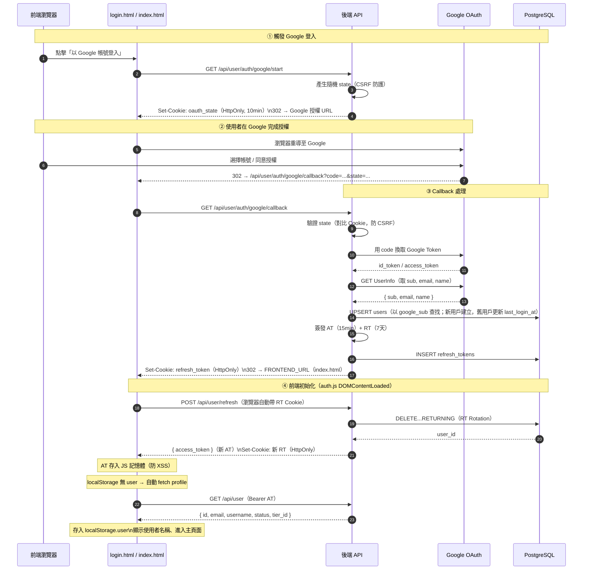

# Google SSO 實作規格

本文件說明：Google-Only 登入的身分設計、DB schema、Callback 端點設計，以及既有資料庫的 Migration SQL。

---

## 1. 為何以 `google_sub` 為身分主鍵？

Google 使用 **OpenID Connect**，登入後的 ID Token / UserInfo 含：

| 欄位 | Google 名稱 | 意義 |
|------|-------------|------|
| **主體識別碼** | `sub`（Subject） | Google 帳號的**唯一穩定 ID**。改暱稱、改 email 都不會變。存為 `users.google_sub`。 |
| 聯絡用 | `email` | 可能被使用者更改；不能作為身分主鍵，只做顯示用。 |

---

## 2. Users 表設計（Google-Only）

```sql
CREATE TABLE IF NOT EXISTS users (
    id UUID PRIMARY KEY DEFAULT gen_random_uuid(),
    email VARCHAR(255) UNIQUE NOT NULL,
    username VARCHAR(100) UNIQUE NOT NULL,
    google_sub TEXT UNIQUE NOT NULL,       -- Google OIDC subject，必填
    last_login_provider VARCHAR(32) DEFAULT 'google',
    status VARCHAR(20) DEFAULT 'active',
    tier_id UUID REFERENCES subscription_tiers(id) ON DELETE SET NULL,
    last_login_at TIMESTAMPTZ,
    created_at TIMESTAMPTZ DEFAULT CURRENT_TIMESTAMP,
    updated_at TIMESTAMPTZ DEFAULT CURRENT_TIMESTAMP
);
```

移除的欄位（相較舊雙模式 schema）：
- `password_hash`：不再支援本地密碼
- `email_verified`：Google 已驗證信箱，欄位無意義
- `CONSTRAINT users_has_password_or_google`：不再需要

---

## 3. OAuth 端點設計

### `GET /api/user/auth/google/start`
- 產生隨機 `state`，存入 HttpOnly Cookie（10 分鐘有效）
- 302 重導到 Google 授權 URL

### `GET /api/user/auth/google/callback`（Google Console 登記的 Redirect URI）
- 驗 `state`（CSRF 防護）
- 用 `code` 換 Google Access Token
- 呼叫 Google UserInfo API 取 `sub`、`email`、`name`
- Upsert `users`（以 `google_sub` 查找）
- 簽發自有 JWT AT + RT，設定 HttpOnly Cookie
- 302 重導回前端（前端用 `POST /api/user/refresh` 換 AT）

---

## 4. 既有資料庫 Migration SQL

> **執行前請先備份資料庫！**
> 
> 進入 DB 容器：
> ```bash
> docker-compose -f ./deploy/docker-compose.yml exec db psql -U postgres -d Insight
> ```

### 情境 A：開發環境（刪除所有舊帳號，乾淨重來）

舊帳號是用密碼建立的（`password_hash` 有值、`google_sub` 為 NULL），無法直接升級到 `google_sub NOT NULL`。  
若這些都是測試帳號，**推薦先清空使用者資料**，再套用新 schema：

```sql
-- ⚠ 確認你要清空所有測試帳號！
-- CASCADE 會一起清除 refresh_tokens、user_usage_quotas、token_usage_logs 等關聯資料
-- chats / projects / messages 因 ON DELETE CASCADE 也會一起被刪除
TRUNCATE TABLE users CASCADE;

-- 1. 移除舊 schema 中密碼與驗證相關欄位
ALTER TABLE users DROP COLUMN IF EXISTS password_hash;
ALTER TABLE users DROP COLUMN IF EXISTS email_verified;

-- 2. 移除舊 CHECK constraint
ALTER TABLE users DROP CONSTRAINT IF EXISTS users_has_password_or_google;

-- 3. 將 google_sub 改為 NOT NULL（TRUNCATE 後所有 row 都已清空，可安全加限制）
--    若 google_sub 尚未存在則先新增
ALTER TABLE users ADD COLUMN IF NOT EXISTS google_sub TEXT;
ALTER TABLE users ALTER COLUMN google_sub SET NOT NULL;

-- 4. 確保 UNIQUE INDEX 存在
DROP INDEX IF EXISTS ux_users_google_sub;
CREATE UNIQUE INDEX ux_users_google_sub ON users(google_sub);

-- 5. last_login_provider 預設值更新
ALTER TABLE users ALTER COLUMN last_login_provider SET DEFAULT 'google';
```

---

### 情境 B：保留現有帳號（下次 Google 登入時自動綁定）

若不想刪除現有帳號，可保持 `google_sub` 為 nullable，下次使用者用 Google 登入同一 email 時，Callback 邏輯會自動補綁 `google_sub`：

```sql
-- 1. 移除密碼欄位（不再使用）
ALTER TABLE users DROP COLUMN IF EXISTS password_hash;
ALTER TABLE users DROP COLUMN IF EXISTS email_verified;

-- 2. 移除舊 CHECK constraint
ALTER TABLE users DROP CONSTRAINT IF EXISTS users_has_password_or_google;

-- 3. google_sub 仍為 nullable（現有帳號 sub 為 NULL，等下次 Google 登入補綁）
ALTER TABLE users ADD COLUMN IF NOT EXISTS google_sub TEXT;

-- 確保 UNIQUE INDEX（允許 NULL 並存）
DROP INDEX IF EXISTS ux_users_google_sub;
CREATE UNIQUE INDEX ux_users_google_sub
    ON users (google_sub)
    WHERE google_sub IS NOT NULL;

-- 4. last_login_provider 預設值更新
ALTER TABLE users ALTER COLUMN last_login_provider SET DEFAULT 'google';
```

> **注意**：情境 B 的 `users` 表中 `google_sub` 仍為 nullable，與 `init_db.sql` 的新定義（`NOT NULL`）有差異。  
> 這是刻意設計的過渡態：未來全部使用者都用 Google 登入後，可再執行 `ALTER TABLE users ALTER COLUMN google_sub SET NOT NULL;`。

---

### 情境 C：保留聊天記錄，舊帳號 email 改成 Gmail 後自動綁定

適用場景：你有一個用密碼建立的舊帳號，想保留它的所有聊天/專案資料，同時切換成用 Google 登入。

**原理**：後端 callback 的查找順序為：
1. 先以 `google_sub` 查找 → 找不到
2. 再以 **相同 email** 查找 → 找到則自動補綁 `google_sub`，聊天記錄完整保留

所以只需把資料庫中的 email 改成你的 Gmail，其餘操作後端自動完成。

#### 步驟一：進入 DB

```bash
docker-compose -f ./deploy/docker-compose.yml exec db psql -U postgres -d Insight
```

#### 步驟二：確認現有帳號

```sql
SELECT id, email, username, google_sub FROM users;
```

#### 步驟三：把 email 改成你的 Gmail

```sql
UPDATE users
SET email = 'your.gmail@gmail.com'   -- 換成你實際的 Gmail
WHERE email = '目前的舊email';
```

確認修改結果（`google_sub` 此時為 `NULL` 屬正常）：

```sql
SELECT id, email, username, google_sub FROM users;
```

#### 步驟四：執行 Schema Migration

> **注意**：`ALTER TABLE ... ALTER COLUMN last_login_provider SET DEFAULT` 這行只有在欄位已存在時才有效。  
> 若你的舊 schema 沒有此欄位（執行時出現 `column does not exist` 錯誤），改用下面的 `ADD COLUMN` 版本即可，兩段擇一執行。

```sql
-- 移除舊欄位與 constraint
ALTER TABLE users DROP COLUMN IF EXISTS password_hash;
ALTER TABLE users DROP COLUMN IF EXISTS email_verified;
ALTER TABLE users DROP CONSTRAINT IF EXISTS users_has_password_or_google;

-- 新增 google_sub 欄位
ALTER TABLE users ADD COLUMN IF NOT EXISTS google_sub TEXT;

-- 建立 partial unique index（允許多筆 NULL 並存）
DROP INDEX IF EXISTS ux_users_google_sub;
CREATE UNIQUE INDEX ux_users_google_sub
    ON users (google_sub)
    WHERE google_sub IS NOT NULL;

-- last_login_provider：若欄位已存在則更新預設值，若不存在則新增
-- 擇一執行：
ALTER TABLE users ALTER COLUMN last_login_provider SET DEFAULT 'google';
-- 或（若上方報錯 "column does not exist"）：
ALTER TABLE users ADD COLUMN IF NOT EXISTS last_login_provider VARCHAR(32) DEFAULT 'google';
```

執行完確認結果：

```sql
SELECT id, email, username, google_sub, last_login_provider FROM users;
```

預期結果：
- `google_sub` → 空（正常，登入後自動補）
- `last_login_provider` → `google`（預設值）

#### 步驟五：重啟後端並用 Google 登入

```bash
docker-compose -f ./deploy/docker-compose.yml restart backend
```

用步驟三填入的同一個 Gmail 帳號點「以 Google 帳號登入」，後端 callback 會自動：
- 比對 email → 找到舊帳號
- 填入 `google_sub`（永久綁定）
- 所有聊天記錄、專案資料完整保留

---

## 5. Google Cloud Console 設定

| 欄位 | 值 |
|------|----|
| **Authorized JavaScript origins** | `http://localhost`（開發）、`https://yourdomain.com`（正式） |
| **Authorized redirect URIs** | `http://localhost:8000/api/user/auth/google/callback` |

> Redirect URI 必須與 `GOOGLE_OAUTH_REDIRECT_URI` 環境變數**完全一致**（含 port、path、protocol）。

---

## 6. 相關環境變數（`.env`）

```dotenv
GOOGLE_CLIENT_ID=xxx.apps.googleusercontent.com
GOOGLE_CLIENT_SECRET=GOCSPX-...
GOOGLE_OAUTH_REDIRECT_URI=http://localhost:8000/api/user/auth/google/callback
FRONTEND_URL=http://localhost
COOKIE_SECURE=false   # 開發環境；正式 HTTPS 環境改為 true
```

---

## 7. 完整登入流程（前端 → 後端 → 前端）



### 步驟說明

| 步驟 | 說明 |
|------|------|
| ① 觸發 | `login.html` 點擊按鈕 → `GET /api/user/auth/google/start` → 後端設 `oauth_state` Cookie → 302 至 Google |
| ② Google 授權 | 使用者在 Google 選擇帳號並同意授權 → Google 302 回後端 Callback URI |
| ③ Callback | 後端驗 state、換取 Token、Upsert 用戶、設 RT Cookie → 302 回前端首頁 |
| ④ 前端初始化 | `auth.js` DOMContentLoaded 執行 `tryRefreshToken()` → 取得 AT → 若 localStorage 無 user 則 fetch `/api/user` profile |

---

## 8. 相關檔案

| 檔案 | 說明 |
|------|------|
| `app/backend/api/auth.py` | Google SSO 端點實作（start / callback / logout / refresh） |
| `app/backend/database/init_db.sql` | 新環境的 `users` 表定義（Google-only） |
| `app/frontend/html/login.html` | Google SSO 登入頁面（僅單一 Google 按鈕） |
| `app/frontend/js/login.js` | 登入頁邏輯（OAuth redirect + 錯誤代碼處理） |
| `app/frontend/js/auth.js` | Token 管理、首次登入 profile fetch、三重 RT 換發機制 |
| `specifications/api_spec.md` | 完整 API 端點規格 |
